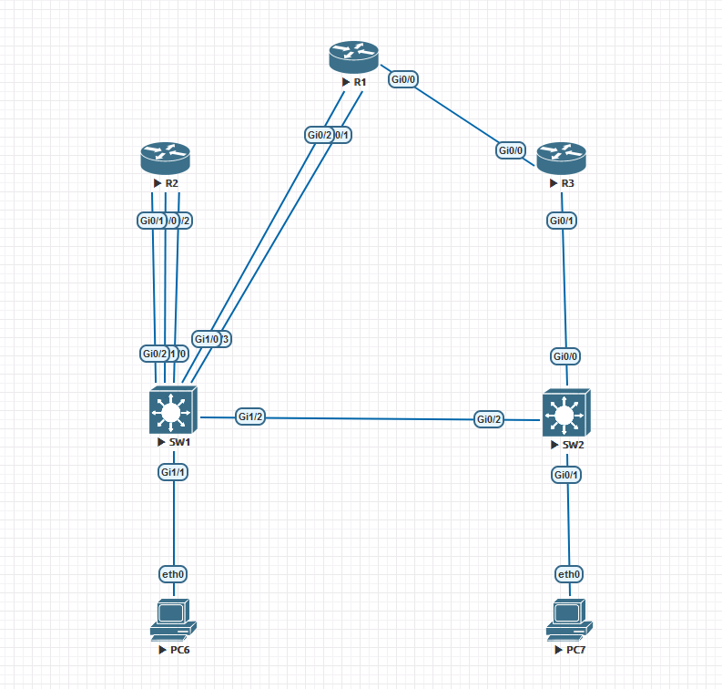

# 多出口NAT + IPSEC + OSPF #

## Topology ##



## HQ ## 

```bash
hostname HQ
crypto isakmp policy 10
    encr aes 256
    hash sha256
    authentication pre-share
    group 14
    lifetime 3600
crypto isakmp key cisco address 123.0.3.2    
crypto ipsec transform-set TS esp-aes 256 esp-sha256-hmac 
    mode tunnel
crypto ipsec profile IPSEC_PROFILE
    set transform-set TS 
interface Tunnel0
    ip address 192.168.100.1 255.255.255.0
    tunnel source GigabitEthernet0/0
    tunnel mode ipsec ipv4
    tunnel destination 123.0.3.2
    tunnel protection ipsec profile IPSEC_PROFILE
interface Tunnel1
    ip address 192.168.200.1 255.255.255.0
    tunnel source GigabitEthernet0/1
    tunnel mode ipsec ipv4
    tunnel destination 123.0.3.2
    tunnel protection ipsec profile IPSEC_PROFILE
interface GigabitEthernet0/0
    ip address 123.0.1.2 255.255.255.252
    ip nat outside
interface GigabitEthernet0/1
    ip address 123.0.2.2 255.255.255.252
    ip nat outside
interface GigabitEthernet0/2
    ip address 192.168.1.1 255.255.255.0
    ip nat inside
router ospf 10
    network 192.168.1.0 0.0.0.255 area 0
    network 192.168.100 0.0.0.255 area 0
    network 192.168.200 0.0.0.255 area 0
access-list 1 permit 192.168.1.0 0.0.0.255
ip nat inside source list 1 interface GigabitEthernet0/0 overload
ip nat inside source list 1 interface GigabitEthernet0/1 overload
ip route 0.0.0.0 0.0.0.0 123.0.1.1 5
ip route 0.0.0.0 0.0.0.0 123.0.2.1 10
```

```bash
hostname BRANCH
crypto isakmp policy 10
    encr aes 256
    hash sha256
    authentication pre-share
    group 14
    lifetime 3600
crypto isakmp key cisco address 123.0.1.2      
crypto isakmp key cisco address 123.0.2.2      
crypto ipsec transform-set TS esp-aes 256 esp-sha256-hmac 
    mode tunnel
crypto ipsec profile IPSEC_PROFILE
    set transform-set TS 
interface Tunnel0
    ip address 192.168.100.2 255.255.255.0
    tunnel source GigabitEthernet0/0
    tunnel mode ipsec ipv4
    tunnel destination 123.0.1.2
    tunnel protection ipsec profile IPSEC_PROFILE
interface Tunnel1
    ip address 192.168.200.2 255.255.255.0
    tunnel source GigabitEthernet0/0
    tunnel mode ipsec ipv4
    tunnel destination 123.0.2.2
    tunnel protection ipsec profile IPSEC_PROFILE
interface GigabitEthernet0/0
    ip address 123.0.3.2 255.255.255.252
    ip nat outside
interface GigabitEthernet0/1
    ip address 192.168.2.1 255.255.255.0
    ip nat inside
router ospf 10
    network 192.168.2.0 0.0.0.255 area 0
    network 192.168.100.0 0.0.0.255 area 0
    network 192.168.200.0 0.0.0.255 area 0
access-list 1 permit 192.168.2.0 0.0.0.255
ip nat inside source list 1 interface GigabitEthernet0/0 overload
ip route 0.0.0.0 0.0.0.0 123.0.3.1
```