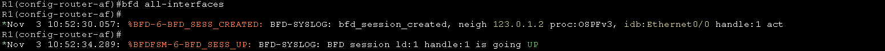
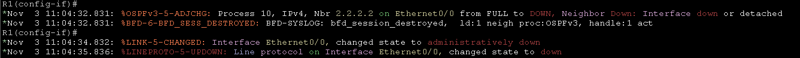
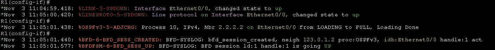
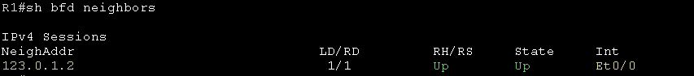
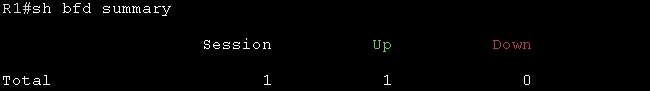

# Bidirectional Forwarding Detection 雙向轉發偵測 #

BFD是一個檢測協定，可以為所有類型的媒體提供故障檢測時間，BFD使用一種低開銷、短持續時間的方式來偵測路由之間的路徑，透過向路由器發送快速故障偵測來啟動路由表重新計算過程，有助於縮短網路收斂時間

## 先決條件 ##

所有開啟BFD的路由器需啟用ip cef和ip routing 

## Topology ## 


## 配置 ##

BFD需要先在要運行BFD鄰居的介面上配置基本的參數

```bash
int e0/0 
    bfd interval 50 min_rx 50 multiplier 5 #interval(BFD探測的間隔)，單位是毫秒、min_rx(最小接收間隔)，單位是毫秒、multiplier(失敗偵測的次數)，當在50*5毫秒內收到5次探測失敗後鏈路視為故障
```

配置完成後，接著要在路由協定中配置BFD，這部分每個路由協定稍微不同，以下會列出常用的路由協定配置方法

## OSPF ## 

OSPFv2配置方法 

```bash
router ospf 10 
    bfd all-interfaces
```

OSPFv3配置方法

```bash
router ospfv3 10 
    address-family ipv4 unicast 
        bfd all-interfaces
    address-family ipv6 unicast 
        bfd all-interfaces
```

提示訊息可以看到BFD鄰居已經建立起來



把e0/0介面關閉後，可以看到BFD鄰居已經斷開



重新開啟介面，在介面開啟完成後馬上就可以看到已經建立OSPF鄰居和BFD鄰居



## EIGRP ##

EIGRP配置方法

```bash
router eigrp 10 
    bfd all-interfaces
```

EIGRP Named-Mode配置方法

```bash
router eigrp instance1 
    address-family ipv4 unicast autonomous-system 10 
        af-interface default 
            bfd 
    address-family ipv6 unicast autonomous-system 10 
        af-interface default 
            bfd
```


## BGP ##

```bash
router bgp 65001 
    neighbor 123.0.1.2 fall-over bfd 
```

## Show command ## 

可以使用以下幾種指令查看BFD的狀態

查看bfd鄰居

```bash
show bfd neighbors 
```



查看BGP摘要資訊

```bash
show bfd summary
```




## Reference ## 

https://www.cisco.com/en/US/docs/ios/12_4t/ip_route/configuration/guide/t_bfd.html

https://www.cisco.com/c/zh_tw/support/docs/ip/ip-routing/220364-troubleshoot-bidirectional-forwarding-de.html#toc-hId--1889449577