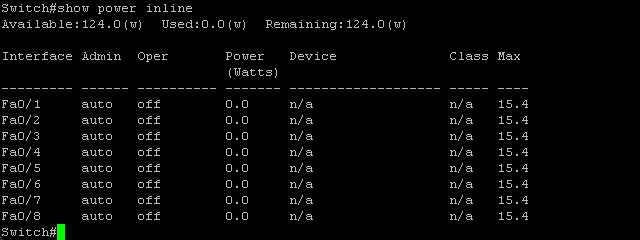
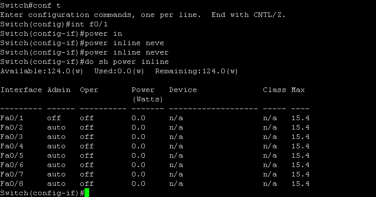

# Power over Ethernet #

PoE可以以乙太網路線來提供無線網路控制器、IPPhone和Cammera等裝置電源

## Management Modes ##

```
auto - 自動檢測連接設備是否需要電源，若發現連接設備的端口擁有足夠的功率，會授予端口足夠的功率為設備供電，若功率超過系統預算，會拒絕功率，確保電源關閉並生成日誌信息
static - 預先分配端口配置最大瓦數的電源給端口，並保證端口有可用電源
never - 關閉端口PoE功能和設備檢測，此端口僅為數據端口
``` 

## 查看PoE ##

查看PoE，下圖可以看到可用為124W，還未使用所以使用率為0W，剩餘124W以及每個Port使用的瓦數和最高瓦數

```
show power inline 
```



## 關閉端口PoE ##

下圖可以看到F0/1已被關閉

```bash
int f0/1
    power ineline never 
```



## Reference ##

https://www.cisco.com/en/US/docs/switches/lan/catalyst3850/software/release/3.2_0_se/multibook/configuration_guide/b_consolidated_config_guide_3850_chapter_011010.html#con_1901925