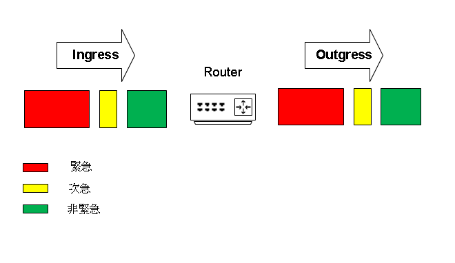

# Cisco IOS queuing #

## First In First Out(FIFO) or First come First Service(FCFS) ##

預設方式，先進先出，不管是否緊急依照先進Queue的封包先出



## Priority Queuing(PQ) ##

優先級對列，流量轉發依照優先級，High轉發完成之後才會轉發Medium，接著是Normal和Low，例如將語音流量放到High，就可保證網路在發生壅塞時能夠最優先傳遞語音流量，缺點是如果一直有語音流量要傳出，其他流量就會卡在Queue中無法被傳出，可以保證語音能夠通信，但無法保證其餘流量的通信


```bash
class-map VoIP
    mtach ip dscp ef
class-map BE
    match ip dscp default 
policy-map POLICY1
    
    
```

## Custom Queuing(CQ) ##


## Weighted Fair Queuing(WFQ) ##


## Low Latency Qqueuing(LLQ) ##


## Weighted Round Robin Queuing(WRRQ) ##

