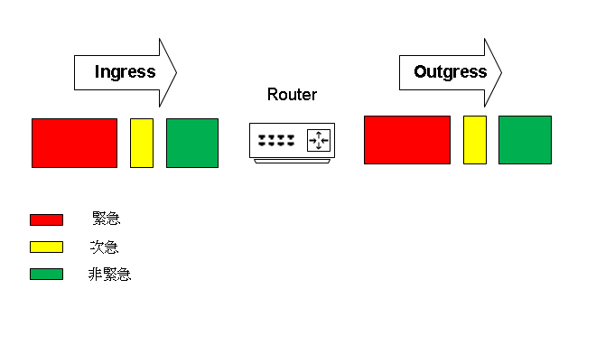

# Quality of Service #

[簡介](#簡介)

[頻寬不足的解決方案](#頻寬不足的解決方案)

[Qos Models](#qos-models)
- [Best Effort](#best-effort)
- [IntServ](#intserv) 
- [DiffServ](#diffserv)

[分類標記](#分類標記) 
- [IPP](#font-colorblack-stylebackgrounda5a5a5ip-precedenceipp-ip優先級font)
- [DSCP](#font-colorblack-stylebackgrounda5a5a5differentiated-services-code-pointdscp-差異化服務代碼點font)
- [ToS換算公式](#tos換算公式)

[Qos機制](#qos-mechanisms)
- [classification](#classification-分類)
- [marking](#marking-標記)
- [congestion-management](#congestion-management-壅塞管理)
- [congestion-avoidance](#congestion-avoidance-壅塞避免)
- [policing and shaping](#policing-and-shaping-管制和整形)
- [link-efficiency](#link-efficiency-鍊路效率)


[Qos Queuing](#qos-queuing)
- [FIFO](#first-in-first-outfifo)
- [WFQ](#weighted-fair-queuingwfq)
- [CBWFQ](#class-based-weighted-fair-queueingcbwfq)
- [LLQ](#low-latency-queuellq)

[Tail Drop](#tail-drop)

[WRED](#weighted-random-early-detectionwred)

[Qos配置](#qos配置)


## 簡介 ##
    
在有限的頻寬下，Qos可以保證需要流量的服務能夠優先通過，例如在語音服務中，用戶對於延遲較為敏感，若是在通話時延遲甚至斷開連線，用戶體驗將會大受影響，但一般傳輸資料時或者查看網頁時，掉幾個包還算可以接受，所以需要使用Qos設定出優先順序，讓需要的封包能夠優先通行

## 頻寬不足的解決方案 ##

1. 升級線路，但花費也會增加
2. 優先轉發重要頻寬
3. 壓縮2層訊匡
4. 壓縮3層IP表頭
	
## QoS Models ##    

### Best effort ###

預設值，盡力而為，不區分任何流量，同等對待所有封包，例如FIFO<br>
Benefits 

1. 不需要特別處理封包

Drawbacks

1. 服務品質無保證
2. 無服務區分性
		
### Integrated Services(IntServ) 綜合服務  ###

預留網路資源，讓封包通過時有足夠資源提供服務，但一般流量無法使用此預留路線，例如RSVP

### Differentiated Services(DiffServ) 區分服務 ###

不預留網路資源，當流量暢通時，所有流量都可以使用線路，當發生雍塞(Congestion)時，才會分類按照優先度進行流量管制
 
## 分類標記 ##

在IP標頭的ToS欄位標記封包的優先權，ToS長度為8bit，可選擇使用IPP(前3個Bit)或者DSCP(前6個Bit)

### IP Precedence(IPP) IP優先級 ###

在IP標頭的Tos(Type of Service)欄位的前3bit寫入優先級

| IPP  | binary  | Decimal | RFC分類 |
| --- |  ---  | --- | --- |
| Routine | 000 | 0 | Best Effort Data 盡力而為 |
| Priority | 001 | 1 | Medium Priority Data 中等優先順序 |
| Immediate | 010 | 2 | High Priority Data 高等優先順序 |
| Flash | 011 | 3 | Call Control/Signaling |
| Flash Override | 100 | 4 | Video 影像 |
| Criticla | 101 | 5 | VoIP 基於IP的語音服務|
| Internetwork Control | 110 | 6 | Internetworking/Routing 繞送|
| Network Control | 111 | 7 | Reserved 預留的 |

### Differentiated Services Code Point(DSCP) 差異化服務代碼點 ###

使用ToS欄位，前3bit用來判斷重要性，4~5bit代表Drop Preferences，第6bit目前未使用所以保持為0，在DSCP中AF值不存在差異，除非經過不支援DSCP的Software Queuing系統，就會有分別，所以習慣看成AF4x比AF1x重要，當網路壅塞時，Drop Preferences越大就越傾向Drop，因此在同一AF內AF13比AF11差，較容易被Drop

| 分類名稱 | 次分類 | binary | Decimal | Cisco recommended |
| --- | --- | --- | --- | --- |
| DF |  | 000000 | 0 | Best Effort |
| CS1 |  | 001000 | 8 | Scavenger |
| AF1 | AF11 | 001010 | 10 | Bulk Data |
|  | AF12 | 001100 | 12 | Bulk Data |
|  | AF13 | 001110 | 14 | Bulk Data |
 CS2 |  | 010000 | 16 | Admin System |
| AF2 | AF21 | 010010 | 18 | Transaction Data |
|  | AF22 | 010100 | 20 | Transaction Data |
|  | AF23 | 010110 | 22 | Transaction Data |
| CS3 |  | 011000 | 24 | Signling |
| AF3 | AF31 | 011010 | 26 | Multimedia Streaming |
|  | AF32 | 011100 | 28 | Multimedia Streaming |
|  | AF33 | 011110 | 30 | Multimedia Streaming |
| CS4 |  | 100000 | 32 | Real-time Interactive |
| AF4 | AF41 | 100010 | 34 | Multimedia Conferencing |
|  | AF42 | 100100 | 36 | Multimedia Conferencing |
|  | AF43 | 100110 | 38 | Multimedia Conferencing |
| CS5 |  | 101000 | 40 | Broadcast Video |
| EF |  | 101110 | 46 | VoIP Telephony |
| CS6 |  | 110000 | 48 | Network Control |
| CS7 |  | 111000 | 56 | Reserved |

>可使用公式快速計算出AF十進位值 AFxy = (8*x)+(2*y)

### Per-Hop Behaviors 每一跳的行為 ###

Default PHB 預設
- 六個bit全為0
- FIFO
- 每一個封包平等對待

EF Expedited Forwarding 加速轉發
- 確保最低延遲
- 保證頻寬可優先轉發
- 該類別流量不可超過保證頻寬，超過將被Drop
- 常使用於Voice或影音等對延遲較為敏感的服務 

AF Assured Forwarding 保證轉發
- 保證頻寬
- 當網路未發生壅塞時，允許佔用額外的頻寬
- 有四個標準類(AF1~4)

Class-Selector(CS) 類別選擇
- 相容IPP
- CS越大，優先權越高
- CS0~7 = IPP0~7

### ToS換算公式 ###

	ToS = 8bit
	IPP只取前3bit，轉換為Tos公式為前3bit的值*32
	DSCP只取前6bit，轉換為Tos公式為前6bit的值*4
	例如：
	ToS = 10000000
	IPP = 100，取得值後再\*32就會是ToS的值，所以公式為4*32 = 128
	DSCP = 100000，取得值後再\*32就會是ToS的值，所以公式為32*4 = 128

## Qos Mechanisms ##

### Classification 分類 ###

- Access list
- IP precedence value 
- IP DSCP value
- Qos group number
- MPLS experimental bits
- Protocol (including NBAR)
- IEEE 802.1Q/ISL CoS
- Priority values
- Input Interface
- Source Mac Address
- Destination Mac Address
- RTP(UDP) port range
- Any packet

### Marking 標記 ###

根據不同流量對每個封包進行標記

### Congestion Management 壅塞管理 ###

根據每個封包上的標記，將封包放置到對應的Queue當中

### Congestion Avoidance 壅塞避免 ###

當預先定義的隊列達到限制的閥值，壅塞避免可能隨機丟棄封包，或是在更早的時候開始丟棄封包，避免壅塞

### Policing and Shaping 管制和整形 ###

Policing 管制 - 達到限制的閥值時，丟棄封包<br>
Shaping 整形 - 達到限制的閥值時，先將封包放入緩存，此緩存大小與記憶體有關，等有空閒時，再進行發送
### Link Efficiency 鍊路效率 ###

Compression 壓縮 - 壓縮表頭可以有效的降一語音傳輸的流量消耗，發送端只須在開始時傳送一個完整的表頭，之後重複的內容可以不傳<br>
Link Fragmentation and Interleaving 鍊路分片和交互 - 當兩個60byte的語音封包中間夾了一個1500byte的封包時，在第一個語音封包傳送後，第二個語音封包要傳送須等待1500byte的封包通過才可傳送，就會造成延遲，所以鍊路分片語交互就是用來將長的封包分成短的，並且和語音封包交互傳送，減少傳送之間的間隔

## Qos Queuing ## 

### First In First Out(FIFO) ###

預設方式，先進先出，不按照優先順序


 
### Weighted Fair Queuing(WFQ) 加權公平對列###
    
Scheduler 調度器<br>	
Traffice Flow 流量<br>
當流量未爆滿時，不會建立Software Queue<br>


當流量爆滿時，WFQ會按照Traffice Flow的數量產生Software Queue，並根據IPP計算出每條Flow的weight，Scheduler從Software Queue拿出Packet的次數為反比，即是weight越大，拿出packet的次數越少，weight越小，拿出packet的次數越多
    

    
理論上每條Queue只服務一條Traffic Flow，除非Traffic Flow數量超過Max Queue(預設為64條)，這時候不同的Flow才會被安排在同一條Queue，Cisco Router是透過此公式計算Weight的32384/(IPP+1) = weight
		
	例如IPP=7
		
	32384/(7+1) = 4048 
		
	所以IPP = 7的weight為4048，IPP越高則weight越小，就可以得到越好的服務質量，相反IPP越小則weight越大，就不會獲得好的服務質量
    
### Class-based Weighted Fair Queueing(CBWFQ) ###
    
基於類別的加權公平對列

	相對於WFQ自動建立Software Queue，CBWFQ可以預先建立不同的Queue並設定Bandwidth，每秒Scheduler在Class 1抓取100K，在Class 2抓取200K，另外，在Class Default中包含了一個WFQ
		

    

### Low Latency Queue(LLQ) ###

低延遲對列

	只要Hardware Queue有空間，Scheduler必先從LLQ拿取Packet，接著才會依照優先權抓取Class 2，Class 3的Packet


### 建立方法 ###

先建立class-map接著在policy-map設定Bandwidth(CBWFQ)，和Priority(LLQ)

```powershell
policy-map CBLLQ
	class CLASS-EF
		priority 50000 #單位為Kbps
	class CLASS-AF11
		bandwidth 20000 #單位為Kbps
	class CLASS-AF43
		bandwidth 20000
	class CLASS-default
		bandwidth 10000
```

也可以使用percent百分比來計算Bandwidth，總數不能超過100

```powershell
policy-map CBLLQ
	class CLASS-EF
		priority percent 50
	class CLASS-AF11
		bandwidth percent 20
	class CLASS-AF43 
		bandwidth percent 20
	class CLASS-default
		bandwidth percent 10
```

bandwidth remaining percent 

將Priority的頻寬扣掉之後再照百分比算出頻寬

```powershell
policy-map CBLLQ
	class CLASS-EF
		priority 50000
	class CLASS-AF11
		bandwidth remaining percent 20
	class CLASS-AF43 
		bandwidth remaining percent 20
	class CLASS-default
		bandwidth remaining percent 10
```

## Tail Drop ##

## Weighted Random Early Detection(WRED) ##

加權隨機先期檢測

可按照IPP或DSCP設定不同的Drop Policy 

#### Minimum Threshold ###

最低筏值

當Queue長度達到多少開始Drop

### Probability Denominator ###

概率分母

會Drop多少Packet，如把Probability Denominator設定為10，就會從Queue中每10個Packet隨機選一個Drop

### Maximum Threshod ###

最高筏值

當Queue過了最高筏值，就強制Tail Drop

### 設定WRED ###

在policy-map中加入random-detect，預設使用IPP，LLQ不可設定WRED

```powershell
policy-map CBLLQ
	class CLASS-EF
		priority 50000 #LLQ不可設定
	class CLASS-AF11
		bandwidth remaining percent 20
		random-detect 
	class CLASS-AF43 
		bandwidth remaining percent 20
		random-detect 
	class CLASS-default
		bandwidth remaining percent 10
		random-detect 
```

### 修改WRED ###

```powershell
#IPP
random-detect precedence <IPP> <Minimum Threshold> <Maximum Threshold> <Probability Denominator >
#DSCP
random-detect dscp <class> <Minimum Threshold> <Maximum Threshold> <Probability Denominator>
```
## Qos配置 ##

### Classification不同方式配置 ###

### Access list ###

```bash
access-list 100 permit tcp any any lt 1024 #比對常見服務
class-map Common-Services #建立class-map並套用ACL
    match access-group 100
```
### IP precedence value ###

```bash
class-map IPP
    match ip precedence <0-7>
	match ip precedence 1 #等同於DSCP CS1
```
### IP DSCP value ###

```bash
class-map dscp 
    match dscp 1 #批配IPv4和IPv6
	match ip dscp 1 #指定批配IPv4
	match ip dscp AF11 AF12 AF13 CS6
```
### Qos group number ###

設備不支援IPP也不支援DSCP時可以使用
```bash
access-list 100 permit ip 192.168.1.0 0.0.0.255 any #比對流量
class-map qosgroup 
    match access-group 100
policy-map qosgroup
    class qosgroup
	set qos-group 1
class-map Test
    match qos-group 1
int f0/0
    service-policy input qosgroup 
```
### MPLS experimental bits ###
```bash

```
### Protocol (including NBAR) ###
```bash

```
### IEEE 802.1Q/ISL CoS ###
```bash

```
### Priority values ###
```bash

```
### Input Interface ###

```bash

```
### Source Mac Address ###

```bash

```
### Destination Mac Address ###

```bash

```
### RTP(UDP) port range ###

```bash

```
### Any packet ###

```bash

```
