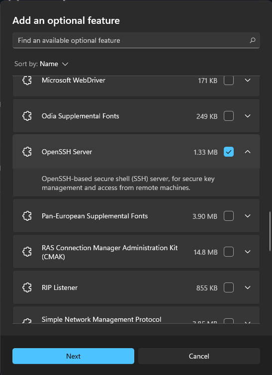

# 備份和還原 #

## [備份](#備份) ##

- [使用TFTP進行備份](#使用tftp進行備份) 

- [使用SCP進行備份](#使用scp進行備份) 

## [還原](#還原)


## 備份 ##

## 使用TFTP進行備份 ##

```bash
copy running-config tftp: #複製running-config到TFTP Server
Address or name of remote host[]?192.168.1.100 #TFTP Server IP
Destination filename[Router-config]? #傳至TFTP Server的檔名，可自行更改
```

## 使用SCP進行備份 ##

    在Server開啟SSH功能，以下會寫出Windows以及Linux開啟OpenSSH Server的方法

### Windows ###

下面以Win11作為示範，Win10操作方法類似，點選左下角Windows Icon後選擇setting 


點選左邊的Apps


選擇optional features


點選View features並找到OpenSSH Server


勾選並安裝即可



### Linux ###

安裝套件，以下以Ubuntu進行示範

```bash
sudo apt -y install openssh-server
systemctl start sshd #開啟服務
```

### 開始備份 ###

在Server都開啟SSH後，就可以進行備份

```bash
copy startup-config scp:C:\Users\user1\ #將startup-config copy至scp server，因此練習沒有特別安裝SCP Server軟體，以本機開啟服務作為SCP Server所以須指定目的地路徑，若有安裝軟體的話在軟體中選擇目的地路徑，並使用scp:即可
Address or name of remote host []? 10.1.1.100 #scp server IP
Destination username [SW1]? user1 #使用者名稱，輸入本機使用者即可，若是沒有密碼需新增密碼
Destination filename [C:\Users\user1\]? backup_ios #目的地檔名
```


## 還原 ##

若是因為系統損壞進入rommon mode的話，可使用以下方式修復

```bash
IP_ADDRESS=192.168.1.1 #Router IP
IP_SUBNET_MASK=255.255.255.0 #遮罩
DEFAULT_GATEWAY=192.168.1.1 #預設閘道
TFTP_SERVER=192.168.1.100 #TFTP Server IP
TFTP_FILE=c1841-adventerprisek9-mz.151-4.M.bin #要從TFTP載下來的系統檔
#以上都配置好以後使用以下指令下載
tftpdnld
#詢問是否繼續，輸入Yes
Do you wish to continue? y/n: [n]: yes
#跑完以後開機
boot
```