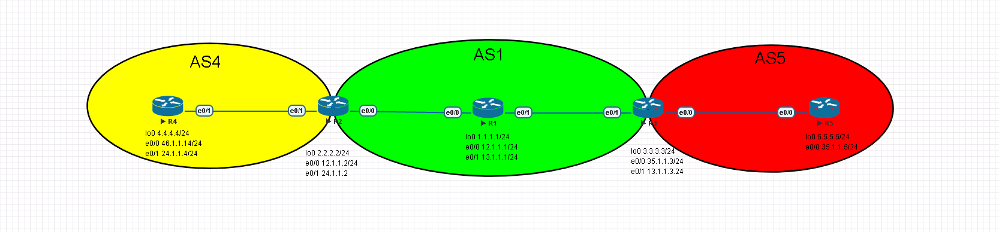
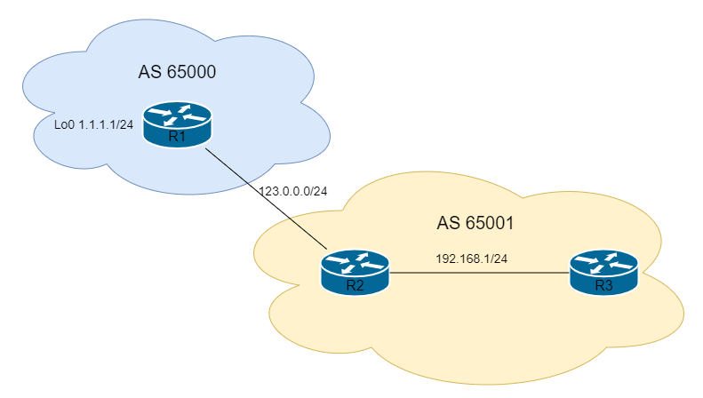

# BGP Configuration #

## 基本配置 ##

```bash
router bgp 1 #配置BGP ASN 1
    bgp router-id 1.1.1.1 #Router-ID為1.1.1.1
    neighbor 123.0.1.1 remote-as 1 #鄰居IP以及鄰居的ASN
    network 192.168.1.0 mask 255.255.255.0 #通告路由，跟OSPF、EIGRP和RIP等IGP不同，BGP的Network不是通告介面，而是只要路由表中有的，不管從甚麼路由協定拿到的路由，就算介面中沒有，也可以通告出來
```

>若是兩點之間有其他網路設備使兩點無法建立鄰居，可使用Multihop指令將兩個Router連起來

```bash
neighbor 123.0.1.1 ebgp-multihop 2 #2為最大跳躍數，就是兩台Router中間相隔的Hop數目，依照實際情況更改
```

## 使用Loopback做為鄰居IP ##



在IBGP中，使用Loopback做為鄰居IP可避免因實體介面關閉而Down掉導致無法路由，因IGP中通常會配置其他IGP(RIP,OSPF,EIGRP等...)，所以可使用這種方法，此方法較少使用於EBGP，因為eBGP並不會使用IGP將兩個AS連起來，例如上圖R2與R3要建立BGP的鄰居關係，直接使用平常的作法在R2輸入neighbor 3.3.3.3 remote-as 1的話是無法建立起鄰居的，因R2的來源位置為12.1.1.1，但R3使用的鄰居IP為R2的lookback位址2.2.2.2，所以無法建立起鄰居，這時就需要多加一行update-source更改來源位置為lookback介面，即可建立起鄰居，做一邊鄰居即可建立起來，不過建議最好是兩邊都做

```bash
R2#
router bgp 1
    neighbor 3.3.3.3 remote-as 1 
    neighbor 3.3.3.3 update-source loopback 0
R3#
router bgp 1
    neighbor 2.2.2.2 remote-as 1
    neighbor 3.3.3.3 update-source loopback 0
#另外，若是要在eBGP中使用loopback介面作為鄰居IP的話，需多一行命令，例如R3和R5建立BGP鄰居
R3#
router bgp 1
    neighbor 5.5.5.5 remote-as 5
    neighbor 5.5.5.5 update-source loopback 0 
    neighbor 5.5.5.5 ebgp-multihop 2 #因預設bgp封包的ttl為1，所以如果再eBGP的環境中只到介面就沒了，要到loopback介面，還需要一跳，所以需增加ttl值，此命令可將ttl設定為0-255的值，可依照實際環境進行增減，不指定值直接Enter的話為255，此狀況只有eBGP才會發生，IBGP的預設ttl為255
#且要是無法抵達對方的loopback位置，可寫靜態路由
ip route 5.5.5.5 255.255.255.255 35.1.1.5 
```

## Next-Hop-Self ##



再BGP中是以AS為單位，以上圖來說，當R1使用network命令將1.1.1.0路由發佈出來時，R3收到的BGP路由符號會顯示* i，沒有>，原因是因為Next-Hop是123.0.0.1也就是R1，但R3並沒有路由達到R1，所以不會被放進路由表，R3沒有路由能夠達到R1，所以需使用next-hop-self來將R3的next-hop修改成R2，或者是使用OSPF、EIGRP等IGP發放預設路由，使R3能夠達到R1

```bash
#R2 
router bgp 65001 
    neighbor 192.168.1.3 next-hop-self 
```

## Peer Group ##

>若有多個Neighbor要做相同設定，可使用Peer Group來簡化

```bash
router bgp 1
    neighbor group1 peer-group #配置peer group名稱為group1
    neighbor group1 remote-as 1 #設定ASN
    neighbor group1 password Cisco123 #設定密碼
    neighbor 1.1.1.1 peer-group group1 #套用peer group
    neighbor 2.2.2.2 peer-group group1 #套用peer group 
    neighbor 3.3.3.3 peer-group group1 #套用peer group
```

## 查詢指令 ##

```bash
show ip bgp summary #查看bgp鄰居
show ip bgp #查看bgp表
```

## Reference ##

https://www.jannet.hk/border-gateway-protocol-bgp-zh-hant/