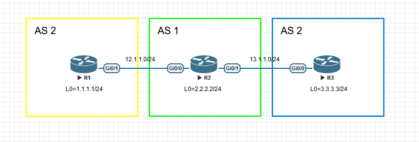
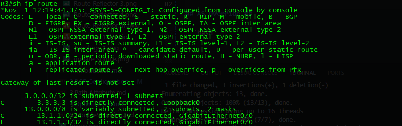
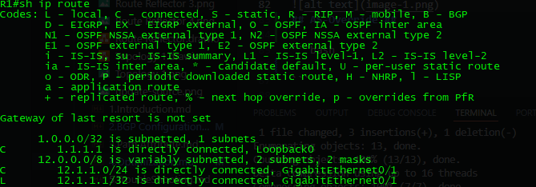
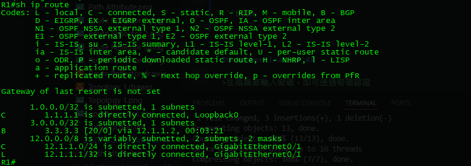
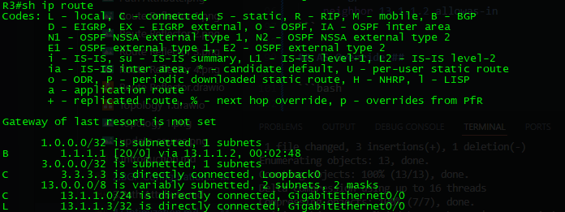

# Optimization # 

- [Optimization](#optimization)
  - [Auto-Summary](#auto-summary)
  - [Aggregate](#aggregate)
    - [使用](#使用)
    - [使用Aggregate-address](#使用aggregate-address)
  - [Allowas-in](#allowas-in)
  - [AS-Override](#as-override)
  - [Authentication](#authentication)
  - [Reference](#reference)


## Auto-Summary ##


關閉auto-summary會攜帶Next-Hop以及Metric值，並且不會進行彙總，以上圖為例，在R1配置了一條靜態路由ip route 3.3.3.3 255.255.255.255 12.1.1.3 

預設開啟自動彙總，可以看到收到3.0.0.0的匯總路由


```bash
no auto-summary
```

關閉自動彙總後，3.0.0.0的彙總路由變成了明細路由，並且下一跳為R1


## Aggregate ## 

BGP要進行路由匯總有幾種方法</br>
- 使用
- 使用aggregate-address 

>BGP在進行路由匯總時要注意進行匯總的路由器本身需要具備至少一條匯總路由內的路由

### 使用 ###

從[2.BGP Configuration](2.BGP%20Configuration.md)可以知道BGP的network指令是將路由表有的路由給發佈出去，而不是發佈介面的網段，所以假設今天有192.168.1.0/24、192.168.2.0/24、192.168.3.0/24、192.168.4.0/24這四條路由想要彙總成一條的話需要這樣寫

```bash

```

### 使用Aggregate-address ### 

```bash
router bgp 65001 
    aggregate-address 192.168.0.0 255.255.252.0 
```

使用以上命令後從接收的路由器會發現原本/24的路由被匯總成/22的路由，但明細路由還是發佈出去了，如果不想要收到明細路由，要加上summary-only 

```bash
router bgp 65001
    aggregate-address 192.168.0.0 255.255.252.0 summary-only 
```

## Allowas-in ##

預設BGP無法接收到相同AS的路由，為了避免路由迴圈，但也可使用allowas-in讓相同AS的路由器能夠接收到對方的路由



```bash
[R1]
router bgp 2
    neighbor 12.1.1.2 remote-as 1 
    network 1.1.1.1 mask 255.255.255.255
[R2]
router bgp 1
    neighbor 12.1.1.1 remote-as 2 
    neighbor 13.1.1.3 remote-as 2 
[R3]
router bgp 2
    neighbor  13.1.1.2 remote-as 1 
    network 3.3.3.3 mask 255.255.255.255 
```

查看R1和R3的路由表看不到對方的loopback路由





在R1與R3開啟allowas-in後再次查看路由表

```bash
[R1]
router bgp 2
    neighbor 12.1.1.2 allowas-in 
[R3]
router bgp 2
    neighbor 13.1.1.2 allowas-in 
```
再次查看R1和R3的路由表就可以看到已經接收到對方的Loopback路由了





## AS-Override ##

```bash

```

## Authentication ##

>在兩端都輸入密碼，即可透過密碼認證

```bash
router bgp 1
    neighbor 8.8.8.8 password Cisco123
```

## Reference ##

AS-Override https://community.cisco.com/t5/networking-knowledge-base/understanding-bgp-as-override-feature/ta-p/3111967