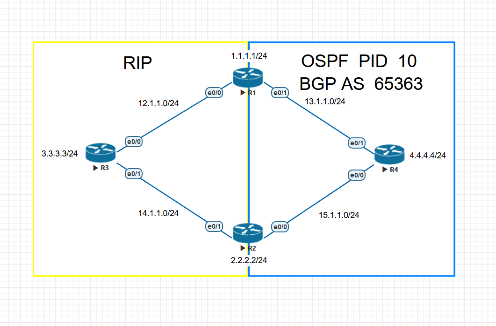
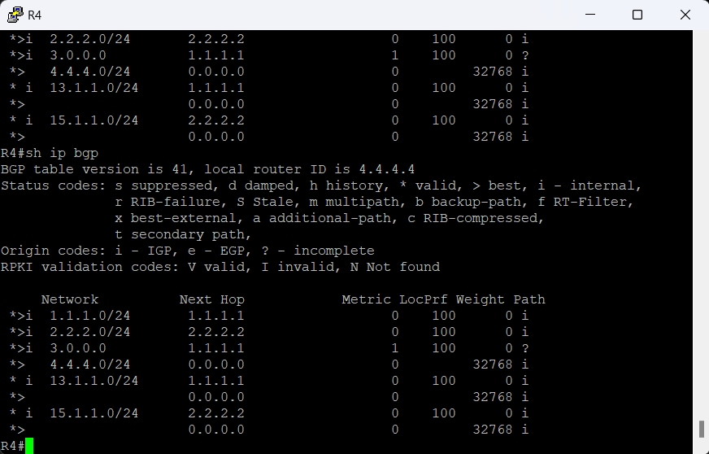
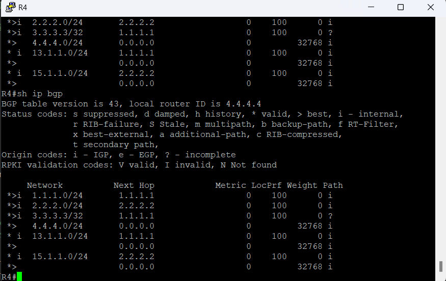

# Optimization # 

## no auto-summary ##



關閉auto-summary會攜帶Next-Hop以及Metric值，並且不會進行彙總，以上圖為例，在R1配置了一條靜態路由ip route 3.3.3.3 255.255.255.255 12.1.1.3 

預設開啟自動彙總，可以看到收到3.0.0.0的匯總路由



```bash
no auto-summary
```

關閉自動彙總後，3.0.0.0的彙總路由變成了明細路由，並且下一跳為R1



## Aggregate ## 

BGP要進行路由匯總有幾種方法</br>
- 使用
- 使用aggregate-address 

>BGP在進行路由匯總時要注意進行匯總的路由器本身需要具備至少一條匯總路由內的路由

### 使用 ###

從[2.BGP Configuration](2.BGP%20Configuration.md)可以知道BGP的network指令是將路由表有的路由給發佈出去，而不是發佈介面的網段，所以假設今天有192.168.1.0/24、192.168.2.0/24、192.168.3.0/24、192.168.4.0/24這四條路由想要彙總成一條的話需要這樣寫

```bash

```

### 使用Aggregate-address ### 

```bash
router bgp 65001 
    aggregate-address 192.168.0.0 255.255.252.0 
```

使用以上命令後從接收的路由器會發現原本/24的路由被匯總成/22的路由，但明細路由還是發佈出去了，如果不想要收到明細路由，要加上summary-only 

```bash
router bgp 65001
    aggregate-address 192.168.0.0 255.255.252.0 summary-only 
```

## Route Reflector ## 

為了解決iBGP水平分割的問題(iBGP接收到路由不會傳給另一個iBGP Peers)，BGP可藉由開啟Route Reflector來讓iBGP的路由能夠透過Route Reflector傳遞出去


```bash
router bgp 1 
    neighbor 1.1.1.1 route-reflector-client 
    neighbor 3.3.3.3 route-reflector-client 
```

## 密碼驗證 ##

>在兩端都輸入密碼，即可透過密碼認證

```bash
router bgp 1
    neighbor 8.8.8.8 password Cisco123
```