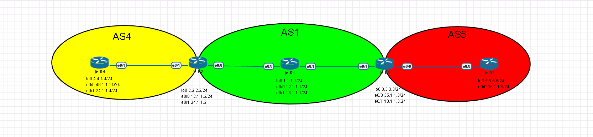

# BGP Configuration #

## 基本配置 ##

>因BGP可調整的東西非常多，以下列出常見的幾種

```bash
router bgp 1 #配置BGP ASN 1，ASN的範圍為1-4294967295
    bgp router-id 1.1.1.1 #Router-ID為1.1.1.1
    neighbor 123.0.1.1 remote-as 1 #鄰居IP以及鄰居的ASN
    network 192.168.1.0 mask 255.255.255.0 #宣告網段
```

>若是兩點之間有其他網路設備使兩點無法建立鄰居，可使用Multihop指令將兩個Router連起來

```bash
neighbor 123.0.1.1 ebgp-multihop 2 #2為最大跳躍數，就是兩台Router中間相隔的Hop數目，依照實際情況更改
```

## 優化 ##

### 使用Loopback做為鄰居IP ###



>在IBGP中，使用Loopback做為鄰居IP可避免因實體介面關閉而Down掉導致無法路由，因IGP中通常會配置其他IGP(RIP,OSPF,EIGRP等...)，所以可使用這種方法，此方法較少使用於EBGP，因為eBGP並不會使用IGP將兩個AS連起來，例如上圖R2與R3要建立BGP的鄰居關係，直接使用平常的作法在R2輸入neighbor 3.3.3.3 remote-as 1的話是無法建立起鄰居的，因R2的來源位置為12.1.1.1，但R3使用的鄰居IP為R2的lookback位址2.2.2.2，所以無法建立起鄰居，這時就需要多加一行update-source更改來源位置為lookback介面，即可建立起鄰居，做一邊鄰居即可建立起來，不過建議最好是兩邊都做

```bash
R2#
router bgp 1
    neighbor 3.3.3.3 remote-as 1 
    neighbor 3.3.3.3 update-source loopback 0
R3#
router bgp 1
    neighbor 2.2.2.2 remote-as 1
    neighbor 3.3.3.3 update-source loopback 0
```

### 密碼驗證 ###

>在兩端都輸入密碼，即可透過密碼認證

```bash
router bgp 1
    neighbor 8.8.8.8 password Cisco123
```

### Peer Group ###

>若有多個Neighbor要做相同設定，可使用Peer Group來簡化

```bash
router bgp 1
    neighbor group1 peer-group #配置peer group名稱為group1
    neighbor group1 remote-as 1 #設定ASN
    neighbor group1 password Cisco123 #設定密碼
    neighbor 1.1.1.1 peer-group group1 #套用peer group
    neighbor 2.2.2.2 peer-group group1 #套用peer group 
    neighbor 3.3.3.3 peer-group group1 #套用peer group
```

## 查詢指令 ##

```bash
show ip bgp summary #查看bgp鄰居
```

## 參考文章 ##

[https://www.jannet.hk/border-gateway-protocol-bgp-zh-hant/](https://www.jannet.hk/border-gateway-protocol-bgp-zh-hant/)