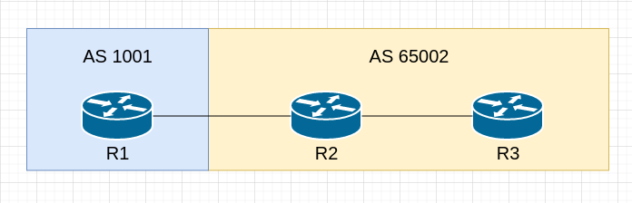

# Border Gateway Protocol 邊界閘道協定 #

## 簡介 ##

>BGP通常應用於大型網路當中，例如ISP之間的路由交換，因BGP有多種可調整的屬性，跟以往學到的OSPF，EIGRP比起來相對困難

## 類型 ##

>BGP分為兩種類型分別為IBGP與EBGP

    IBGP - 於相同的AS組成Peers，就稱為IBGP Peers
    EBGP - 於不同的AS組成Peers，就稱為EBGP Peers
    以上圖為例，R2連接R2的介面會組成IBGP Peers，而R1連接R2的介面會組成EBGP Peers

## AS Number ## 

    AS Number也分為公有以及私有
    公有範圍為0-64511需申請才可使用
    私有範圍為64512-65535

## Peer成立條件 ##

    BGP預設keepalive interval為60秒，hold time為180秒
    在BGP裡，把Neighbors稱作Peers，Peers，與IGP(RIP,OSPF,EIGRP等...)不同，BGP使用TCP 179 Port進行溝通，BGP要建立Peers只須達成以下條件
    1.Peer之間的連通性
    2.Autonomous System Number相同

## BGP message types ##

BGP和EIGRP與OSPF不同，EIGRP和OSPF使用Hello封包進行鄰居的建立以及保持連線，BGP將鄰居的建立與保持連線拆分為兩個信息，分別是Open與Keepalive

    Open - 建立鄰居時發送的信息，包含hold time和rotuer ID
    Keepalive - 用於保持BGP連線狀態
    Update - 路由更新信息，包含路徑屬性與網段信息
    Notification - 當檢測到錯誤信息或者BGP連線中斷時會發出的信息

