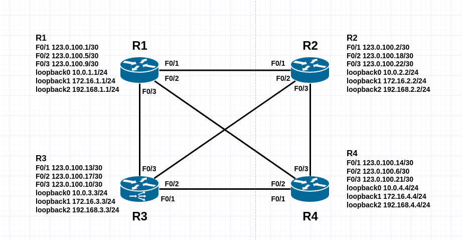

# Border Gateway Protocol 邊界閘道協定 #

## 簡介 ##

>BGP通常應用於大型網路當中，例如ISP之間的路由交換，因BGP有多種可調整的屬性，跟以往學到的OSPF，EIGRP比起來相對困難，因此使用實例讓大家能夠較好理解BGP

## 類型 ##

>BGP分為兩種類型分別為IBGP與EBGP


    IBGP - 於相同的AS組成Peers，就稱為IBGP Peers
    EBGP - 於不同的AS組成Peers，就稱為EBGP Peers
    以上圖為例，R2連接R2的介面會組成IBGP Peers，而R1連接R2的介面會組成EBGP Peers

## Peer成立條件 ##

    BGP預設keepalive interval為60秒，hold time為180秒
    在BGP裡，把Neighbors稱作Peers，Peers，與IGP(RIP,OSPF,EIGRP等...)不同，BGP使用TCP 179 Port進行溝通，BGP要建立Peers只須達成以下條件
    1.Peer之間的連通性
    2.Autonomous System Number相同

## 基本配置 ##

>因BGP可調整的東西非常多，以下列出常見的幾種，其餘的請自行Google

```bash
router bgp 1 #配置BGP ASN 1，ASN的範圍為1-4294967295
    bgp router-id 1.1.1.1 #Router-ID為1.1.1.1
    neighbor 123.0.1.1 remote-as 1 #鄰居IP以及鄰居的ASN
    network 192.168.1.0 mask 255.255.255.0 #宣告網段
```

## 優化

### 使用Loopback做為鄰居IP ###

>在IGP中，可使用Loopback做為鄰居IP，因Loopback為邏輯端口，會永遠開啟，且IGP中通常會配置其他IGP(RIP,OSPF,EIGRP等...)，可防止因為介面關閉導致無法路由，此方法較少使用於EBGP，因為eBGP並不會使用IGP將兩個AS連起來

```bash
router bgp 1
    neighbor 8.8.8.8 remote-as 1 #IP要跟改為Loopback位置
    neighbor 8.8.8.8 update-source loopback0
```

### 密碼驗證 ###

>在兩端都輸入密碼，即可透過密碼認證

```bash
router bgp 1
    neighbor 8.8.8.8 password Cisco123
```

### Peer Group ###

>若有多個Neighbor要做相同設定，可使用Peer Group來簡化

```bash
router bgp 1
    neighbor group1 peer-group #配置peer group名稱為group1
    neighbor group1 remote-as 1 #設定ASN
    neighbor group1 password Cisco123 #設定密碼
    neighbor 1.1.1.1 peer-group group1 #套用peer group
    neighbor 2.2.2.2 peer-group group1 #套用peer group 
    neighbor 3.3.3.3 peer-group group1 #套用peer group
```


## 實例 ##

## Topology ##




## 參考文章 ##

[https://www.jannet.hk/border-gateway-protocol-bgp-zh-hant/](https://www.jannet.hk/border-gateway-protocol-bgp-zh-hant/)