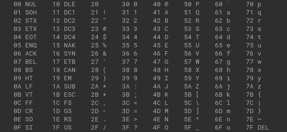

# DHCP #

>每台設備都需要一個IP才可與其他設備進行通訊，若是一間教室有30台電腦，要手動配置30個IP太過於麻煩，所以通常會於網路設備上配置DHCP，讓設備自動配發IP，降低管理難度

## IPv4 DHCP配置方法 ##

```bash
ip dhcp excluded-address 10.1.1.1 10.1.1.10 #要排除的IP，有些IP可能用於閘道或者其餘用途需保留避免IP衝突
ip dhcp pool LAN1 #建立dhcp pool，LAN1為自訂名稱，可自取
    network 10.1.1.0 255.255.255.0 #網段
    default-router 10.1.1.1 #預設閘道
    dns-server 8.8.8.8 #DNS，這裡使用Google的DNS
    domain-name Cisco.com #域名，可寫可不寫
    lease 0 8 #租約時間，天，小時，預設為1天
```

## DHCP Relay ##

```bash
ip helper-address 10.1.1.1 
```

## 保留區 ##



>使用Cisco設備設定保留區要特別注意client-identifier這個參數，參數的內容為cisco- + mac address + -Interface ID轉為hex，可參考上圖，例如PC1的MAC為aaaa.bbbb.cccc，那轉為hex並加上cisco-和-Interface ID後會長這樣0063.6973.636f.2d61.6161.6162.6262.6263.6363.632d.


```bash
ip dhcp pool PC1 #創建一個保留區給PC1
    host 10.1.1.100 255.255.255.0 
    client-identifier 0063.6973.636f.2d 
```

## 參考文章 ##

https://www.jannet.hk/dynamic-host-configuration-protocol-dhcp-zh-hant/

## IPv6 DHCP配置方法 ##

>IPv6的DHCP分為三種SLAAC,stateful,stateless 