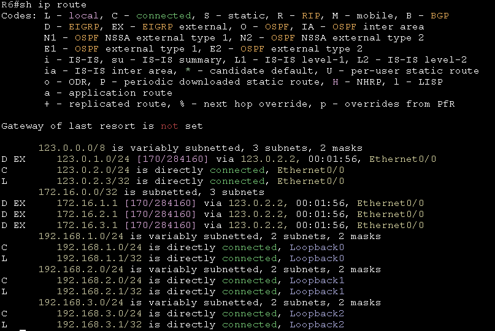
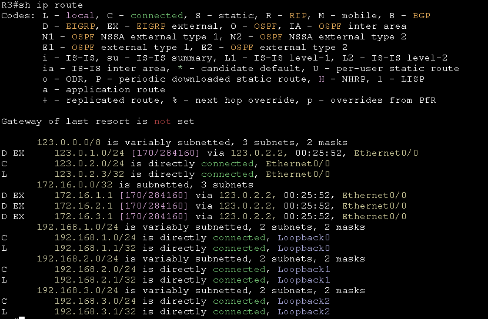
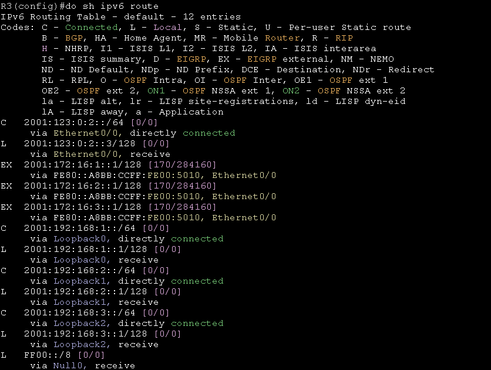
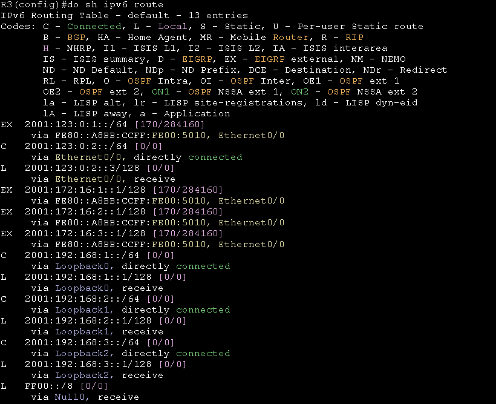

# EIGRP Redistribution # 

EIGRP在進行再發佈其他協定時會需要五個指標，用於計算EIGRP的成本

1. Bandwidth    頻寬，以kilobits為單位
2. Delay        延遲，以microsecond為單位
3. reliability  可靠性，值為0~255 
4. load         鏈路的有效附載，值為0~255
5. MTU          路徑的最小MTU，通常設定為乙太網路的MTU 1500

## Topology ## 



## Tranditional ##

## IPv4 ## 

### 再發佈OSPF到EIGRP ###

```bash
router eigrp 20 
    #                  PID    Bandwidth Delay reliability Load  MTU
    redistribution ospf 10 metric 10000    10         255    1 1500 
```

使用show ip route可以看到代號為EX的就是EIGRP External也就是再發佈進來的路由



## IPv6 ## 

### 再發佈OSPF到EIGRP ### 

與IPv4的做法一樣，只需要再router前面加上ipv6即可，只是IPv6的做法在後面需加上一個include-connected，加上後才會再發佈直連路由，如果沒有加上這個參數，那上面圖片中R2的e0/0的IPv6位置就不會再發佈到R3

```bash 
ipv6 router eigrp 20 
    #                  PID    Bandwidth Delay reliability Load  MTU
    redistribution ospf 10 metric 10000    10         255    1 1500
```

以下兩張圖對比加上include-connected和不加的差別

未加include-connected 



加上include-connected 



可以看出加上include-connected後，R2的e0/0的IPv6位置才會再發佈到R3

## Name Mode ##

### 再發佈OSPF到EIGRP ###

```bash
router eigrp instance1 
    address-family ipv4 unicast autonomous-system 10 
        topology base 
        #                      PID    Bandwidth Delay reliability Load  MTU
            redistribution ospf 10 metric 10000   100         255    1 1500 
    address-family ipv4 unicast autonomous-system 10 
        topology base 
        #                      PID    Bandwidth Delay reliability Load  MTU
            redistribution ospf 10 metric 10000   100         255    1 1500 
```

### 再發佈OSPFv3到EIGRP ###

Name Mode的Redistribution需要再Topology Base中設定，Topology Base提供了許多配置選項，像是redistribution、distance、variance等，下方為redistribution的範例

```bash
router eigrp instance1 
    address-family ipv4 unicast autonomous-system 10 #IPv4再發佈OSPF到EIGRP
        topology base 
            #                    PID    Bandwidth Delay reliability Load  MTU
            redistribution ospfv3 10 metric 10000   100         255    1 1500 
    address-family ipv6 unicast autonomous-system 20 #IPv6再發佈OSPF到EIGRP
        topology base 
            #                  PID    Bandwidth Delay reliability Load  MTU
            redistribution ospf 10 metric 10000    10         255    1 1500 #這邊不用打ospfv3，因為是在IPv6 address-family中
```