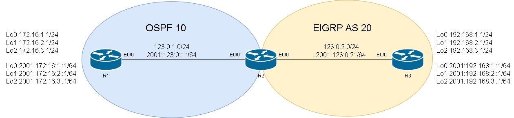

# EIGRP Redistribution # 

EIGRP在進行再發佈其他協定時會需要五個指標，用於計算EIGRP的成本

1. Bandwidth    頻寬，以kilobits為單位
2. Delay        延遲，以microsecond為單位
3. reliability  可靠性，值為0~255 
4. load         鏈路的有效附載，值為0~255
5. MTU          路徑的最小MTU，通常設定為乙太網路的MTU 1500

## Tranditional ##

## IPv4 ## 

### 再發佈OSPF到EIGRP ###

```bash
router eigrp 10 
    #                  PID       Bandwidth Delay reliability Load  MTU
    redistribution ospf 10 metric    10000    10         255    1 1500 
```

使用show ip route可以看到代號為EX的就是EIGRP External也就是再發佈進來的路由



## IPv6 ## 

### 再發佈OSPF到EIGRP ### 


## Name Mode ##

### 再發佈OSPF到EIGRP ###

```bash

```

### 再發佈OSPFv3到EIGRP ###

Name Mode的Redistribution需要再Topology Base中設定，Topology Base提供了許多配置選項，像是redistribution、distance、variance等，下方為redistribution的範例

```bash
router eigrp instance1 
    address-family ipv4 unicast autonomous-system 10 #IPv4再發佈OSPF到EIGRP
        topology base 
            redistribution ospfv3 10 metric 1500 100 255 1 1500 #redistribution後的參數由左至右分別是protocol、process-id、metric、bandwidth-metric、delay-metric、reliability-metric、load-metric、mtu-bytes route-map name，route-map在此範例未用到
    address-family ipv6 unicast autonomous-system 20 #IPv6再發佈OSPF到EIGRP
        topology base 
            redistribution ospf 10 metric 1500 10 255 1 1500 #記得這邊不用打ospfv3，因為是在IPv6下
```