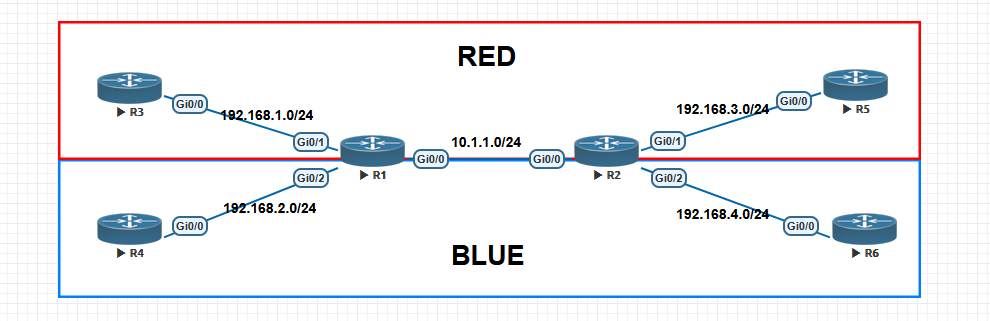
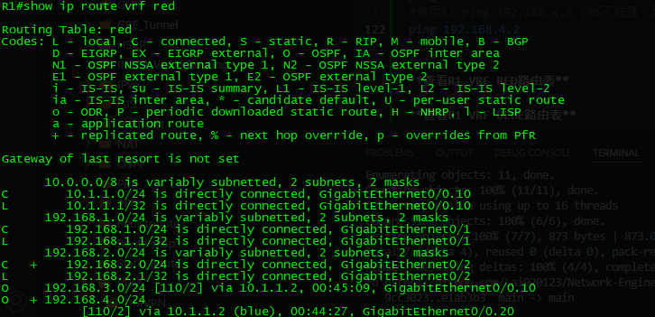
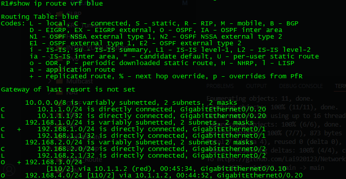

# Easy Virtual Network #

EVN（Easy Virtual Network） 是 Cisco 為 簡化多租戶網路（Multi-Tenant Network） 而開發的技術，主要用於 多 VRF（Virtual Routing and Forwarding）環境。它可以讓網管人員更輕鬆地管理多條邏輯獨立的網路，而不需要繁瑣的 VRF 設定。

## 配置 ##

**Topology**



```bash
[R1]
vrf definition red 
    vnet tag 10 
    address-family ipv4
vrf definition blue 
    vnet tag 20 
    address-family ipv4 
int g0/0
    #只需在一個介面配置vnet trunk即可，不需配置封裝與VRF
    vnet trunk 
    ip address 10.1.1.1 255.255.255.0
    no shutdown 
int g0/1
    vrf forwarding red 
    ip address 192.168.1.1 255.255.255.0
    no shutdown 
int g0/2   
    vrf forwarding blue 
    ip address 192.168.2.1 255.255.255.0
    no shutdown 
router ospf 10 vrf red 
    router-id 1.1.1.1 
    network 192.168.1.0 0.0.0.255 arae 0
    network 10.1.1.0 0.0.0.255 area 0
router ospf 20 vrf blue 
    router-id 1.1.1.1
    network 192.168.2.0 0.0.0.255 area 0
    network 10.1.1.0 0.0.0.255 area 0 
[R2]
vrf definition red 
    vnet tag 10 
    address-family ipv4
vrf definition blue 
    vnet tag 20
    address-family ipv4 
int g0/0
    #只需在一個介面配置vnet trunk即可，不需配置封裝與VRF
    vnet trunk 
    ip address 10.1.1.2 255.255.255.0
    no shutdown 
int g0/1
    vrf forwarding red 
    ip address 192.168.3.1 255.255.255.0
    no shutdown 
int g0/2   
    vrf forwarding blue 
    ip address 192.168.4.1 255.255.255.0
    no shutdown 
router ospf 10 vrf red 
    router-id 1.1.1.1 
    network 192.168.3.0 0.0.0.255 arae 0
    network 10.1.1.0 0.0.0.255 area 0
router ospf 20 vrf blue 
    router-id 1.1.1.1
    network 192.168.4.0 0.0.0.255 area 0
    network 10.1.1.0 0.0.0.255 area 0 
[R3]
int g0/0
    ip address 192.168.1.2 255.255.255.0
    no shutdown 
[R4]
int g0/0
    ip address 192.168.2.2 255.255.255.0
    no shutdown 
[R5]
int g0/0
    ip address 192.168.3.2 255.255.255.0
    no shutdown 
[R6]
int g0/0
    ip address 192.168.4.2 255.255.255.0
    no shutdown 
[Check]
#檢查指令與VRF類似
show vnet detail 
show vnet interfaces
```

## Route-Replicate ##

假設當RED也需要能夠存取全域路由表時，就可以使用Route-Replicate

```bash
vrf definition red 
    address-family ipv4
        route-replicate from vrf global #指的是全域路由表，也可指定為別的VRF
```

另一個情境，假設我只需要192.168.1.0/24(VRF RED)能夠與192.168.2.0/24(VRF BLUE)能夠互通，而192.168.3.0/24與192.168.4.0/24不能互通，可以使用route-replicate，達成

```bash
[R1]
vrf definition red 
    address-family ipv4
        route-replicate from vrf blue unicast all #複製所有，也可指定static、OSPF等路由協定
vrf definition blue
    address-family ipv4
        route-replicate from vrf red unicast all
[R3]
#加上一條預設路由
ip route 0.0.0.0 0.0.0.0 192.168.1.1 
[R4]
#加上一條預設路由
ip route 0.0.0.0 0.0.0.0 192.168.2.1 
[Check]
#使用R3 ping 192.168.2.2 (R4能通，因為剛剛複製了路由至VRF RED)
ping 192.168.2.2 
#使用R3 ping 192.168.3.2 (R5能通，因為是VRF RED)
ping 192.168.3.2 
#使用R3 ping 192.168.4.2 (R6不能通，因為R2沒有做route-replicate)
ping 192.168.4.2
```

**查看R1 VRF RED路由表**



**查看R1 VRF BLUE路由表**



>前面有個+代表是replicate來的