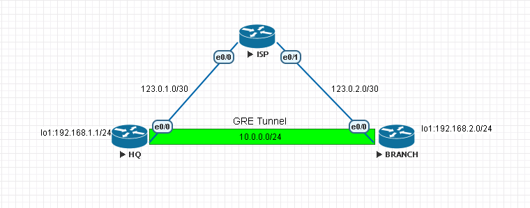

# GRE Tunnel #

>GRE Tunnel用來在IP上在封裝一層GRE後再封裝一層IP，第一層IP用於繞送，建立點對點通道讓兩端的流量能夠通過，通常用來讓路由協定通過或者讓兩端內部網路能夠通信，但GRE Tunnel並未實施加密，所以通常會搭配IPSec實現加密

## LAB ## 

實驗目標

在HQ和Branch 建立GRE Tunnel並讓兩端OSFP能夠建立鄰居，實現兩端內網互相ping通

Topology 



## 基本配置 ##

### ISP  ### 

```bash
enable 
configure terminal 
hostname ISP
int e0/0
    ip address 123.0.1.1 255.255.255.252
    no shutdown 
int e0/1
    ip address 123.0.2.1 255.255.255.252
    no shutdown 
```

### HQ ###

```bash
enable 
configure terminal
hostname HQ
ip route 0.0.0.0 0.0.0.0 123.0.1.1 #static route指向ISP讓HQ和BRANCH能夠ping通
int e0/0
    ip address 123.0.1.2 255.255.255.252
    no shutdown 
int loopback 0
    ip address 192.168.1.1 255.255.255.0
```

### BRANCH ###

```bash
enable 
configure terminal
hostname BRANCH
ip route 0.0.0.0 0.0.0.0 123.0.2.1 #static route指向ISP讓HQ和BRANCH能夠ping通
int e0/0
    ip address 123.0.2.2 255.255.255.252
    no shutdown 
int loopback 0
    ip address 192.168.2.1 255.255.255.0
```

## 配置GRE Tunnel ##

### HQ ###

```bash
int tunnel 0 
    ip address 10.0.0.1 255.255.255.0
    tunnel mode gre ip #mode為gre
    tunnel source 123.0.1.2 #來源IP
    tunnel destination 123.0.2.2 #目的IP
```

### BRANCH ###

```bash 
int tunnel 0 
    ip address 10.0.0.2 255.255.255.0
    tunnel mode gre ip #mode為gre
    tunnel source 123.0.2.2 #來源IP
    tunnel destination 123.0.1.2 #目的IP
```

## 配置路由協定(OSPF) ##

### HQ ###

```bash
router ospf 1
    network 123.0.1.0 0.0.0.3 area 0
    network 192.168.1.0 0.0.0.255 area 0
```

### BRANCH ###

```bash
router ospf 1
    network 123.0.2.0 0.0.0.3 area 0
    network 192.168.2.0 0.0.0.255 area 0
```