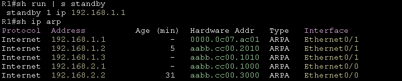

# Hot Standby Redundancy Protocl 熱備援冗餘協定 #

## 簡介 ##

HSRP是Cisco專有的FHRP協定，用於進行閘道備援，不過一次只能有一個Active轉發流量，所以會有一台是無法轉發流量的，做不到完整的附載平衡

## Multicast Address ##

HSRP使用組播位置

    224.0.0.2

## HSRP MAC Address ##

HSRP使用的MAC位置是0000.0c07.acxx，xx為群組編號



## HSRPv1 ##

### 基礎配置 ###

```bash
standby 10 ip 192.168.1.254 #10為Group Number，兩端設定須相同
```
### 優化 ###

```bash
standby 10 priority 105 #優先權，值為0~255，優先權高的會成為Active，低的成為Standby，預設為100
standby 10 timers msec 200 msec 700 #調整Hello Interval和Hold Time，單位為毫秒，預設Hello Interval為3秒，Hold Time為10秒導致溝通速度慢，可適當調整以增進效能
standby 10 preempt delay 300 #在每個執行HSRP的介面中設置搶占，溝通過程中若是Priority發生變化，會依照最新的Priority決定設備將扮演Active or Standby，不一定要配置Delay，配置Preempt Delay用意是當故障接口重新復原後，將檢測到有一Active，Standby會先等待Delay時間後再接管Active，避免Active路由器未準備好就直接進行接管，可能會有一段時間無法上網的情況，可以依情況以及機器效能調整Delay時間
standby 10 authentication md5 key-string Cisco123 #MD5驗證
```

### 防止對外端口Down ### 

```bash
ip sla 1 #新增IP SLA
    icmp-echo 8.8.8.8 source-ip 192.168.1.1 #ping測試8.8.8.8，來源ip為192.168.1.1
    frequency 2 #測試頻率為2秒一次
ip sla schedule 1 life forever start-time now #配置ip sla排程
track 1 ip sla 1 reachability #track 1 對應至ip sla 1
int vlan 10 #進入設置hsrp的介面
    standby 10 track 1 decrement 15 #套用track 1，若是Track 1 Down則Priority減15 ，追蹤對外介面，當介面出現問題時會自動將Priority降低，使其他正常的設備扮演Active
```

### 使用md5驗證 ###

```bash
#以下兩種方式擇一即可
#使用key-string
int vlan 10 #進入要配置的介面
    hsrp 10 authentication md5 key-string Cisco123
#使用key-chain
key chain hsrp1 #chain的名字
    key 1 #key id 
    key-string Cisco123 #密碼
int vlan 10 #進入要配置的介面
    hsrp 10 authentication md5 key-chain hsrp1 #將key-chain套用至介面
```

## HSRPv2 ##

HSRPv1不支援IPv6，要支援IPv6的話需開啟HSRPv2

```bash
int vlan 10
    standby version 2
    standby 10 ip 192.168.10.254 #ipv4/6的group number不能一樣
    standby 10 ipv6 FE80::FFFF
    standby 10 timers 200 msec 700 
    standby 10 preempt 
    standby 10 priority 105 
```


## HSRPv1 vs HSRPv2 ##

項目	HSRPv1	HSRPv2
版本號	版本 1	版本 2
虛擬 MAC 地址格式	0000.0C07.ACxx (xx 為群組號碼)	0000.0C9F.Fxxx (xxx 為群組號碼)
支持的群組數量	0–255	0–4095
多播地址	使用 224.0.0.2	使用 224.0.0.102
UDP 埠號	1985	1985
組態名稱	群組 ID 與 VLAN ID 無直接關聯	群組 ID 與 VLAN ID 可直接對應
認證機制	僅支持簡單文本認證	支持簡單文本認證和 MD5 認證
IPv6 支持	不支持	支持
協議的效能	適合小型和較舊的網絡環境	適合大型和現代化網絡環境
默認優先級	100	100