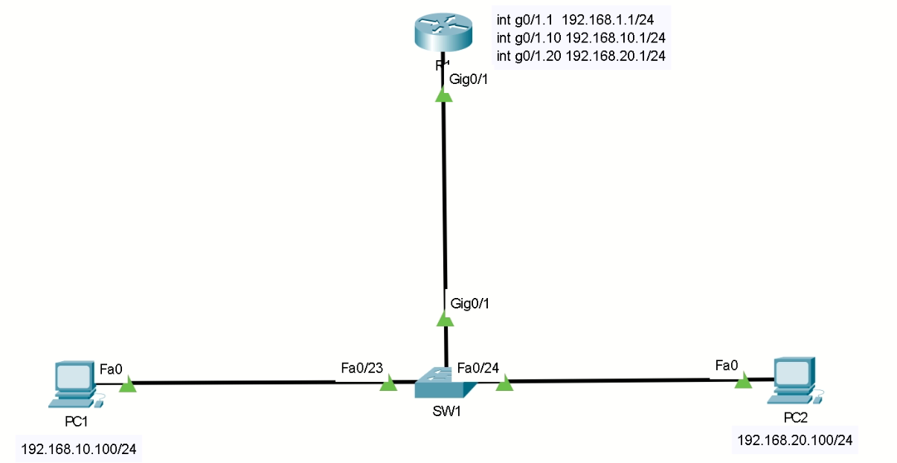
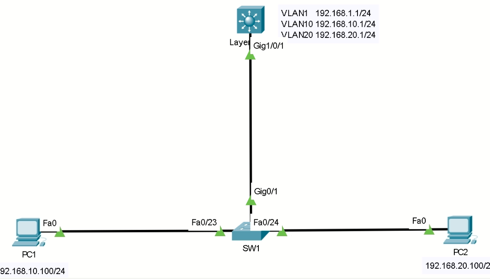

# Inter VLAN Routing #

>若是想讓不同VLAN能夠互通，就需使用到能夠進行繞送的設備(例如:路由器,三層交換機)並配置Inter VLAN Routing，也可稱作單臂路由，讓不同的VLAN能夠通過路由器的邏輯界面或者三層交換機的SVI進行繞送

## 使用路由器配置Inter VLAN Routing ##

拓樸圖為以下



### SW1 ###

先配置交換機

```bash
enable #進入特權模式
configure terminal #進入全域配置模式
hostname SW1 #主機名稱為SW1
vlan 10,20 #建立VLAN，若是使用packet tracer請個別建立
#將f0/23,f0/24加入VLAN 10以及VLAN20
int f0/23
    switchport mode access
    switchport access vlan 10
int f0/24
    switchport mode access
    switchport access vlan 20
#將面對路由器的那個端口設定為Trunk Port(重要)，要設定為Trunk Port VLAN才有辦法通過
int g0/1
    switchport mode trunk #若是使用三層交換機，在輸入switchport mode trunk之前需要多一條指令switchport trunk encapsulation dot1Q
#交換機配置完成
```

### R1 ###

```bash
enable #進入特權模式
configure terminal #進入全域配置模式
hostname R1 #主機名稱為R1
int g0/1
    no shutdown #開啟介面
    no ip address #移除介面的IP位置，恢復成沒有IP的狀態
int g0/1.1 #建立子接口，通常子接口會配置為VLAN的編號，目的為方便管理員進行辨別
    encapsulation dot1Q 1 native #封裝到Native VLAN 1
    ip address 192.168.1.1 255.255.255.0 #配置IP
int g0/1.10 #建立子接口
    encapsulation dot1Q 10 #封裝至VLAN10
    ip addess 192.168.10.1 255.255.255.0 #配置IP
int g0/1.20 #建立子接口
    encapsulation dot1Q 20 #封裝至VLAN20
    ip addess 192.168.20.1 255.255.255.0 #配置IP
#路由器配置完成
```


## 使用三層交換機配置Inter VLAN Routing ##

拓樸圖為以下



先配置SW1

### SW1 ###

```bash
enable #進入特權模式
configure terminal #進入全域配置模式
hostname SW1 #主機名稱為SW1
vlan 10,20 #建立VLAN，若是使用packet tracer請個別建立
#將f0/23,f0/24加入VLAN 10以及VLAN20
int f0/23
    switchport mode access
    switchport access vlan 10
int f0/24
    switchport mode access
    switchport access vlan 20
#將面對路由器的那個端口設定為Trunk Port(重要)，要設定為Trunk Port VLAN才有辦法通過
int g0/1
    switchport mode trunk #若是使用三層交換機，在輸入switchport mode trunk之前需要多一條指令switchport trunk encapsulation dot1Q
#交換機配置完成
```

### Layer3-SW ###

```bash
enable #進入特權模式
configure terminal #進入全域配置模式
hostname Layer3-SW #主機名稱為Layer3-SW
vlan 10,20 #建立VLAN，若是使用packet tracer請個別建立
ip routing #開啟繞送
int vlan 1 #配置SVI
    ip address 192.168.1.1 255.255.255.0 #配置IP
    no shutdown #啟用介面
int vlan 10 #配置SVI
    ip address 192.168.10.1 255.255.255.0 #配置IP
    no shutdown #啟用介面
int vlan 20 #配置SVI
    ip address 192.168.20.1 255.255.255.0 #配置IP
    no shutdown #啟用介面
#三層交換機配置完成
```
