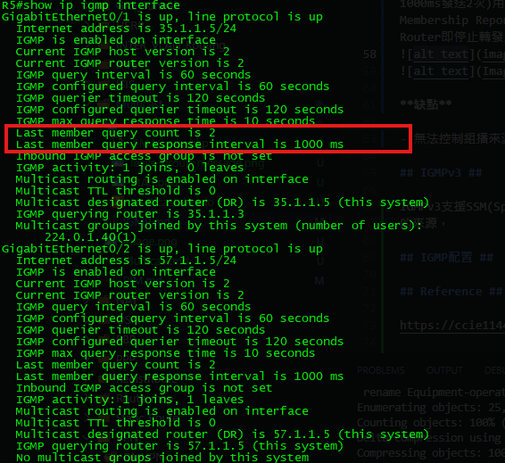
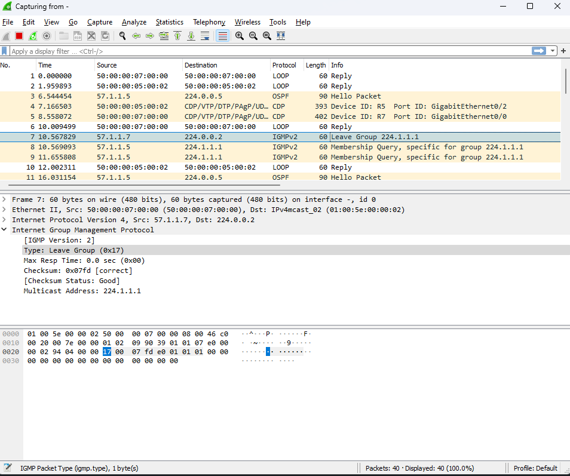

# Internet Group Mangement Protocol # 

分辨哪些為組播成員，要接收組播流量

## Any-Source Multicast ##


假設在一個組播環境中有三台伺服器同時發送某直播流量，組員無法選擇要接收哪台伺服器的流量，只能選擇是否接收

## Source-specific Multicast ##

假設在一個組播環境中有三台伺服器同時發送某直播流量，組員可以選擇要接收哪一台伺服器的組播，和哪些伺服器的流量不要接收


## IGMPv1 ##

**訊息類型**

- **Membership Query** 查詢有哪些成員要接收組播流量，使用224.0.0.1(所有host、Router)，查詢間隔為預設為60秒，180秒Timeout

- **Membership Report** 回復Query，不響應的終端即不加入組播，當一台設備加入組播時也會主動發送Report

**缺點**

-  **無離組手段，需等待超時也就是180秒**

**IGMPv1封包格式**

<table>
  <tr>
    <th>Version</th>
    <th>Type</th>
    <th>Unused</th>
    <th>Checksum</th>
  </tr>
  <tr>
    <td colspan="4" align="center">Group Address</td>
  </tr>
</table>

**Version** : IGMP版本

**Type** 

  - 1為Query
  - 2為Report 

**Group Address** : 組播位置

## IGMPv2 ##

IGMPv2支援ASM(Any Source Multicast任意來源組播)功能，並在IGMPv2新增了離組信息

**訊息類型**

- **Query General** 查詢224.0.0.1(所有host、Router)
  
- **Group-specific Query(0x11)** 與IGMPv1不同的是，IGMPv2的Query更改成查詢特定組播群組，也就是假設目標為239.1.1.1，就只會查詢239.1.1.1的群組，而不會查詢到其他組播群組成員

- **Leave Group Message(0x17)** 離組信息，使用224.0.0.2(所有Router)，當主機決定不接收組播信息時可以發送離組信息給Router，當組播成員傳送Leave Group Message給Router時，因群組內可能還有其他成員，Router會發送一個Group-Specific Query(預設為1000ms發送2次)用於查詢群組內是否還有成員，如果還有成員存在，該成員會發送Membership Report，當Router接收到Membership Report，即會維持Active，若沒有回應，Router即停止轉發此群組的組播流量
  




**缺點**

- 無法控制組播來源

## IGMPv3 ##

IGMPv3支援SSM(Specific Source Multicast指定來源組播)功能，使的IGMPv3能夠過濾組播的來源，

## IGMP配置 ##

```bash
#更改igmp版本
int g0/0
  ip igmp version 3 
#更改last-member-query-count
int g0/0
    ip igmp last-member-query-count 5 #依照實際情況更改
#更改last-member-query-interval 
int g0/0
    ip igmp last-member-query-interval 10000 
#該介面若只有一個成員，可使用immediate讓router收到leave message時不送出last-memeber-query，直接判斷所有host已離開群組
access-list 1 permit 239.1.1.1 
int g0/0
  ip igmp immediate-leave group-list 1 
#IGMPv3 SSM設定
```

## IGMP Snooping ##

若是組播環境中有交換機未開啟IGMP Snooping，交換機接收到組播流量時並不會知道那些介面或VLAN有此群組的成員，所以會以廣播方式處理組播信息，IGMP Snooping能夠選擇將組播信息傳遞給正確的組播成員


```bash
[R1]
enable 
conf t
hostname R1
int g0/0
    ip address 12.1.1.1 255.255.255.0
    no shutdown 
int g0/1
    ip address 13.1.1.1 255.255.255.0
    no shutdown 
int lo0
    ip address 1.1.1.1 255.255.255.255
router ospf 1
    router-id 1.1.1.1
    network 0.0.0.0 0.0.0.0 area 0
[R2]
enable 
conf t
hostname R2
int g0/0
    ip address 12.1.1.2 255.255.255.0
    no shutdown 
int g0/1
    ip address 24.1.1.2 255.255.255.0
    no shutdown 
int g0/2
    ip address 10.1.1.1 255.255.255.0
int lo0
    ip address 2.2.2.2 255.255.255.255
router ospf 1
    router-id 2.2.2.2
    network 0.0.0.0 0.0.0.0 area 0
[R3]
enable 
conf t
hostname R3
int g0/0
    ip address 34.1.1.3 255.255.255.0
    no shutdown 
int g0/1
    ip address 13.1.1.3 255.255.255.0
    no shutdown 
int g0/2
    ip address 192.168.1.1 255.255.255.0
int lo0
    ip address 3.3.3.3 255.255.255.255
router ospf 1
    router-id 3.3.3.3
    network 0.0.0.0 0.0.0.0 area 0
[R4]
enable 
conf t
hostname R4
int g0/0
    ip address 34.1.1.4 255.255.255.0
    no shutdown 
int g0/1
    ip address 24.1.1.4 255.255.255.0
    no shutdown 
int lo0
    ip address 4.4.4.4 255.255.255.255
router ospf 1
    router-id 4.4.4.4
    network 0.0.0.0 0.0.0.0 area 0
[Source]
enable 
conf t
hostname Source 
int g0/0
    ip address 10.1.1.100 255.255.255.0
    no shutdown 
[PC1]
enable 
conf t
hostname PC1
int g0/0
    ip address 192.168.1.100 255.255.255.0
    no shutdown 
[PC2]
enable 
conf t
hostname PC2
int g0/0
    ip address 192.168.1.101 255.255.255.0
    no shutdown 
[PC3]
enable
conf t 
hostname PC3
int g0/0
    ip address 192.168.1.102 255.255.255.0
    no shutdown 
[PC4]
enable
conf t 
hostname PC4
int g0/0
    ip address 192.168.1.103 255.255.255.0
    no shutdown 
```

## Reference ##

https://ccie11440.blogspot.com/2007/07/igmpv1-vs-igmpv2-vs-igmpv3.html

https://www.jannet.hk/internet-group-management-protocol-igmp-zh-hant/#IGMP_Version_2

https://www.networkacademy.io/ccie-enterprise/multicast/introduction-to-igmp