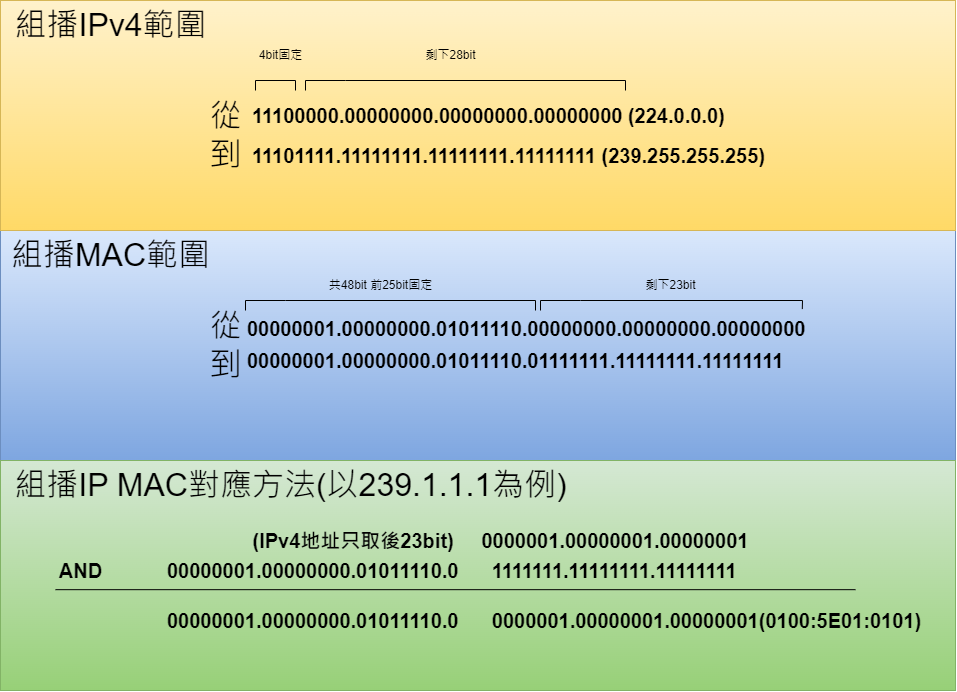

# Multicast 組播 #

## 組播應用類型 ##

- One to many  
- Many to Many  
- Many to one 

## 組播地址範圍 ##

組播使用的地址是Class D，也就是224.0.0.0-239.255.255.255，其中又分成幾類

- Reserved link local address，保留地址，範圍是224.0.0.0 ~ 224.0.0.255，例如224.0.0.1(所有的Host、Router)、224.0.0.2(所有的Router)、224.0.0.5-6(OSPF)、224.0.0.9(RIPv2)、224.0.0.10(EIGRP)和224.0.0.13(ICMP)。
- Globally scoped addresses，全域組播地址，範圍是224.0.1.0 ~ 238.255.255.255。
    
    在全域組播地址中也有兩塊為保留地址，分別是Source specific multicast和GLOP addresses。

    - Source specific multicast，指定來源組播，範圍是232.0.0.0 ~ 232.255.255.255。
    - GLOP addresses，申請ASN時會附贈一段GLOP地址，，範圍是233.0.0.0 ~ 233.255.255.255，計算方式為，若ASN為65001，將65001換算成Hex，接著將四位數Hex分成兩個兩位數後轉換回Dec，再加上233，就會得到233.253.233.0/24。
- Limited scope addresses，本地可使用組播地址，無法在Internet使用，範圍是239.0.0.0 ~ 239.255.255.255。

## 組播MAC ##

組播MAC與IP對應方法請看下圖

但依照此方法的問題是，MAC位置的bit並不夠拿來對應到每個組播IP位置，因IP除了固定的4bit有28bit，MAC除了固定的25bit有23bit，28bit無法全部與23bit對應，解決方法就是不要使用重複IP/MAC對應的組播位置