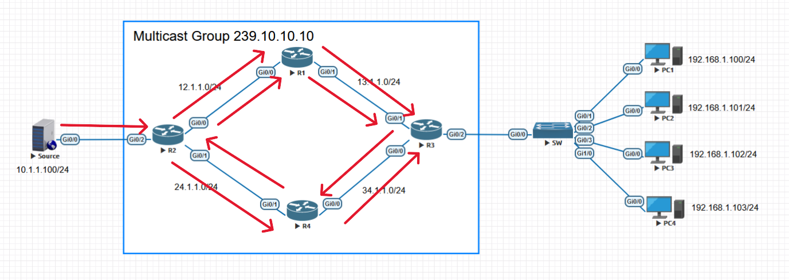

# Protocol Independent Multicast(PIM) #

用於傳遞組播流量的協定，負責建立和維護組播路由表，以確保流量以最佳路徑達到組播成員


## Reverse path forward(RPF) ##

只有PIM使用RPF檢查，RPF是為了防止組播迴圈的一種機制，案例如下圖，假設沒有RPF，當Source傳遞組播流量至R2時，R2會傳遞給R1與R4，R1和R4會傳給R3，R3會在傳回給R1和R4，這樣一來就會造成迴圈




## Mroute ##

**組播路由類型**

- **(*,G) Route** 
- **(S,G) Route**

## Flag ##


## Shorest Path Tree ##

由組播來源至組員的最短路徑稱為SPT

## Shared Distribution Trees ##


## DR ##

**網路類型**
- **Point-to-Point ** 在點到點的網路環境不需要選舉DR，因沒有意義
- **Broadcast** 在廣播網路環境需要選出一個DR，由他來發送Query

**DR選舉**
- 比較PIM鄰居優先級，預設為1，預設有搶占功能，只有PIMv2支援，PIMv1不支援
- 較高介面IP作為PIM的DR

## Dense Mode ##

不管是否有組員，都推送組播流量，路由器只要有收到組播都會建立路由表，所以就算沒有成員也會建立(S,G)路由，對設備負擔較大

```bash
ip multicast-routing 
int range g0/0-2
    ip pim dense-mode 
```

**Prune** 一種Dense Mode的優化機制，Cisco設備3min Flood一次，若是沒有組員，路由器會發送Prune封包給上游，減少傳遞不必要的流量

## Sparse Mode ##

通過RP查看是否有組員，有組員才發組播流量，沒有的話就不發，路由器沒收到組播的話也不會形成路由表，可減少設備的開銷，使用Sparse Mode的RPF檢查是以RP的最優路徑進行檢查

**Rendezvous Point會合點(RP)**


## 配置方法 ##

```bash
ip multicast-routing #開啟組播路由
int range e0/0-2
    ip igmp join-group 239.1.1.1
```

## 查看命令 ##

```bash
show ip mroute #查看組播路由表
show ip pim neighbor #查看pim鄰居表
show ip igmp membership #檢查IGMP成員
```

## Reference ##

https://www.networkacademy.io/ccie-enterprise/multicast/multicast-ip-to-mac-mapping