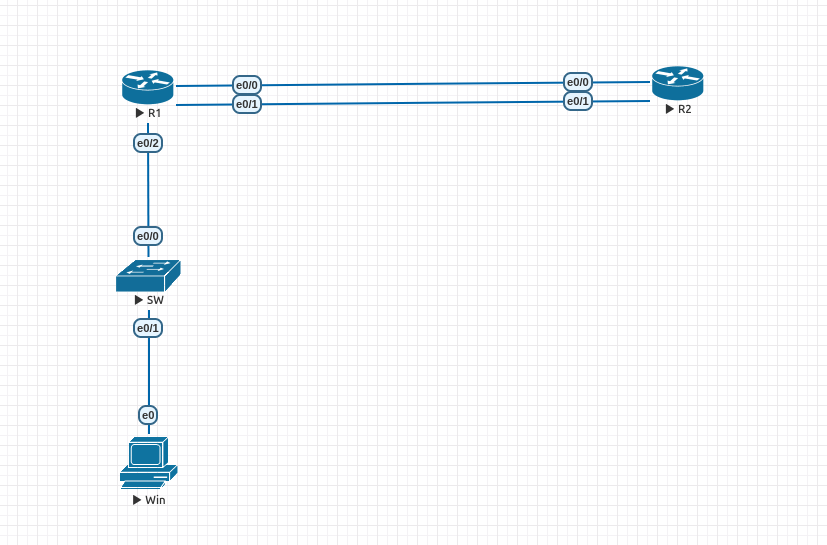

# NAT #

## NAT配置方法 ##

```bash
int f0/0 #對內介面
    ip nat inside 
int f0/1 #對外介面
    ip nat outside
ip nat inside source static tcp 192.168.1.100 80 123.0.1.1 80 #內部IP 192.168.1.100的80 port對應到外部IP 123.0.1.1的80 port
ip nat inside source static tcp 192.168.1.100 443 123.0.1.1 443 #內部IP 192.168.1.100的443 port對應到外部IP 123.0.1.1的443 port
ip nat inside source static udp 192.168.1.100 53 123.0.1.1 53 #內部IP 192.168.1.100的53 port對應到外部IP 123.0.1.1的53 port
```

## PAT配置方法 ##

    一對多

```bash
int f0/0 #對內介面
    ip nat inside 
int f0/1 #對外介面
    ip nat outside
access-list 1 permit 192.168.1.0 0.0.0.255 #建立比對內部流量ACL
ip nat inside source interface f0/1 overload 
```
## Dynamic NAT ##

    多對多

```bash
int f0/0 #對內介面
    ip nat inside 
int f0/1 #對外介面
    ip nat outside
access-list 1 permit 192.168.1.0 0.0.0.255 #建立比對內部流量ACL
ip nat pool POOL1 123.0.1.1 123.0.1.10 netmask 255.255.255.0 #建立NAT pool名為pool1
ip nat inside source list 1 pool POOL1 overload #啟用Dynamic NAT

```

## 兩個對外接口NAT ##

假設e0/0為1G，e0/1為1.54M，平時對外走e0/0，若是e0/0損壞，才走e0/1做備援



```bash
#R1
enable 
configure terminal
hostname R1
int e0/0
    ip address 123.0.1.1 255.255.255.252
    no shutdown 
int e0/1
    ip address 123.0.1.5 255.255.255.252
    no shutdown 
int e0/2
    ip address 192.168.1.1 255.255.255.0
    no shutdown 

int range e0/0-1
    ip nat outside
int e0/2
    ip nat inside 

access-list 1 permit 192.168.1.0 0.0.0.255

route-map e0/0 permit 1
    match ip address 1
    match interface e0/0    
route-map e0/1 permit 1
    match ip address 1
    match interface e0/1

ip nat inside source route-map e0/0 interface e0/0 overload
ip nat inside source route-map e0/1 interface e0/1 overload

ip route 0.0.0.0 0.0.0.0 123.0.1.2 5
ip route 0.0.0.0 0.0.0.0 123.0.1.6 10

#R2
enable 
configure terminal
hostname R2
int e0/0
    ip address 123.0.1.2 255.255.255.252
    no shutdown 
int e0/1
    ip address 123.0.1.5 255.255.255.252
    no shutdown 
int loopback 0 
    ip address 8.8.8.8 255.255.255.255
```

## NAT Virtual Interface ##

NAT Virtual Interface移除了在介面配置NAT inside,outside,為解決進行靜態NAT時內部使用者無法使用外部地址進行靜態NAT訪問內部伺服器，需使用私有IP才可訪問的問題

```bash
#配置ACL
access-list 1 permit 192.168.1.0 0.0.0.255 

int f0/0
    ip nat enable #啟用NAT
int f0/1
    ip nat enable 
ip nat source static tcp 172.16.1.10 80 209.165.201.5 80 #靜態NAT
ip nat source list 1 interface f0/0 overload #PAT
``` 

查看的方式也與傳統的NAT不太一樣，需要加上nvi一詞

```bash
show ip nat nvi translations 
show ip nat nvi statistics 
```