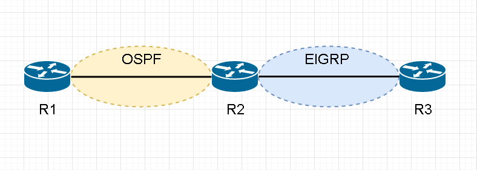

# OSPF #

## 簡介 ##

OSPF為開放標準的Link-State路由協定，收斂速度雖沒有EIGRP快，但無限制跳躍數，且可運作於多廠牌設備當中，所以大多數企業網路都會使用OSPF

## Link-State Protocols ##

在鍊路狀態路由協定中，每個路由器都擁有一張完整的網路拓樸，可以分辨出接收到的路由信息是由哪個介面發出來的

## Multicast Address ##

OSPF的組播位置有兩種，分別為

- 224.0.0.5 - DR,BDR向DROTHER發送DD,LSA Request和LSA Update時使用

- 224.0.0.6 - DROTHER向DR,BDR發送DD,LSA Request和LSA Update時使用

## 為什麼要劃分Area ##

- 最小化路由表

- 本地的拓樸變動，只會影響到該區域，所有區域將路由注入骨幹區域後骨幹再將路由資訊傳播到其他區域

- 有些LSA只會在該區域內傳播，不會傳送到整個拓樸中

## Backbone area ##

骨幹區域，又稱為Transit area或者area 0

## Regular area ##

常規區域，又稱為nonbackbone areas，非骨幹區域的area

## BR ##

Backbone Router骨幹路由器，最少一個Interface連接Area 0，稱為BR，以上圖為例，R2和R3為BR

## ABR ##

Area Border Router區域邊界路由器，連接兩個Area以上稱為ABR，以上圖為例，R2和R3為ABR

## ASBR ##

Autonomous System Border Router自治系統邊界路由器，連接其他AS的Router稱為ASBR，以上圖為例，R2為ASBR

## OSPF 封包類型 ##

|Type|用途|
|---|---|
|Hello|發現鄰居並建立鄰接，OSPF預設Hello Interval為10秒，Dead Interval為四倍40秒|
|DBD(Database Description 資料庫描述)|DBD中包含了LSA的部份描述，接收到DBD後，就會發現缺少哪些LSA的訊息，再進行後續的請求
|LSR(Link-State Request 鍊路狀態請求)|向其他Router請求詳細的LSA信息|
|LSU(Link-State Update 鍊路狀態更新)|傳送指定請求的LSA|
|LSACK(Link-State Acknowledgment 鍊路狀態確認)|用來進行LSU的確認|

## LSA類型 ##

|LSA Type|Description| |
|---|---|---|
|1|Router LSA|宣告link ip以及Router-ID，每顆路由器都會宣告|
|2|Network LSA|宣告網路遮罩netmask，由DR宣告|
|3|Summary LSA||
|4|ASBR summary LSA||
|5|Autonomous system LSA||
|6-11|Other types||

## Link-State Advertisement ##

	每個LSA都包含了一個Sequence number，Sequence number大小為4byte，從-0x80000001 ~ 0x7FFFFFFF，在SPF的算法中，會經由比較LSA Sequence number的大小來判斷此LSA是否為新的LSA，越大則代表越新，接著在加入LSDB中

### LSDB ###

	Link-State Datebase 鍊路狀態資料庫，同個區域中的每個Router會有相同的LSDB

## Route Summarization ## 

OSPF只能在ABR和ASBR做路由匯總，在匯總後會產生一筆錄由指向null防止迴圈

## 路由類型 ##

|類型|描述|
|---|---|
|O|同個區域內路由|
|O IA|不同區域之間的路由|
|O E1|再發佈路由，會累計Metric值，預設Metric為20|
|O E2|再發佈路由，不累計Metric值，預設Metric為20(預設值)| 
|O N1||
|O N2||

