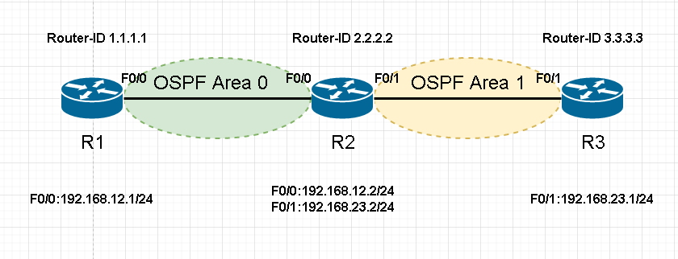
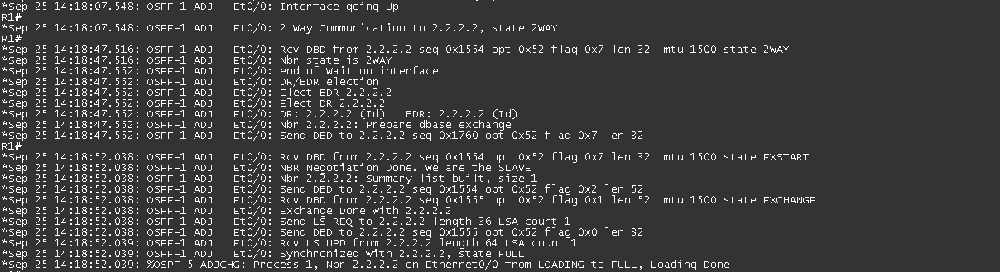
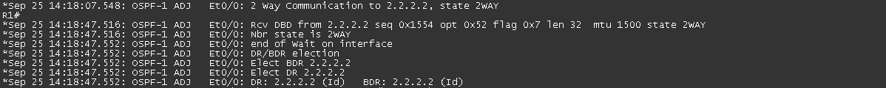
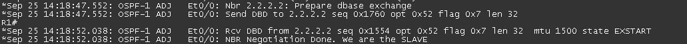
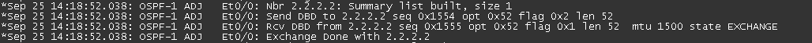
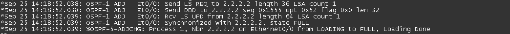

# OSPF鄰接過程 #

要觀察OSPF鄰接過程可以使用debug ip ospf adj進行查看，看完後記得使用undebug all關閉

## Neighbor和Adjacency的差異 ##

	Neighbor - 建立鄰居的過程只到two-way就結束
	Adjacency - 建立鄰接包含整個過程

## 成為鄰居條件 ##

	1.Area ID相同
	2.網段相同
	3.Hello Interval以及Dead Interval需相同，預設Hello Interval為10秒，Dead Interval為四倍大40秒
	4.認證類型以及密碼一致
	5.MTU相同

## OSPF鄰接過程 ##

下面以此拓樸做說明

完整鄰接過程

### Down ###

不發送Hello 

### Init ###

開始向對方發送Hello

### Two-way ###

進行DR/BDR選舉，建立鄰居關係，以上圖為例，可以看到選舉結果DR為R1，BDR為R2

### Exstart ###

預備交換鍊路資訊

### Exchange ###

交換DBD，讓對方知道它需要哪些LSA

### Loading ###

開始交換LSA

### Full ###

交換完成，建立鄰接關係