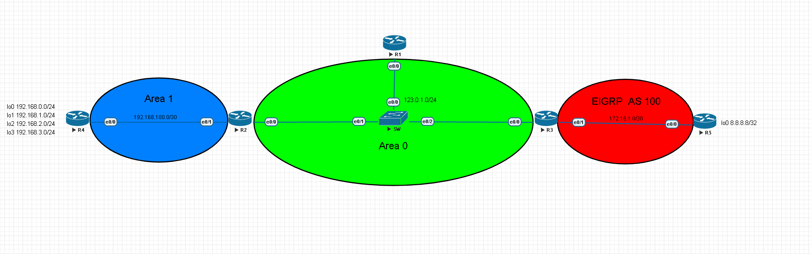

# Optimization #

## Hello/Dead Interval ## 

OSPF預設的Hello Interval為10秒，Dead Interval為40秒，調整Hello Interval和Dead Interval可以增加OSPF的收斂速度，不過須注意每台啟用OSPF的路由器Hello Interval以及Dead Interval需相同

```bash
int e0/0
    ip ospf hello-interval 1
    ip ospf dead-interval 3
```

## 調整Priority ##

```bash
#選舉DR/BDR時會用到，越大越好，更改完後，要重啟ospf process
int e0/0
	ip ospf priority 100
int e0/1
	ip ospf priority 0 #不選舉
```

## 修改介面頻寬(計算成本用,非真實頻寬) ##

```bash
router ospf 1
auto-cost reference-bandwidth 1000 #單位為Mbits
#修改介面卡
int f0/0
    ip ospf cost 1
```

## 雜湊驗證 ##

使用md5

```bash
router ospf 1
    area 0 authentication message-digest
int e0/0
    ip ospf message-digest 1 md5 Cisco123 
```

使用sha256

```bash
key chain ospf-hmac-key1
    key1 
    cryptographic-algorithm hmac-sha256
    key-string Cisco123 
int e0/0 #再開啟ospf的介面上開啟驗證
    ip ospf authentication key-chain ospf-hmac-key1 
```

## Passive Interface ##

OSPF可以使用passive-interface讓介面不接收任何ospf的訊息也不發送，通常會套用在對使用者那端的介面，因使用者不需要接收OSPF信息，有幾種方式配置passive-interface

第一種，一個一個將不需要開啟OSPF的介面passive-interface，這樣下passive-interface的介面就不會發送OSPF訊息也不接收

```bash
router ospf 1
    passive-interface e0/0
    passive-interface e0/1
    passive-interface e0/2
```

第二種，先將介面全部passive-interface，再將要開啟OSPF的介面no passive-interface

```bash
router ospf 1
    passive-interface default 
    no passive-interface e0/0
    no passive-interface e0/1
```

## Route Summarization ## 



路由匯總可以將多條路由合併成一條路由，減少LSA的更新，只能在ABR或ASBR進行路由匯總，以上圖為例，要在ABR也就是R2將下面四條/24的路由匯總成一條/22的路由

|Network|Subnet Mask|
|---|---|
|192.168.0.0|255.255.255.0|
|192.168.1.0|255.255.255.0|
|192.168.2.0|255.255.255.0|
|192.168.3.0|255.255.255.0|

```bash
area 0 range 192.168.0.0 255.255.252.0 
```

從R1使用show ip route ospf查看可以看到路由已經匯總成一條192.168.20.0/22的路由


且從R2可以看到多了一條192.168.20.0/22指向Null0，這是為了防止路由迴圈，例如若是R4有一筆指向R2的預設路由，並將路由匯總成一條192.168.0.0/24，假設今天沒有192.168.3.0/24這條路由，那當R2傳送了一個封包目的地為192.168.3.1給R4時，R4並沒有這條路由，所以會往預設路由走，而R2又會將封包傳給R4，造成路由迴圈，所以當在ABR使用路由匯總時會自動產生一筆錄由指向null0


