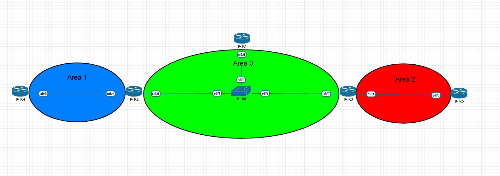
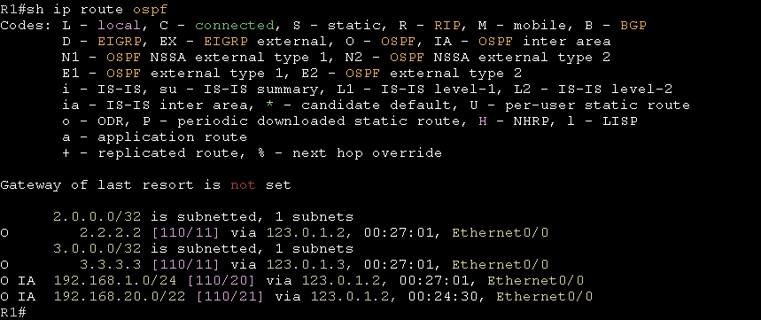
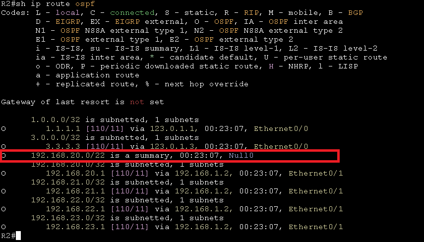

# Optimization #

## Hello/Dead Interval ## 

OSPF預設的Hello Interval為10秒，Dead Interval為40秒，調整Hello Interval和Dead Interval可以增加OSPF的收斂速度，不過須注意每台啟用OSPF的路由器Hello Interval以及Dead Interval需相同

```bash
int e0/0
    ip ospf hello-interval 1
    ip ospf dead-interval 3
```

## 調整Priority ##

```bash
#選舉DR/BDR時會用到，越大越好，更改完後，要重啟ospf process
int e0/0
	ip ospf priority 100
int e0/1
	ip ospf priority 0 #不選舉
```

## 修改介面頻寬(計算成本用,非真實頻寬) ##

```bash
#公式，注意計算單位，10^8單位為bit，interface為K,M或G，loopback成本為10G
10^8/interface
10^8 = 100M 
#範例
#介面卡頻寬為100M
10^8/100 = 100/100 = 1
#但有個問題是，若介面卡頻寬為1G也就是1000M，計算結果會取正整數，也就是1，這就會造成
#100M和1000M的計算結果是相同的，解法為修改介面卡頻寬，以下為修改命令
#進入ospf修改參考頻寬
router ospf 1
    auto-cost reference-bandwidth 100000 #單位為Mbits，依照環境情況調整參考頻寬，網路頻寬越大參考頻寬需設定越高
#修改介面卡參考頻寬，需在學習路由的入方向進行修改才有效
int f0/0
    ip ospf cost 1
```

## 雜湊驗證 ##

使用md5

```bash
router ospf 1
    area 0 authentication message-digest
int e0/0
    ip ospf message-digest 1 md5 Cisco123 
```

使用sha256

```bash
key chain ospf-hmac-key1
    key1 
    cryptographic-algorithm hmac-sha256
    key-string Cisco123 
int e0/0 #再開啟ospf的介面上開啟驗證
    ip ospf authentication key-chain ospf-hmac-key1 
```

## Passive Interface ##

OSPF可以使用passive-interface讓介面不接收任何ospf的訊息也不發送，通常會套用在對使用者那端的介面，因使用者不需要接收OSPF信息，有幾種方式配置passive-interface

第一種，一個一個將不需要開啟OSPF的介面passive-interface，這樣下passive-interface的介面就不會發送OSPF訊息也不接收

```bash
router ospf 1
    passive-interface e0/0
    passive-interface e0/1
    passive-interface e0/2
```

第二種，先將介面全部passive-interface，再將要開啟OSPF的介面no passive-interface

```bash
router ospf 1
    passive-interface default 
    no passive-interface e0/0
    no passive-interface e0/1
```

## Route Summarization ## 



路由匯總可以將多條路由合併成一條路由，減少LSA的更新，只能在ABR或ASBR進行路由匯總，以上圖為例，要在ABR也就是R2將下面四條/24的路由匯總成一條/22的路由

|Network|Subnet Mask|
|---|---|
|192.168.0.0|255.255.255.0|
|192.168.1.0|255.255.255.0|
|192.168.2.0|255.255.255.0|
|192.168.3.0|255.255.255.0|

```bash
area 0 range 192.168.0.0 255.255.252.0 
```

從R1使用show ip route ospf查看可以看到路由已經匯總成一條192.168.20.0/22的路由



且從R2可以看到多了一條192.168.20.0/22指向Null0，這是為了防止路由迴圈，例如若是R4有一筆指向R2的預設路由，並將路由匯總成一條192.168.0.0/24，假設今天沒有192.168.3.0/24這條路由，那當R2傳送了一個封包目的地為192.168.3.1給R4時，R4並沒有這條路由，所以會往預設路由走，而R2又會將封包傳給R4，造成路由迴圈，所以當在ABR使用路由匯總時會自動產生一筆錄由指向null0



要在ASBR進行外部路由匯總可以使用以下命令

```bash
router ospf 1
	summary-address 192.168.20.0 255.255.252.0
```

## 預設路由 ##

```bash
default-information originate #如果沒加always，則需要先手動設一條預設路由
default-information originate always 
```

## Stub ## 

OSPF Stub可以將多筆再發佈的路由轉成一筆預設路由，讓末端的路由器只要路由表中找不到路由就直接找ABR

>再同一區域內的每台Router都要宣告area 1 stub，否則鄰居將會Down 

```bash
router ospf 1
	area 1 stub 
```

## Route filter ## 

### Topology ###

>OSPF和EIGRP已經做好雙方的再發佈讓兩邊都能收到對方的路由，但是R2不想讓R1收到R3的路由，所以要在R2上做一些設定，讓R1收到的路由不包含R3的路由


### 使用Access-List，此方法只能用在IPv4 ###

>使用ACL有缺點，以這張拓樸為例，ACL是沒辦法做到從R2再發佈EIGRP只允許192.168.1.0/24至R1，其餘的192.168.2.0/24、192.168.3.0/24、192.168.4.0/32、192.168.5.0/32都不允許，因為ACL寫成access-list 10 permit 192.168.1.0 0.0.255.255會允許192.168.0.0/16至192.168.0.0/32的路由都發佈出去，沒辦法過濾更細部的遮罩，所以須使用prefix-list

```bash
#建立ACL阻擋不須通過的路由
access-list 1 deny 192.168.1.0 0.0.0.255 
access-list 1 deny 192.168.2.0 0.0.0.255 
access-list 1 deny 192.168.3.0 0.0.0.255 
access-list 1 permit any
router ospfv3 10
    address-family ipv4 unicast 
        distribute-list 1 out eigrp 20 #套用ACL到開啟OSPF的介面，這樣EIGRP再發佈進來的路由就會被ACL過濾掉
```

使用show ip route ospfv3可以看到路由表的差異

套用前


套用後


>在嘗試下一項時記得先將上一項的設定移除，不然會卡到

### 使用prefix-list ###

>Prefix-list的優點是可以根據更細部的遮罩進行過濾，例如有192.168.1.0/24、192.168.1.128/25、192.168.1.240/28三段路由，而我只允許192.168.1.240/28通過，可以使用ip prefix-list filter seq 5 permit 192.168.1.128/25就可以過濾掉其餘路由

    ip prefix-list 1 permit 192.168.1.0/24 le 32 (允許網段192.168.1.0/24 / 允許遮罩 24-32)
    ip prefix-list 1 permit 192.168.1.0/24 ge 30 (允許網段192.168.1.0/24 / 允許遮罩 30-32)
    ip prefix-list 1 permit 192.168.1.0/24 ge 25 le 30 (允許網段192.168.1.0/24 / 允許遮罩 25-30)

```bash
#IPv4 prefix-list 
ip prefix-list OSPF-Filter seq 5 permit 192.168.0.0/16 le 24 #seq只是序號，像是ACL的序號，通常設定為5的倍數，不會影響到prefix-list的功能，在刪除prefix-list時可以指定序號刪除
router ospfv3 10 
    address-family ipv4 unicast 
        distribute-list prefix OSPF-Filter out eigrp 20 
```

使用show ip route ospfv3可以看到路由表的差異

套用前


套用後


```bash 
#IPv6 prefix-list 
ipv6 prefix-list OSPF-Filter seq 5 deny 2001:192:168:4::1/128 #阻擋2001:192:168:4::1/128的路由
ipv6 prefix-list OSPF-Filter seq 10 deny 2001:192:168:5::1/128 #阻擋2001:192:168:5::1/128的路由
ipv6 prefix-list OSPF-Filter seq 15 permit ::/0 le 128 #其餘所有路由都可通過
router ospfv3 10 
    address-family ipv6 unicast 
        distribute-list prefix OSPF-Filter out eigrp 20
```

使用show ipv6 route ospfv3可以看到路由表的差異

套用前


套用後


>在嘗試下一項時記得先將上一項的設定移除，不然會卡到

### 使用route-map ###

使用route-map

```bash
#IPv4 
#先建立ACL
access-list 10 permit 192.168.1.0 0.0.3.255 
#再建立route-map
route-map OSPF-Filter permit 10 #這裡的10跟ACL的10沒有關係，只是序號
    match ip address 10 #對應到ACL 10
#套用route-map 
router ospfv3 10 
    address-family ipv4 unicast 
        redistribute eigrp 20 route-map OSPF-Filter #套用route-map到EIGRP，這樣EIGRP再發佈進來的路由就會被route-map過濾掉
```

使用show ip route ospfv3可以看到路由表的差異

套用前


套用後


## Reference ## 

prefix-list https://ccie.lol/knowledge-base/prefix-list/