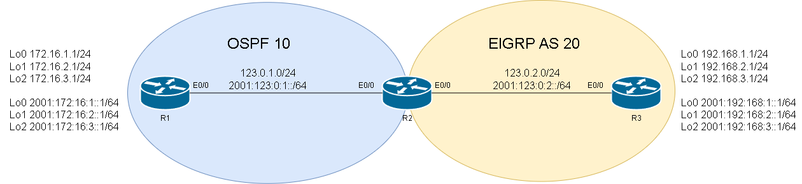
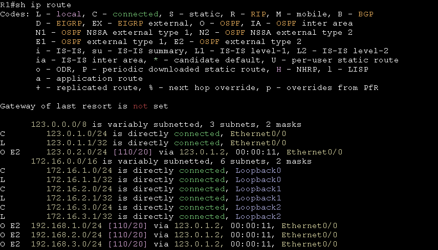

# Redistribution #

**Metric Type 1** 會依照線路累加成本

**Metric Type 2** 使用固定成本，不會疊加，預設如果什麼都沒改直接使用redistribute再發佈路由的話，會使用E2(也就是Default)，Metric為1

## Topology ##



## OSPFv2 ## 

下面使用OSPFv2做範例，示範如何進行不同路由協定的再發佈

### 調整再發佈路由的成本 ###


```bash
router ospf 10 
    redistribute bgp 200 metric 20 #再發佈的OSPF路由成本為20
```

### 調整再發佈路由的Metric-Type ###

```bash
router ospf 10
    redistribute bgp 200 metric-type 1 subnet #再發佈的OSPF Metric-Type更改為Type 1，會累加路由成本
    #也可以與metric一起使用，兩個命令不衝突
```

### 再發佈RIP到OSPF ###

```bash
router ospf 10
    redistribute rip subnets metric-type 1
```

## 再發佈EIGRP到OSPF ##

```bash
router ospf 10 
    redistribute eigrp metric 100 subnets #metric為OSPF的成本，不指定的話會用預設值20
```

使用show ip route可以看到E2的路由，這是因為OSPF的metric-type預設為E2，如果要改成E1的話，則需要在redistribute後面加上metric-type 1




## OSPFv3 ## 

## OLD ## 

下面使用OSPFv3做範例，示範如何進行不同路由協定的再發佈，OSPFv3與OSPF的指令稍微不同

### RIP and OSPF ###

```bash

```

### 再發佈EIGRP到OSPFv3 ### 

IPv6的做法在後面需加上一個include-connected，加上後才會再發佈直連路由，如果沒有加上這個參數，那上面圖片中R2的e0/0的IPv6位置就不會再發佈到R3

```bash
ipv6 router ospf 10 
    redistribute eigrp 20 include-connected 
```

## NEW ##


### 再發佈EIGRP到OSPFv3 ### 


```bash
router ospfv3 10 
    address-family ivp4 unicast 
        redistribute eigrp 20 
    address-family ipv6 unicast 
```