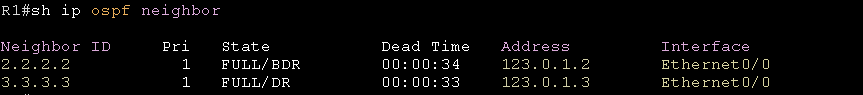
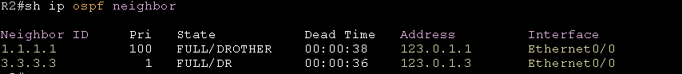
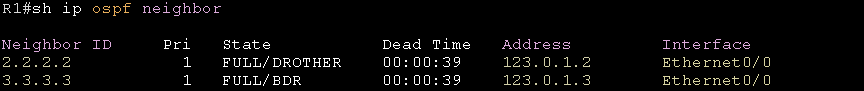
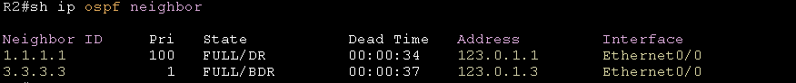

# DR BDR election #

## DR/BDR/DROTHERs ##

- Designated Router指定路由器，由DR跟BDR和DROTHERs進行LSA的溝通，再統一發送結果，DROTHERs之間不會進行LSA的溝通，避免造成過多不必要的流量

- Backup Designated Router備份指定路由器，若是DR故障，則BDR會晉升成為DR繼續進行LSA的溝通，但若是故障的DR又重新回到拓樸中，也不會重新進行election，等到下一次重啟OSPF時才會重新進行election(重啟修改priority那台以外的的其他台)，重啟ospf使用clear ip ospf process

- DROTHERs，不是DR也不是BDR就稱為DROTHERs

## DR/BDR如何選舉 ##

OSPF會在每個區域選出DR與BDR，用於統一發放鏈路狀態更新，DR/BDR選舉會先看Priority，Priority大的成為DR，第二大的成為BDR，其餘成為DROTHER，若是Priority相同，就會比Router-id，較大的為DR，第二大的成為BDR，其他成為DROTHER

## 範例 ##


以上面的拓樸為例，在這個區域中有三顆路由器，所以會選出DR、BDR和DROTHER，配置如下

```bash
R1#
int e0/0 
    ip address 123.0.1.1 255.255.255.0
    no shutdown 
router ospf 1
    router-id 1.1.1.1 
    network 123.0.1.0 0.0.0.255 area 0
R2#
int e0/0
    ip address 123.0.1.2 255.255.255.0
    no shutdown
router ospf 1
    router-id 2.2.2.2
    network 123.0.1.0 0.0.0.255 area 0
R3#
int e0/0
    ip address 123.0.1.3 255.255.255.0
    no shutdown 
router ospf 1
    router-id 3.3.3.3 
    network 123.0.1.0 0.0.0.255 area 0
```

OSPF預設每台路由器的priority為1，所以在未更改的情況下，會使用Router-id來進行比較，選出DR、BDR以及DROTHER，所以R3會成為DR，R2成為BDR，R1以及其餘路由器會成為DROTHER，

從R1使用show ip ospf neighbor可以看到R3為DR，R2為BDR



不過若是今天想要使用R1作為DR，可以使用ip ospf priority <0-255>來調整priority的值使其變成DR

```bash
R1#
int e0/0
    ip ospf priority 100
```

更改後在R1和R2使用show ip ospf neighbor會發現雖然priority已經變更為100，不過R1依舊是DROTHER




因為更改後OSPF不會重新進行選舉，需重新啟動R1(變更priorirty的路由器)以外路由器的OSPF Process才會重新選舉出DR和BDR

```bash
clear ip ospf process 
Reset ALL OSPF process? [no]: yes
```

再次從R1和R2使用show ip ospf neighbor查看就可以看到R1已經成為DR，而R3的Router-id相比R2更高，所以成為BDR



