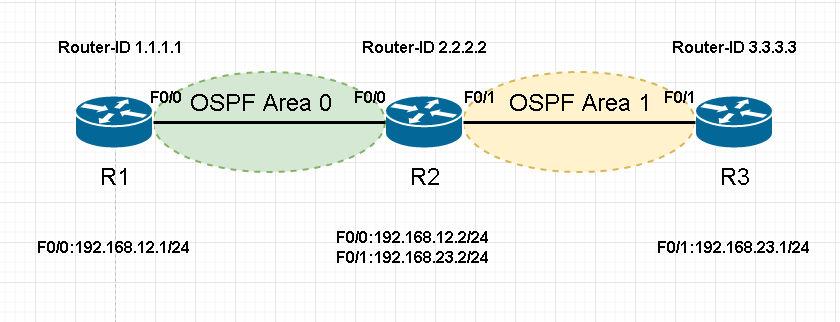

# OSPF-Theory1 #

## 簡介 ##

OSPF為開放標準的Link-State路由協定，收斂速度雖沒有EIGRP快，但無限制跳躍數，且可運作於多廠牌設備當中

## Link-State Protocols ##

在鍊路狀態的路由協定中，每個路由器都擁有一張完整的網路拓樸，可以分辨出接收到的路由信息是由誰發出來的

## Multicast Address ##

OSPF的組播位置有兩種，分別為

- 224.0.0.5 - DR,BDR向DROTHER發送DD,LSA Request和LSA Update時使用

- 224.0.0.6 - DROTHER向DR,BDR發送DD,LSA Request和LSA Update時使用

## 為什麼要劃分Area ##

- 最小化路由表

- 本地的拓樸變動，只會影響到該區域

- 有些LSA只會在該區域內傳播，不會傳送到整個拓樸中

## Backbone area ##

骨幹區域，又稱為Transit area或者area 0

## Regular area ##

常規區域，又稱為nonbackbone areas，非骨幹區域的area

## BR ##


	Backbone Router 骨幹路由器，最少一個Interface連接Area 0，稱為BR，以上圖為例，R2和R3為BR

## ABR ##

	Area Border Router 區域邊界路由器，連接兩個Area以上稱為ABR，以上圖為例，R2和R3為ABR

## ASBR ##


	Autonomous System Border Router 自治系統邊界路由器，連接其他AS的Router稱為ASBR，以上圖為例，R2為ASBR

## DR ##

	Designated Router 指定路由器，由DR跟BDR和DROTHERs進行LSA的溝通，再統一發送結果，DROTHERs之間不會進行LSA的溝通，避免造成過多不必要的流量

## BDR

	Backup Designated Router 備份指定路由器，若是DR故障，則BDR會晉升成為DR繼續進行LSA的溝通，但若是故障的DR又重新回到拓樸中，也不會重新進行election，等到下一次重啟OSPF時才會重新進行election(重啟修改priority那台以外的的其他台)，重啟ospf使用clear ip ospf process

## DR/BDR選舉 ##

OSPF會在每個區域選出DR與BDR，用於統一發放鏈路狀態更新，DR/BDR選舉會先看Priority，Priority大的成為DR，第二大的成為BDR，其餘成為DROTHER，若是Priority相同，就會比router-id，較大的為DR，第二大的成為BDR，其他成為DROTHER

## DROTHERs

	不是DR也不是BDR則稱為DROTHERs

## Neighbor和Adjacency的差異 ##

	Neighbor - 建立鄰居的過程只到two-way就結束
	Adjacency - 建立鄰接包含整個過程

## 成為鄰居條件 ##

	1.Area ID相同
	2.網段相同
	3.Hello Interval以及Dead Interval需相同，預設Hello Interval為10秒，Dead Interval為四倍大40秒
	4.認證類型以及密碼一致
	5.MTU相同

## OSPF鄰接過程 ##

下面以此拓樸做說明



完整鄰接過程


### Down ###

不發送Hello 

### Init ###


開始向對方發送Hello

### Two-way ###


進行DR/BDR選舉，建立鄰居關係，以上圖為例，可以看到選舉結果DR為R1，BDR為R2

### Exstart ###


預備交換鍊路資訊

### Exchange ###


交換DBD，讓對方知道它需要哪些LSA

### Loading ###


開始交換LSA

### Full ###

交換完成，建立鄰接關係

## 路徑成本計算 ##

```bash
#公式，注意計算單位，10^8單位為bit，interface為K,M或G
10^8/interface
10^8 = 100M 
#範例
#介面卡頻寬為100M
10^8/100 = 100/100 = 1
#但有個問題是，若介面卡頻寬為1G也就是1000M，計算結果會取正整數，也就是1，這就會造成
#100M和1000M的計算結果是相同的，解法為修改介面卡頻寬，以下為修改命令
#進入ospf修改
router ospf 1
auto-cost reference-bandwidth 1000 #單位為Mbits
#修改介面卡
int f0/0
ip ospf cost 1
```

## OSPF 封包類型 ##

|Type|用途|
|---|---|
|Hello|發現鄰居並建立鄰接，OSPF預設Hello Interval為10秒，Dead Interval為四倍40秒|
|DBD(Database Description 資料庫描述)|DBD中包含了LSA的部份描述，接收到DBD後，就會發現缺少哪些LSA的訊息，再進行後續的請求
|LSR(Link-State Request 鍊路狀態請求)|向其他Router請求詳細的LSA信息|
|LSU(Link-State Update 鍊路狀態更新)|傳送指定請求的LSA|
|LSACK(Link-State Acknowledgment 鍊路狀態確認)|用來進行LSU的確認|

## LSA類型 ##

|LSA Type|Description| 
|---|---|
|1|Router LSA|
|2|Network LSA|
|3|Summary LSA|
|4|ASBR summary LSA|
|5|Autonomous system LSA|
|6-11|Other types|

## Link-State Advertisement ##

	每個LSA都包含了一個Sequence number，Sequence number大小為4byte，從-0x80000001 ~ 0x7FFFFFFF，在SPF的算法中，會經由比較LSA Sequence number的大小來判斷此LSA是否為新的LSA，越大則代表越新，接著在加入LSDB中

### LSDB ###

	Link-State Datebase 鍊路狀態資料庫，同個區域中的每個Router會有相同的LSDB

## Route Summarization ## 

OSPF只能在ABR和ASBR做路由匯總，在匯總後會產生一筆錄由指向null防止迴圈