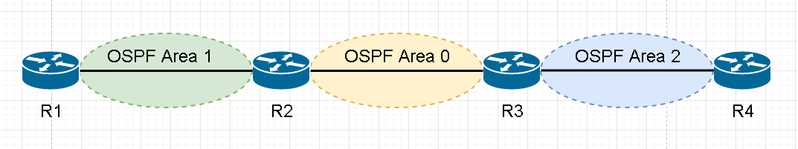
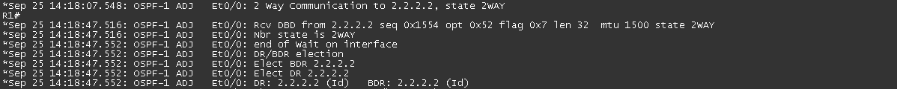
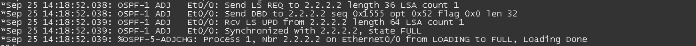

# OSPF-Theory1 #

## 簡介 ##

OSPF為開放標準的Link-State路由協定，收斂速度雖沒有EIGRP快，但無限制跳躍數，且可運作於多廠牌設備當中

## Link-State Protocols ##

在鍊路狀態的路由協定中，每個路由器都擁有一張完整的網路拓樸，可以分辨出接收到的路由信息是由誰發出來的

## Multicast Address ##

OSPF的組播位置有兩種，分別為

- 224.0.0.5 - DR,BDR向DROTHER發送DD,LSA Request和LSA Update時使用

- 224.0.0.6 - DROTHER向DR,BDR發送DD,LSA Request和LSA Update時使用

## 為什麼要劃分Area ##

- 最小化路由表

- 本地的拓樸變動，只會影響到該區域

- 有些LSA只會在該區域內傳播，不會傳送到整個拓樸中

## Backbone area ##

骨幹區域，又稱為Transit area或者area 0

## Regular area ##

	常規區域，又稱為nonbackbone areas，非骨幹區域的area

## BR ##



	Backbone Router 骨幹路由器，最少一個Interface連接Area 0，稱為BR，以上圖為例，R2和R3為BR

## ABR ##

	Area Border Router 區域邊界路由器，連接兩個Area以上稱為ABR，以上圖為例，R2和R3為ABR

## ASBR ##


	Autonomous System Border Router 自治系統邊界路由器，連接其他AS的Router稱為ASBR，以上圖為例，R2為ASBR

## DR/BDR選舉 ##

選舉會先看Priority，若是Priority相同，就會比router-id，較大的為DR，其他為BDR或DROTHER

## DR ##

	Designated Router 指定路由器，由DR跟BDR和DROTHERs進行LSA的溝通，再統一發送結果，DROTHERs之間不會進行LSA的溝通，避免造成過多不必要的流量

## BDR

	Backup Designated Router 備份指定路由器，若是DR故障，則BDR會晉升成為DR繼續進行LSA的溝通，但若是故障的DR又重新回到拓樸中，也不會重新進行election，等到下一次重啟OSPF時才會重新進行election，重啟ospf使用clear ip ospf process

## DROTHERs

	不是DR也不是BDR則稱為DROTHERs

## Neighbor和Adjacency的差異 ##

	Neighbor - 建立鄰居的過程只到two-way就結束
	Adjacency - 建立鄰接包含整個過程

## 成為鄰居條件 ##

	1.Area ID相同
	2.Area Type相同
	3.網段相同
	4.Hello Interval以及Dead Interval需相同
	5.認證類型以及密碼一致
	6.MTU相同

## OSPF鄰接過程 ##

下面以此拓樸做說明


完整鄰接過程


### Down ###

不發送Hello 

### Init ###


開始向對方發送Hello

### Two-way ###



進行DR/BDR選舉，建立鄰居關係，以上圖為例，可以看到選舉結果DR為R1，BDR為R2

### Exstart ###


預備交換鍊路資訊

### Exchange ###


交換DBD，讓對方知道它需要哪些LSA

### Loading ###



開始交換LSA

### Full ###

交換完成，建立鄰接關係

## 路徑成本計算

```bash
#公式，注意計算單位，10^8單位為bit，interface為K,M或G
10^8/interface
10^8 = 100M 
#範例
#介面卡頻寬為100M
10^8/100 = 100/100 = 1
#但有個問題是，若介面卡頻寬為1G也就是1000M，計算結果會取正整數，也就是1，這就會造成
#100M和1000M的計算結果是相同的，解法為修改介面卡頻寬，以下為修改命令
#進入ospf修改
router ospf 1
auto-cost reference-bandwidth 1000 #單位為Mbits
#修改介面卡
int f0/0
ip ospf cost 1
```
