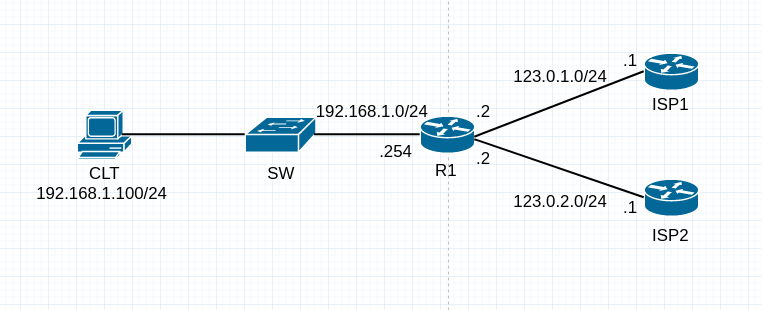

# Policy Based Routing 基於政策的路由 #



## PBR配置 ##

```bash
ip sla 1 #建立ip sla 1
    icmp-echo 123.0.1.1 source-ip 123.0.1.2 #ping測試123.0.1.1，來源為123.0.1.2
    frequency 10 #頻率為10秒一次
ip sla schedule 1 life forever start-time now #設定排程，立即啟用並永久存活
track 1 ip sla 1 reachability #Track 1使用ip sla 1
ip sla 2 #建立ip sla 2
    icmp-echo 123.0.2.1 source-ip 123.0.2.2 #ping測試123.0.1.1，來源為123.0.1.2
    frequency 10 #頻率為10秒一次
ip sla schedule 2 life forever start-time now #設定排程，立即啟用並永久存活
track 2 ip sla 2 reachability #Track 1使用ip sla 1
ip access-list extended WEB #建立名稱型ACL WEB
    permit tcp 192.168.1.0 0.0.0.255 any eq 80 #比對HTTP流量
ip access-list extended TELNET #建立名稱型ACL TELNET
    permit tcp 192.168.1.0 0.0.0.255 any eq 23
route-map PBR_LOAD_SHARE permit 1 #建立Route-map名稱為PBR_LOAD_SHARE，序號為1
    match ip address WEB #比對HTTP流量
    set ip next-hop verify-availability 123.0.1.1 1 track 1 #指定下一站為123.0.1.1
route-map PBR_LOAD_SHARE permit 2 #建立Route-map名稱為PBR_LOAD_SHARE，序號為2
    match ip address TELNET #比對HTTP流量
    set ip next-hop verify-availability 123.0.2.1 2 track 2 #指定下一站為123.0.1.1
int f0/1
    ip policy route-map PBR_LOAD_SHARE #套用至流量進入的介面
```

## 雙介面NAT + PBR + Float Route ##

```bash
#先解決NAT，使用NVI配置方法，一般NAT方式也可以，配置方式差不多，可以看NAT.md

ip sla 1 #建立ip sla 1
    icmp-echo 123.0.1.1 source-ip 123.0.1.2 #ping測試123.0.1.1，來源為123.0.1.2
    frequency 10 #頻率為10秒一次
ip sla schedule 1 life forever start-time now #設定排程，立即啟用並永久存活
track 1 ip sla 1 reachability #Track 1使用ip sla 1
ip sla 2 #建立ip sla 2
    icmp-echo 123.0.2.1 source-ip 123.0.2.2 #ping測試123.0.1.1，來源為123.0.1.2
    frequency 10 #頻率為10秒一次
ip sla schedule 2 life forever start-time now #設定排程，立即啟用並永久存活
track 2 ip sla 2 reachability #Track 1使用ip sla 1
ip access-list extended WEB #建立名稱型ACL WEB
    permit tcp 192.168.1.0 0.0.0.255 any eq 80 #比對HTTP流量
ip access-list extended TELNET #建立名稱型ACL TELNET
    permit tcp 192.168.1.0 0.0.0.255 any eq 23
route-map PBR_LOAD_SHARE permit 1 #建立Route-map名稱為PBR_LOAD_SHARE，序號為1
    match ip address WEB #比對HTTP流量
    set ip next-hop verify-availability 123.0.1.1 1 track 1 #指定下一站為123.0.1.1
route-map PBR_LOAD_SHARE permit 2 #建立Route-map名稱為PBR_LOAD_SHARE，序號為2
    match ip address TELNET #比對HTTP流量
    set ip next-hop verify-availability 123.0.2.1 2 track 2 #指定下一站為123.0.1.1
int f0/1
    ip policy route-map PBR_LOAD_SHARE #套用至流量進入的介面
```

### 查看設定 ###

```bash
show track #查看track 
show ip policy #查看PBR套用介面
show route-map #查看Route-map
```