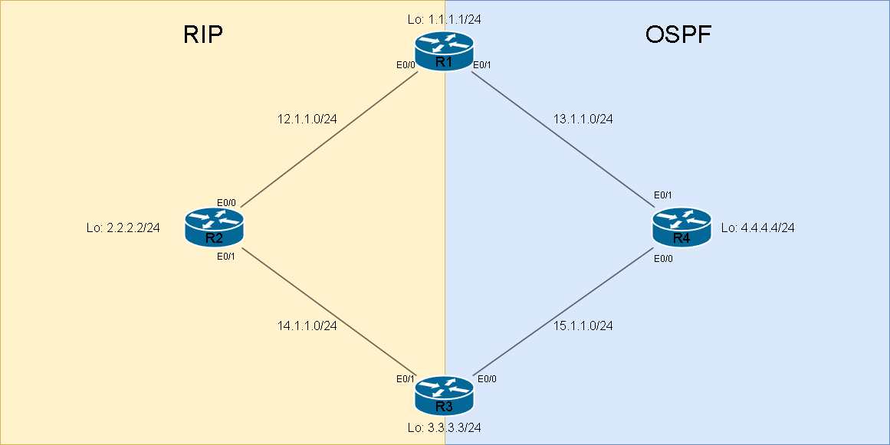

# Redistribute #

路由再發佈可以用在幾種地方

1. 兩個不同的路由協定互相學習路由
2. 再發佈靜態路由
3. 再發佈直連介面的路由
4. 路由過濾(搭配route-map)
## Default Metric ## 

| Protocol | Connected | Static | RIP | EIGRP | OSPF | IS-IS | BGP |
| --- | --- | --- | --- | --- | --- | --- | --- |
| RIP   | 1 | 1 | -- | Infinite | Infinite | Infinite | Infinite |
| EIGRP | Int Metric | Int Metric | Infinite | -- | Infinite | Infinite | Infinite |
| OSPF  | 20(E2) | 20(E2) | 20(E2) | 20(E2) | -- | 20(E2) | 1(E2) |
| IS-IS | 0 | 0 | 0 | 0 | 0 | -- | 0 |
| BGP   | 0 | 0 | IGP Metric | IGP Metric | IGP Metric | IGP Metric | -- |


## RIP ##

再發佈靜態路由

```bash
router rip 
    redistribute static metric 5 
```

再發佈直連介面的路由

```bash
router rip 
    redistribute connected metric 5 
```

再發佈EIGRP

```bash
router rip 
    redistribute eigrp 10 metric 5 
```

再發佈OSPF

```bash
router rip
    redistribute ospf 10 metric 5
```

再發佈OSPFv3

```bash
router rip 
    redistribute ospfv3 10 metric 5
```

再發佈IS-IS

```bash

```

再發佈BGP

```bash
router rip
    redistribute bgp 65001 metric 5
```

## EIGRP ##

>EIGRP在再發佈時會需要加上五個計算成本的指標，來計算出最後的成本

再發佈靜態路由

```bash
router eigrp 10 
    redistribute static metric 10000 10 255 1 1500
```

再發佈直連介面的路由

```bash
router eigrp 10 
    redistribute connected metric 10000 10 255 1 1500
```

再發佈RIP 

```bash
router eigrp 10 
    redistribute rip metric 10000 10 255 1 1500 
```

再發佈不同AS的EIGRP

```bash
router eigrp 10
    redistribute eigrp 20 metric 10000 10 255 1 1500
```

再發佈OSPF

```bash
router eigrp 10 
    redistribute ospf 10 metric 10000 10 255 1 1500
```

再發佈IS-IS

```bash

```

再發佈BGP

```bash
router eigrp 10 
    redistribute bgp 65001 metric 10000 10 255 1 1500
```

## EIGRP Named Mode ## 

再發佈靜態路由

```bash
ipv6 unicast-routing 
router eigrp instance1 
    address-family ipv4 unicast autonomous-system 10 
        topology base
            redistribute static metric 10000 10 255 1 1500 
    address-family ipv6 unicast autonomous-system 10 
        topology base
            redistribute static metric 10000 10 255 1 1500
```

再發佈直連介面的路由

```bash
ipv6 unicast-routing 
router eigrp instance1 
    address-family ipv4 unicast autonomous-system 10 
        topology base
            redistribute connected metric 10000 10 255 1 1500 
    address-family ipv6 unicast autonomous-system 10 
        topology base
            redistribute connected metric 10000 10 255 1 1500
```

再發佈RIPNG

```bash
ipv6 unicast-routing 
router eigrp instance1 
    address-family ipv4 unicast autonomous-system 10 
        topology base
            redistribute rip metric 10000 10 255 1 1500 
    address-family ipv6 unicast autonomous-system 10 
        topology base
            redistribute rip <Process name> metric 10000 10 255 1 1500 include-connected #再發佈RIPNG需要加上Process Name，include-connected代表連直連介面的路由也一起發佈
```

再發佈不同AS的EIGRP

```bash
ipv6 unicast-routing 
router eigrp instance1 
    address-family ipv4 unicast autonomous-system 10 
        topology base
            redistribute eigrp 20 metric 10000 10 255 1 1500 
    address-family ipv6 unicast autonomous-system 10 
        topology base
            redistribute eigrp 20 metric 10000 10 255 1 1500 include-connected #include-connected代表連直連介面的路由也一起發佈
```

再發佈OSPF

```bash
ipv6 unicast-routing 
router eigrp instance1 
    address-family ipv4 unicast autonomous-system 10 
        topology base
            redistribute ospf 10 metric 10000 10 255 1 1500 
    address-family ipv6 unicast autonomous-system 10 
        topology base
            redistribute ospf 10 metric 10000 10 255 1 1500 include-connected #include-connected代表連直連介面的路由也一起發佈
```

再發佈OSPFv3

```bash
ipv6 unicast-routing 
router eigrp instance1 
    address-family ipv4 unicast autonomous-system 10 
        topology base
            redistribute ospfv3 10 metric 10000 10 255 1 1500 
    address-family ipv6 unicast autonomous-system 10 
        topology base
            redistribute ospfv3 10 metric 10000 10 255 1 1500 include-connected #include-connected代表連直連介面的路由也一起發佈
```

再發佈IS-IS

```bash

```

再發佈BGP

```bash
再發佈OSPF

```bash
ipv6 unicast-routing 
router eigrp instance1 
    address-family ipv4 unicast autonomous-system 10 
        topology base
        redistribute bgp 65001 metric 10000 10 255 1 1500 
```


## OSPFv2 ##

>OSPF可以選擇再發佈metric-type1或者metric-type2，metric-type1是指再發佈的路由會被當成E1，metric-type2是指再發佈的路由會被當成E2，預設是E2

再發佈靜態路由

```bash
router ospf 10 
    redistribute static metric 10
```

再發佈直連介面的路由

```bash
router ospf 10
    redistribute connected metric 10 #subnet是指連子網路也發佈，例如，如果你有一條直連的網路192.168.1.0/24，使用了subnets參數后，OSPF將包括這個網路的所有子網，如192.168.1.0/24、192.168.1.1/24、192.168.1.2/24等都再發佈出去
```

再發佈RIP 

```bash
router ospf 10 
    redistribute rip metric 10 
```

再發佈EIGRP

```bash
router ospf 10 
    redistribute eigrp metric 10 
```

再發佈不同進程的OSPF，通常用做解決Ireegular Area(不規則區域)問題

```bash
router ospf 10 
    redistribute ospf 20 metric 10 
```

再發佈不同進程的OSPFv3，通常用做解決Ireegular Area(不規則區域)問題

```bash
router ospf 10 
    redistribute ospfv3 20 metric 10 
```

再發佈IS-IS

```bash

```

再發佈BGP

```bash
router ospf 10 
    redistribute bgp 65001 metric 10
```

## OSPFv3 ## 

>OSPFv3與OSPFv2差不多，只是多了IPv6以及address-family，其餘概念是一樣的

再發佈靜態路由

```bash
router ospfv3 10 
    address-family ipv4 unicast  
        redistribute static metric 10 
    address-family ipv6 unicast 
        redistribute static metric 10 
```

再發佈直連介面的路由

```bash
router ospfv3 10 
    address-family ipv4 unicast  
        redistribute connected metric 10 
    address-family ipv6 unicast 
        redistribute connected metric 10 
```

再發佈RIP 

```bash
router ospfv3 10
    address-family ipv4 unicast 
        redistribute rip metric 10
    address-family ipv6 unicast 
        redistribute rip metric 10
```

再發佈EIGRP

```bash
router ospfv3 10 
    address-family ipv4 unicast  
        redistribute eigrp 20 metric 10 
    address-family ipv6 unicast 
        redistribute eigrp 20 metric 10 
```

再發佈不同進程的OSPF，通常用做解決Ireegular Area(不規則區域)問題

```bash
router ospfv3 10 
    address-family ipv4 unicast  
        redistribute ospf 20 metric 10
    address-family ipv6 unicast
        redistribute ospf 20 metric 10 
```

再發佈不同進程OSPFv3，通常用做解決Ireegular Area(不規則區域)問題

```bash
router ospfv3 10 
    address-family ipv4 unicast  
        redistribute ospfv3 20 metric 10
    address-family ipv6 unicast
        redistribute ospfv3 20 metric 10 
```

再發佈IS-IS

```bash

```

再發佈BGP

```bash
router ospfv3 10 
    address-family ipv4 unicast 
        redistribute bgp 65001 metric 10
    address-family ipv6 unicast
        redistribute bgp 65001 metric 10
```

## IS-IS ##

再發佈靜態路由

```bash

```

再發佈直連介面的路由

```bash

```

再發佈RIP 

```bash

```

再發佈EIGRP

```bash

```

再發佈OSPF

```bash

```

再發佈IS-IS

```bash

```

再發佈BGP

```bash

```

## BGP ##

再發佈靜態路由

```bash

```

再發佈直連介面的路由

```bash

```

再發佈RIP 

```bash

```

再發佈EIGRP

```bash

```

再發佈OSPF

```bash

```

再發佈IS-IS

```bash

```

再發佈BGP

```bash

```

## 雙點雙向路由再發佈 ##



>當較大AD值的路由協定向較小AD值得路由協定進行再發佈時，以上圖為例，再R1和R3配置雙點雙向路由再發佈時，會發現R1或R3有一台會收到由OSPF發佈往R2 Loopback 0的路由，但這會造成

```bash

```