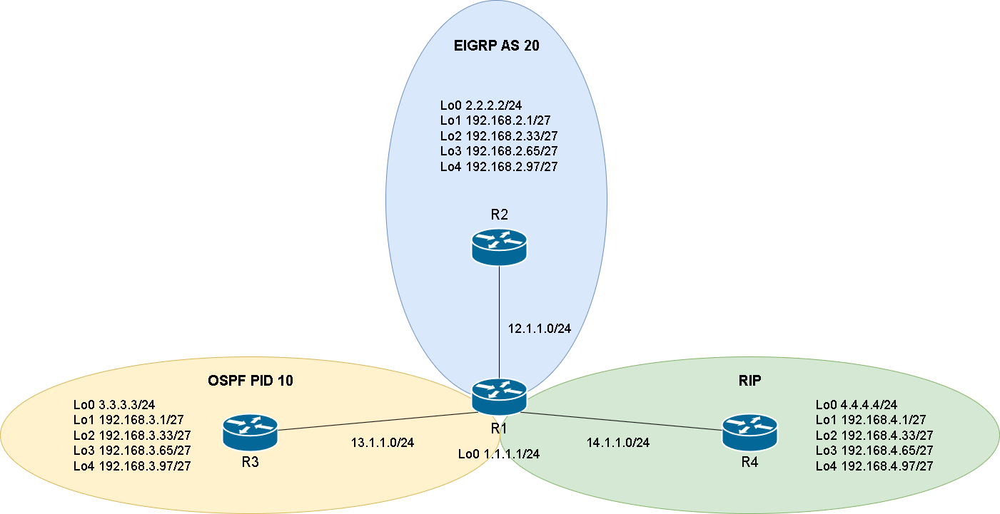

# Route Map #

Route-Map主要有以下幾種用途

1. Redistribution Route Filtering 再發佈路由過濾
2. Policy-Based Routing 策略路由
3. BGP Policy implementation BGP策略

## Route-Map執行順序 ##

Match - 只要Match任何一個都執行Set</br>
Set - 被Match的話執行所有Set</br>
沒寫Match的話，就是Match all</br>
沒寫Set的話，就是不做任何事</br>

## 再發佈路由過濾 ##



以上圖來說，假設今天要將EIGRP再發佈至OSPF，但只允許192.168.7.0/27、192.168.7.32/27、192.168.7.64/27三條路由通過，192.168.7.96/27不能通過，且192.168.7.0/27、192.168.7.32/27要使用Metric-Type 1，就可以使用route-map來達成

```bash
#因為需要用遮罩來過濾，所以不能使用ACL，要使用prefix-list
ip prefix-list 10 seq 10 permit 192.168.7.0/27 
ip prefix-list 10 seq 20 permit 192.168.7.32/27 
ip prefix-list 20 seq 10 permit 192.168.7.64/27 
#建立Route-Map 
route-map ospf-filter permit 10 
    match ip address prefix-list 10 
    set metric-type type-1
route-map ospf-filter permit 20 
    match ip address prefix-list 20
#套用Route-Map
router ospf 10 
    redistribute eigrp 20 subnet route-map ospf-filter
```

## 策略路由 ##

```bash

```

## BGP策略 ##

```bash

```
