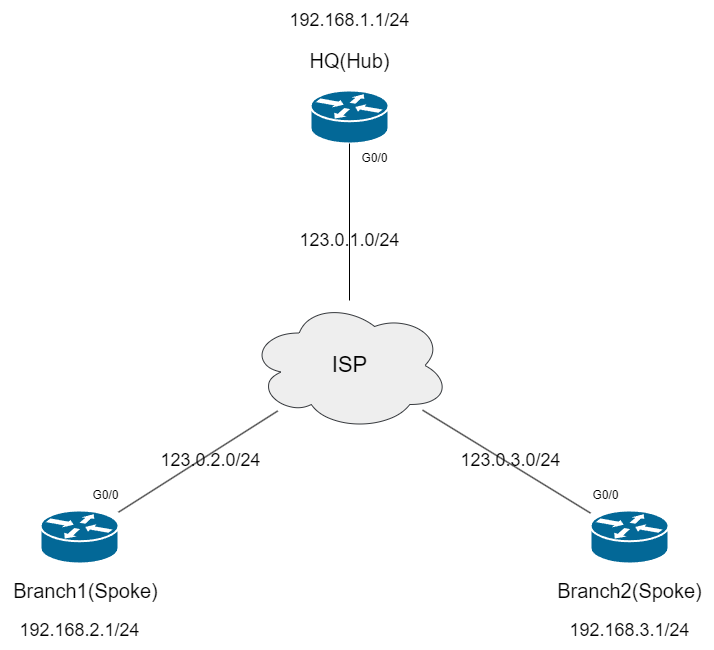

# DMVPN EIGRP Phase 3 #

## Topology ##



>拓樸已經預先配置了IP和Static Route指向ISP

## Phase 3 ##

```bash
[HQ]
int tunnel 0
    ip nhrp redirect #在HUB(NHS)加上redirect
    
[BRANCH1]
int tunnel 0
    ip nhrp shortcut #在Spoke加上shortcut
[BRANCH2]
int tunnel 0
    ip nhrp shortcut #在Spoke加上shortcut 
```

## Tranditional ## 

```bash
[HQ]
int tun 0 
    ip next-hop-self eigrp 100 #跟Phase 2相比將next-hop-self開回來
```

## Named-Mode ##

```bash
[HQ]
router eigrp DMVPN
    address-family ipv4 unicast autonomous 10 
        af-interface tunnnel 0
            next-hop-self #跟Phase 2相比將next-hop-self開回來
```


最後檢查

```bash
show dmvpn #查看DMVPN是否成功啟用
traceroute 192.168.3.1 source 192.168.2.1 #在Phase 3 Spoke通信第一個包需要通過HUB，接下來的所有都會redirect至Spoke2
show ip nhrp brief #在Spoke1查看ip nhrp映射會發現多了Spoke 2的NHRP映射
show ip route eigrp #從BRANCH1查看從BRANCH2收到的內網路由下一跳為HUB，但前面多了一個%，意思是Override，並且多了一條H的路由，代表目的地為%的路由時會將下一跳重訂向到H的路由
```

## DMVPN over IPSEC ##

```bash
[HQ]
crypto isakmp policy 10 #建立isakmp policy 
    authentication pre-share #驗證使用PSK
    hash sha256 #驗證資料完整性使用sha256
    encryption aes 256 #加密使用aes 256
    group 14 #金鑰交換使用DH14
    lifetime 3600 #SA的生命週期為3600秒
    exit 
crypto isakmp key Cisco123 address 0.0.0.0 #設定PSK以及指定對端IP
crypto ipsec transform-set TS esp-aes 256 esp-sha256-hmac #配置IPSec Phase 2，可選擇AH或ESP的驗證和加密方式
    mode tunnel #模式為tunnel mode，視情況可選擇transport mode
    exit
crypto ipsec profile IPSEC_PROFILE #建立IPSec profile
    set transform-set TS #設定IPSec transform set
int tunnel 0 
    tunnel protection ipsec profile IPSEC_PROFILE
[BRANCH1]
crypto isakmp policy 10 #建立isakmp policy 
    authentication pre-share #驗證使用PSK
    hash sha256 #驗證資料完整性使用sha256
    encryption aes 256 #加密使用aes 256
    group 14 #金鑰交換使用DH14
    lifetime 3600 #SA的生命週期為3600秒
    exit 
crypto isakmp key Cisco123 address 0.0.0.0 #設定PSK以及指定對端IP
crypto ipsec transform-set TS esp-aes 256 esp-sha256-hmac #配置IPSec Phase 2，可選擇AH或ESP的驗證和加密方式
    mode tunnel #模式為tunnel mode，視情況可選擇transport mode
    exit
crypto ipsec profile IPSEC_PROFILE #建立IPSec profile
    set transform-set TS #設定IPSec transform set
int tunnel 0 
    tunnel protection ipsec profile IPSEC_PROFILE
[BRANCH2]
crypto isakmp policy 10 #建立isakmp policy 
    authentication pre-share #驗證使用PSK
    hash sha256 #驗證資料完整性使用sha256
    encryption aes 256 #加密使用aes 256
    group 14 #金鑰交換使用DH14
    lifetime 3600 #SA的生命週期為3600秒
    exit 
crypto isakmp key Cisco123 address 0.0.0.0 #設定PSK以及指定對端IP
crypto ipsec transform-set TS esp-aes 256 esp-sha256-hmac #配置IPSec Phase 2，可選擇AH或ESP的驗證和加密方式
    mode tunnel #模式為tunnel mode，視情況可選擇transport mode
    exit
crypto ipsec profile IPSEC_PROFILE #建立IPSec profile
    set transform-set TS #設定IPSec transform set
int tunnel 0 
    tunnel protection ipsec profile IPSEC_PROFILE
[檢查]
ping 192.168.3.1 source 192.168.2.1 #查看spoke是否可以互相通信
show crypto ipsec sa detail #查看SA是否建立且有流量通過
```

## Reference ## 

https://network-insight.net/2015/02/03/design-guide-dmvpn-phases/
