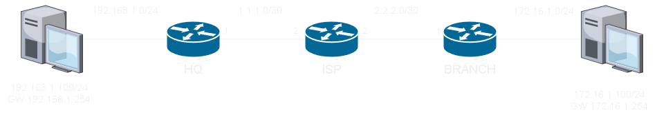

# GRE over IPSec Site to Site #

## Topology ##

>網路基本連通已經完成，此處僅列出VPN相關配置



## HQ ##

```python
int tunnel 0 
    ip address 192.168.100.1 255.255.255.0
    tunnel mode gre ip #mode為gre
    tunnel source g0/0 #來源介面
    tunnel destination 2.2.2.1 #目的IP
router ospf 1 
    router-id 1.1.1.1
    network 192.168.100.0 0.0.0.255 area 0
    network 192.168.1.0 0.0.0.255 area 0 
#IPSec 
access-list 100 permit gre host 1.1.1.1 host 2.2.2.1 #感興趣流量
crypto isakmp policy 10 #配置IKE Phase 1
    authentication pre-share #驗證使用PSK
    encryption aes #加密使用aes
    hash sha #驗證資料完整性使用sha
    group 14 #金鑰交換使用DH14
    exit
crypto isakmp key cisco address 2.2.2.1 #isakmp PSK
crypto isakmp transform-set TS esp-aes esp-sha-hmac #配置IPSec Phase 2，可選擇AH或ESP的驗證和加密方式
    mode transport #封裝模式使用Transport Mode
    exit
crypto map GRE_OVER_IPSEC 10 ipsec-isakmp #設定關聯
    set peer 2.2.2.1 
    set transform-set TS
    match address 100
    exit
int e0/0 #套用
    crypto map GRE_OVER_IPSEC 
```

## BRANCH ##

```python
int tunnel 0 
    ip address 192.168.100.2 255.255.255.0
    tunnel mode gre ip #mode為gre
    tunnel source e0/0 #來源介面
    tunnel destination 1.1.1.1 #目的IP
router ospf 1 
    router-id 3.3.3.3
    network 192.168.100.0 0.0.0.255 area 0
    network 172.16.1.0 0.0.0.255 area 0
#IPSec 
access-list 100 permit gre host 2.2.2.1 host 1.1.1.1 #感興趣流量
crypto isakmp policy 10 #配置IKE Phase 1
    authentication pre-share #驗證使用PSK
    encryption aes #加密使用aes
    hash sha #驗證資料完整性使用sha
    group 14 #金鑰交換使用DH14
    exit
crypto isakmp key cisco address 1.1.1.1 #isakmp PSK
crypto isakmp transform-set TS esp-aes esp-sha-hmac #配置IPSec Phase 2，可選擇AH或ESP的驗證和加密方式
    mode transport #封裝模式使用Transport Mode
    exit
crypto map GRE_OVER_IPSEC 10 ipsec-isakmp #設定關聯
    set peer 1.1.1.1
    set transform-set TS
    match address 100
    exit
int e0/0 #套用
    crypto map GRE_OVER_IPSEC 
```
