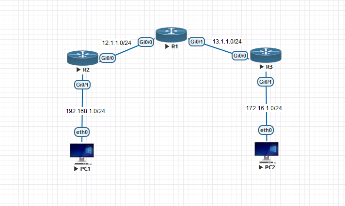

# Location ID Separation Protocol(LISP)

LISP 一種 Overlay 協議，旨在解決現代網路中的可擴展性和移動性問題。它通過將設備的位置（Locator）與標識（ID）分離，使網路能夠更有效地路由流量。LISP 使用 EID 標識終端設備， RLOC 定位設備在網路中的位置。此設計簡化了跨網段的移動性，並提高了網路的可擴展性和靈活性，適用於多站點企業、數據中心。

## LISP 優缺點 ##

**優點**

- 配置簡單，無須與對端建立IGP鄰居即可互通 

**缺點**

- IPv4無法使用IPSec，不保證安全性

## LISP 角色 ##

**Endpoint ID(EID)** - 內網設備的私有IP位置

**Routing Locator(RLOC)** - 邊界路由器的外網介面地址

**Mapping Server(MS)** - 紀錄每個站點LISP映射，MS需要知道每個站點的RLOC與EID供邊界路由器查詢映射

**Mapping Resolver(MR)** - 協助ITR詢問Mapping Server目的地是否為對方端點的EID，解析後若是對方端點的EID，就會通過LISP進行轉發，通常與MS為同一台設備

**Ingree Tunnel Router(ITR)** - 接收來自客戶端的流量並傳送到目的地的設備稱為ITR，當查詢路由表後發現沒有達到目的地的路由，就會請求MR來查詢此路由是否為EID，或者路由表中只有一條預設路由也會發送請求給MR

**Engree Tunnel Router(ETR)** - 將流量傳輸至客戶端的設備稱為ETR，並且ETR會定期發送更新給MS，讓MS更新數據庫

**(XTR)** - 

## LISP 實驗 ##

**Topology**



```bash
[R1]
enable 
conf t
hostname R1
int g0/0    
    ip address 12.1.1.1 255.255.255.0
    no shutdown 
int g0/1
    ip address 13.1.1.1 255.255.255.0
    no shutdown 
router lisp
    site A
        authentication-key Cisco123
        eid-prefix 192.168.1.0/24 accept-more-specifics
    site B
        authentication-key Cisco123
        eid-prefix 172.16.1.0/24 accept-more-specifics
    ipv4 map-server
    ipv4 map-resolve
[R2]
enable 
conf t
hostname R2
int g0/0
    ip address 12.1.1.2 255.255.255.0
    no shutdown
int g0/1
    ip address 192.168.1.1 255.255.255.0
    no shutdown 
ip route 0.0.0.0 0.0.0.0 12.1.1.1 
router lisp
    database-mapping 192.168.1.0/24 IPv4-interface GigabitEthernet0/0 priority 100 weight 100 #Priority為假設有多台出口路由器(RLOC)，可以指定哪台為出口流量的主要路徑，weight當路徑Priority相同時，按照權重分配流量比例，權重越高，分配的越多
    ipv4 itr map-resolver 12.1.1.1 #指定MR
    ipv4 itr #開啟ITR功能
    ipv4 etr map-server 12.1.1.1 key Cisco123 #指定MS
    ipv4 etr #開啟ETR功能
[R3]
enable 
conf t
hostname R3
int g0/0 
    ip address 13.1.1.3 255.255.255.0
    no shutdown 
int g0/1
    ip address 172.16.1.1 255.255.255.0 
    no shutdown 
ip route 0.0.0.0 0.0.0.0 13.1.1.1 
router lisp
    database-mapping 172.16.1.0/24 IPv4-interface GigabitEthernet0/0 priority 100 weight 100
    ipv4 itr map-resolver 13.1.1.1 #指定MR
    ipv4 itr #開啟ITR功能
    ipv4 etr map-server 13.1.1.1 key Cisco123 #指定MS
    ipv4 etr #開啟ETR功能
[PC1]
ip 192.168.1.100/24 192.168.1.1
[PC2]
ip 172.16.1.100/24 172.16.1.1 
```

## Reference ##

https://www.syscom.com.tw/Industry_Observation_Detail.aspx?EPAID=225

https://www.reddit.com/r/ccnp/comments/1brsj8q/difference_between_itr_and_etr/

https://www.cisco.com/c/en/us/td/docs/ios-xml/ios/iproute_lisp/configuration/xe-16/irl-xe-16-book.html