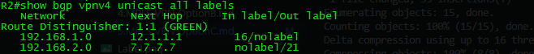

# MPLS VPN OptionC #

## C1配置案例 ##


**目標**

CE兩端Loopback0互通

## 配置IP和底層IGP路由協議 ##

```bash
[R1]
enable 
conf t
hostname R1
int g0/0
    ip address 12.1.1.1 255.255.255.0
    no shutdown 
int lo0
    ip address 192.168.1.1 255.255.255.0
[R2]
enable 
conf t
hostname R2
int g0/0
    ip address 12.1.1.2 255.255.255.0
    no shutdown 
int g0/1
    ip address 23.1.1.2 255.255.255.0
    no shutdown 
int lo0
    ip address 2.2.2.2 255.255.255.255
router ospf 1
    router-id 2.2.2.2
    network 12.1.1.0 0.0.0.255 area 0
    network 23.1.1.0 0.0.0.255 area 0
    network 2.2.2.2 255.255.255.255 area 0
[R3]
enable 
conf t
hostname R3
int g0/0
    ip address 13.1.1.3 255.255.255.0
    no shutdown 
int g0/1
    ip address 23.1.1.3 255.255.255.0
    no shutdown 
int g0/2
    ip address 34.1.1.3 255.255.255.0
    no shutdown 
int lo0
    ip address 3.3.3.3 255.255.255.255
router ospf 1
    router-id 3.3.3.3
    network 13.1.1.0 0.0.0.255 area 0
    network 23.1.1.0 0.0.0.255 area 0
    network 34.1.1.0 0.0.0.255 area 0
    network 3.3.3.3 255.255.255.255 area 0
[R4]
enable 
conf t
hostname R4
int g0/2
    ip address 34.1.1.4 255.255.255.0
    no shutdown 
int g0/0
    ip address 45.1.1.4 255.255.255.0
    no shutdown
int lo0
    ip address 4.4.4.4 255.255.255.255
router ospf 1
    router-id 4.4.4.4
    network 34.1.1.0 0.0.0.255 area 0
    network 4.4.4.4 255.255.255.255 area 0
[R5]
enable 
conf t
hostname R5
int g0/0
    ip address 45.1.1.5 255.255.255.0
    no shutdown 
int g0/2
    ip address 56.1.1.5 255.255.255.0
    no shutdown
int lo0
    ip address 5.5.5.5 255.255.255.255
router ospf 1
    router-id 5.5.5.5
    network 56.1.1.0 0.0.0.255 area 0
    network 5.5.5.5 255.255.255.255 area 0
[R6]
enable 
conf t
hostname R6
int g0/2
    ip address 56.1.1.6 255.255.255.0
    no shutdown
int g0/1
    ip address 67.1.1.6 255.255.255.0
    no shutdown 
int g0/0
    ip address 26.1.1.6 255.255.255.0
    no shutdown 
int lo0
    ip address 6.6.6.6 255.255.255.255
router ospf 1
    router-id 6.6.6.6
    network 56.1.1.0 0.0.0.255 area 0
    network 67.1.1.0 0.0.0.255 area 0
    network 26.1.1.0 0.0.0.255 area 0
    network 6.6.6.6 255.255.255.255 area 0
[R7]
enable 
conf t
hostname R7
int g0/0
    ip address 87.1.1.7 255.255.255.0
    no shutdown 
int g0/1
    ip address 67.1.1.7 255.255.255.0
    no shutdown 
int lo0
    ip address 7.7.7.7 255.255.255.255
router ospf 1
    router-id 7.7.7.7
    network 67.1.1.0 0.0.0.255 area 0
    network 87.1.1.0 0.0.0.255 area 0
    network 7.7.7.7 255.255.255.255 area 0
[R8]
enable 
conf t
hostname R8
int g0/0
    ip address 87.1.1.8 255.255.255.0
    no shutdown 
int lo0
    ip address 192.168.2.1 255.255.255.0
[RR1]
enable 
conf t
hostname RR1
int g0/0
    ip address 13.1.1.11 255.255.255.0
    no shutdown 
int lo0
    ip address 11.11.11.11 255.255.255.255
    no shutdown 
router ospf 1
    router-id 11.11.11.11
    network 13.1.1.0 0.0.0.255 area 0
    network 11.11.11.11 255.255.255.255 area 0
[RR2]
enable 
conf t
hostname RR2
int g0/0
    ip address 26.1.1.22 255.255.255.0
    no shutdown 
int lo0
    ip address 22.22.22.22 255.255.255.255
router ospf 1
    router-id 22.22.22.22
    network 26.1.1.0 0.0.0.255 area 0
    network 22.22.22.22 255.255.255.255 area 0
#配置完成後請以R3 ping 11.11.11.11、2.2.2.2、4.4.4.4，並以R6 ping 22.22.22.22、5.5.5.5、7.7.7.7確保連通
```


## 配置IBGP與EBGP ##

```bash
[R1]
router bgp 100 
    neighbor 12.1.1.2 remote-as 65001
    network 192.168.1.0 mask 255.255.255.0
[R2]
vrf definition GREEN
    rd 1:1 
    address-family ipv4 
        route-target 100:1 
router bgp 65001 
    bgp router-id 2.2.2.2
    neighbor 11.11.11.11 remote-as 65001
    neighbor 11.11.11.11 update-source lo0 
    address-family ipv4 unicast vrf GREEN
        neighbor 12.1.1.1 remote-as 100 
    address-family vpnv4 #與RR1建立VPNv4鄰居
        neighbor 11.11.11.11 
[R3]
router bgp 65001 
    bgp router-id 3.3.3.3
    neighbor 11.11.11.11 remote-as 65001
    neighbor 11.11.11.11 update-source lo0 
[R4]
router bgp 65001 
    bgp router-id 4.4.4.4
    neighbor 11.11.11.11 remote-as 65001
    neighbor 11.11.11.11 update-source lo0 
[R5]
router bgp 65002
    bgp router-id 5.5.5.5
    neighbor 22.22.22.22 remote-as 65001
    neighbor 22.22.22.22 update-source lo0 
[R6]
router bgp 65002
    bgp router-id 6.6.6.6
    neighbor 22.22.22.22 remote-as 65001
    neighbor 22.22.22.22 update-source lo0 
[R7]
vrf definition RED
    rd 1:1 
    address-family ipv4 
        route-target 100:1 
router bgp 65002
    bgp router-id 7.7.7.7
    neighbor 22.22.22.22 remote-as 65001
    neighbor 22.22.22.22 update-source lo0 
    address-family ipv4 unicast vrf RED
        neighbor 87.1.1.8 remote-as 200 
[R8]
router bgp 200
    neighbor 87.1.1.7 remote-as 65002
    network 192.168.2.0 mask 255.255.255.0
[RR1]
router bgp 65001 
    bgp router-id 11.11.11.11 #因RR2沒有定義VRF，但需要接收VPNv4路由，所以將RT過濾關閉，代表接收所有VPNv4路由    
    neighbor 2.2.2.2 remote-as 65001
    neighbor 3.3.3.3 remote-as 65001
    neighbor 4.4.4.4 remote-as 65001
    neighbor 2.2.2.2 update-source lo0 
    neighbor 3.3.3.3 update-source lo0 
    neighbor 4.4.4.4 update-source lo0 
    neighbor 2.2.2.2 route-reflector-client
    neighbor 3.3.3.3 route-reflector-client 
    neighbor 4.4.4.4 route-reflector-client
[RR2]
router bgp 65002
    bgp router-id 22.22.22.22
    no bgp default route-target filter #因RR2沒有定義VRF，但需要接收VPNv4路由，所以將RT過濾關閉，代表接收所有VPNv4路由
    neighbor 5.5.5.5 remote-as 65001
    neighbor 6.6.6.6 remote-as 65001
    neighbor 7.7.7.7 remote-as 65001
    neighbor 5.5.5.5 update-source lo0 
    neighbor 6.6.6.6 update-source lo0 
    neighbor 7.7.7.7 update-source lo0 
    neighbor 5.5.5.5 route-reflector-client
    neighbor 6.6.6.6 route-reflector-client 
    neighbor 7.7.7.7 route-reflector-client
```

## 開啟MPLS ##

```bash
[R2]
mpls ldp router-id lo0 
int g0/1
    mpls ip 
[R3]
mpls ldp router-id lo0 
int range g0/0-2
    mpls ip 
[R4]
mpls ldp router-id lo0 
int g0/2
    mpls ip 
[R5]
mpls ldp router-id lo0 
int g0/2
    mpls ip 
[R6]
mpls ldp router-id lo0 
int g0/0-2
    mpls ip 
[R7]
mpls ldp router-id lo0 
int g0/1
    mpls ip 
[RR1]
mpls ldp router-id lo0 
int g0/0
    mpls ip
[RR2]
mpls ldp router-id lo0 
int g0/0 
    mpls ip
```

## RR1與RR2建立EBGP鄰居 ##

```bash
[R4]
router bgp 65001
    network 11.11.11.11 mask 255.255.255.255 #將11.11.11.11/32發佈給RR2 
    neighbor 11.11.11.11 next-hop-self #發布後下一跳為45.1.1.5，非最佳路由，所以不會放入路由表中，需使用next-hop-self將下一跳更改為4.4.4.4
[R5]
router bgp 65002
    network 22.22.22.22 mask 255.255.255.255
    neighbor 22.22.22.22 next-hop-self #同R4 
[RR1]
router bgp 65001
    address-family vpnv4 
        neighbor 22.22.22.22 remote-as 200 #RR1與RR2能連通後即可建立鄰居
        neighbor 22.22.22.22 update-source lo0 
[RR2]
router bgp 65002
    address-family vpnv4 
        neighbor 11.11.11.11 remote-as 100 
        neighbor 11.11.11.11 update-source lo0 
```

## 開啟傳遞標籤功能 ##

因R3、R4、R5、R6為BGP IPv4鄰居，不具備傳遞標籤功能，所以須開啟傳遞標籤功能

```bash
[R2]
router bgp 65001
    neighbor 11.11.11.11 send-label 
[R4]
router bgp 65001
    neighbor 11.11.11.11 send-label   
    neighbor 45.1.1.5 send-label 
int g0/0
    mpls bgp forwarding
[R5]
router bgp 65002
    neighbor 22.22.22.22 send-label
    neighbor 45.1.1.4 send-label 
int g0/0
    mpls bgp forwarding 
[R7]
router bgp 65002
    neighbor 22.22.22.22 send-label 
[RR1]
router bgp 65001
    address-family ipv4
        neighbor 2.2.2.2 send-label 
        neighbor 4.4.4.4 send-label 
[RR2]
router bgp 65002 
    address-family ipv4 
        neighbor 5.5.5.5 send-label 
        neighbor 7.7.7.7 send-label 
```

## 優化 ##

當R1 192.168.1.1要到192.168.2.1時，因192.168.2.1這條路由是通過RR2的VPNv4傳送給RR1的，所以next-hop為22.22.22.22，導致封包傳至AS65002時會需要先到RR2在到R7，而不是直接傳給R7，要讓封包直接傳給R8，請看以下配置

```bash
#首先RR1和RR2需配置next-hop-unchanged使從對方收到路由時下一跳不改變
[RR1]
router bgp 65001
    address-family vpnv4 
        neighbor 22.22.22.22 next-hop-unchanged 
[RR2]
router bgp 65002
    address-family vpnv4 
        neighbor 11.11.11.11 next-hop-unchanged 
#接著使用show ip bgp vpnv4 all可以看到下一跳是由7.7.7.7與2.2.2.2傳遞給對方192.168.1.0/24與192.168.2.0/24的路由，但下一跳並不可達，所以需要通告路由
[R4]
router bgp 65001
    network 2.2.2.2 mask 255.255.255.255 
[R5]
router bgp 65002 
    network 7.7.7.7 mask 255.255.255.255
```

## 查看三層標籤 ##

```bash
#第一層BGP VPNv4(VRF)，all可指定VRF
show bgp vpnv4 unicast all labels
#第二層BGP IPv4 
show bgp ipv4 unicast labels
#第三層MPLS LDP
show mpls forwarding-table
```

可以在R1與R8使用traceroute來觀察三層標籤的變化


從R2上觀察三張表的標籤，再對應到上面traceroute的標籤

**show bgp vpnv4 unicast all labels**



**show bgp ipv4 unicast labels**


**show mpls forwarding-table**


## BGP邏輯鄰居關系 ##


## C2配置案例 ##