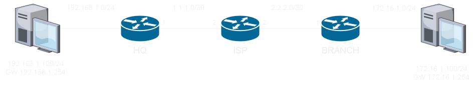

# Virtual Tunnel Interface #

VTI透過使用Tunnel Interface取代傳統使用ACL和crypto map對端口進行對應的方式，簡化IPSec Site to Site VPN的配置。

## Topology ## 

>網路基本連通已經完成，此處僅列出VPN相關配置



## HQ ## 

```bash
crypto isakmp policy 10 #建立isakmp policy 
    authentication pre-share #驗證使用PSK
    hash sha256 #驗證資料完整性使用sha256
    encryption aes 256 #加密使用aes 256
    group 14 #金鑰交換使用DH14
    lifetime 3600 #SA的生命週期為3600秒
    exit 
crypto isakmp key cisco address 2.2.2.1 #設定PSK以及指定對端IP
    exit 
crypto ipsec transform-set TS esp-aes 256 esp-sha256-hmac #配置IPSec Phase 2，可選擇AH或ESP的驗證和加密方式
    mode tunnel #模式為tunnel mode，視情況可選擇transport mode
    exit
crypto ipsec profile IPSEC_PROFILE #建立IPSec profile
    set transform-set TS #設定IPSec transform set
int tunnel 0 
    ip unnunbered e0/0 #使用e0/0的IP作為Tunnel Interface的IP
    tunnel source e0/0 #來源介面
    tunnel destination 2.2.2.1 
    tunnel mode ipsec ipv4 
    tunnel protection ipsec profile IPSEC_PROFILE #設定IPSec profile
```

## BRANCH ## 

```bash
crypto isakmp policy 10 #建立isakmp policy 
    authentication pre-share #驗證使用PSK
    hash sha256 #驗證資料完整性使用sha256
    encryption aes 256 #加密使用aes 256
    group 14 #金鑰交換使用DH14
    lifetime 3600 #SA的生命週期為3600秒
    exit 
crypto isakmp key cisco address 1.1.1.1 #設定PSK以及指定對端IP
    exit 
crypto ipsec transform-set TS esp-aes 256 esp-sha256-hmac #配置IPSec Phase 2，可選擇AH或ESP的驗證和加密方式
    mode tunnel #模式為tunnel mode，視情況可選擇transport mode
    exit
crypto ipsec profile IPSEC_PROFILE #建立IPSec profile
    set transform-set TS #設定IPSec transform set
int tunnel 0 
    ip unnunbered e0/0 #使用e0/0的IP作為Tunnel Interface的IP
    tunnel source e0/0 #來源介面
    tunnel destination 1.1.1.1
    tunnel mode ipsec ipv4 
    tunnel protection ipsec profile IPSEC_PROFILE #設定IPSec profile
```

## Reference ##

https://ccie.lol/knowledge-base/ipsec-two-mode/