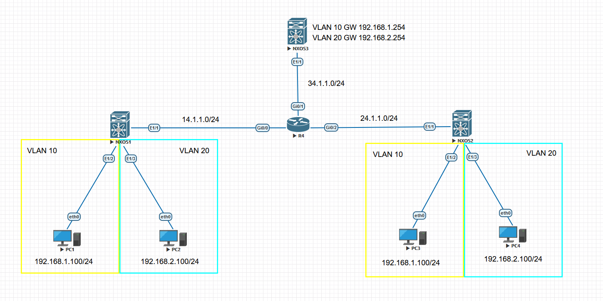

# 靜態VXLAN配置案例二層集中式閘道 #

Topology



**目標:**

1. 實現VLAN 10與VLAN 10互通，VLAN 20與VLAN 20互通，無須Gateway，可直接與相同VLAN的PC通訊

```bash
[R4]
int g0/0
    ip address 14.1.1.4 255.255.255.0
    no shutdown 
int g0/2
    ip address 24.1.1.4 255.255.255.0
    no shutdown
int lo0
    ip address 4.4.4.4 255.255.255.0
router ospf 1
    router-id 4.4.4.4
    network 14.1.1.0 0.0.0.255 area 0
    network 24.1.1.0 0.0.0.255 area 0
    network 4.4.4.4 0.0.0.0 area 0

[NXOS1]
feature ospf #啟用OSPF功能
feature nv overlay #啟用Network Virtualization Overlay功能
feature vn-segment-vlan-based #啟用VLAN與VXLAN binding功能
vlan 10
    vn-segment 10 #binding VNI
vlan 20 
    vn-segment 20 #binding VNI
router ospf 1 
    router-id 1.1.1.1 
int e1/1
    ip address 14.1.1.1 255.255.255.0
    no shutdown 
    ip router ospf 1 area 0
int lo0
    ip address 1.1.1.1 255.255.255.0
int e1/2
    no shutdown 
    switchport 
    switchport mode access
    switchport access vlan 10
int e1/3
    no shutdown 
    switchport 
    switchport mode access 
    switchport access vlan 20 
int nve 1
    no shutdown 
    source-interface loopback 0
    member vni 10 
        ingress-replication protocol static
            peer-ip 2.2.2.2 
    member vni 20 
        ingress-replication protocol static
            peer-ip 2.2.2.2
[NXOS2]
feature ospf #啟用OSPF功能
feature nv overlay #啟用Network Virtualization Overlay功能
feature vn-segment-vlan-based #啟用VLAN與VXLAN binding功能
vlan 10
    vn-segment 10 #binding VNI
vlan 20 
    vn-segment 20 #binding VNI
router ospf 1 
    router-id 2.2.2.2
int e1/1
    ip address 24.1.1.2 255.255.255.0
    no shutdown 
    ip router ospf 1 area 0
int lo0
    ip address 2.2.2.2 255.255.255.0
int e1/2
    no shutdown 
    switchport 
    switchport mode access
    switchport access vlan 10
int e1/3
    no shutdown 
    switchport 
    switchport mode access 
    switchport access vlan 20 
int nve 1
    no shutdown 
    source-interface loopback 0
    member vni 10 
        ingress-replication protocol static
            peer-ip 1.1.1.1
    member vni 20
        ingress-replication protocol static
            peer-ip 1.1.1.1
[PC1]
ip 192.168.1.100/24 
[PC2]
ip 192.168.2.100/24
[PC3]
ip 192.168.1.101/24 
[PC4]
ip 192.168.2.101/24 
#Show命令
show mac address-table #查看MAC位置表
show nve peers detail #查看nve介面狀態
```

