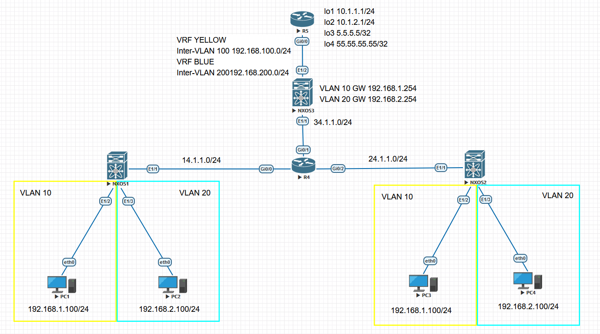

# 靜態集中式閘道VXLAN配置業務完全隔離 #

Topology



**目標:**

1. 實現VLAN 10與VLAN 10、R5的Lo1互通，VLAN 20與VLAN 20、R5的Lo2互通
2. 網路必須隔離開，VLAN 10無法訪問VLAN 20的主機

```bash
[R4]
int g0/0
    ip address 14.1.1.4 255.255.255.0
    no shutdown 
int g0/1
    ip address 34.1.1.4 255.255.255.0
    no shutdown 
int g0/2
    ip address 24.1.1.4 255.255.255.0
    no shutdown
int lo0
    ip address 4.4.4.4 255.255.255.0
router ospf 1
    router-id 4.4.4.4
    network 14.1.1.0 0.0.0.255 area 0
    network 24.1.1.0 0.0.0.255 area 0
    network 34.1.1.0 0.0.0.255 area 0
    network 4.4.4.4 0.0.0.0 area 0

[NXOS1]
feature ospf #啟用OSPF功能
feature nv overlay #啟用Network Virtualization Overlay功能
feature vn-segment-vlan-based #啟用VLAN與VXLAN binding功能
vlan 10
    vn-segment 10 #binding VNI
vlan 20 
    vn-segment 20 #binding VNI
router ospf 1 
    router-id 1.1.1.1 
int e1/1
    ip address 14.1.1.1 255.255.255.0
    no shutdown 
    ip router ospf 1 area 0
int lo0
    ip address 1.1.1.1 255.255.255.0
int e1/2
    no shutdown 
    switchport 
    switchport mode access
    switchport access vlan 10
int e1/3
    no shutdown 
    switchport 
    switchport mode access 
    switchport access vlan 20 
int nve 1
    no shutdown 
    source-interface loopback 0
    member vni 10 
        ingress-replication protocol static
            peer-ip 2.2.2.2 
            peer-ip 3.3.3.3
    member vni 20 
        ingress-replication protocol static
            peer-ip 2.2.2.2
            peer-ip 3.3.3.3 
[NXOS2]
feature ospf #啟用OSPF功能
feature nv overlay #啟用Network Virtualization Overlay功能
feature vn-segment-vlan-based #啟用VLAN與VXLAN binding功能
vlan 10
    vn-segment 10 #binding VNI
vlan 20 
    vn-segment 20 #binding VNI
router ospf 1 
    router-id 2.2.2.2
int e1/1
    ip address 24.1.1.2 255.255.255.0
    no shutdown 
    ip router ospf 1 area 0
int lo0
    ip address 2.2.2.2 255.255.255.0
int e1/2
    no shutdown 
    switchport 
    switchport mode access
    switchport access vlan 10
int e1/3
    no shutdown 
    switchport 
    switchport mode access 
    switchport access vlan 20 
int nve 1
    no shutdown 
    source-interface loopback 0
    member vni 10 
        ingress-replication protocol static
            peer-ip 1.1.1.1
            peer-ip 3.3.3.3
    member vni 20
        ingress-replication protocol static
            peer-ip 1.1.1.1
            peer-ip 3.3.3.3
[NXOS3]
feature interface-vlan #啟用單臂路由功能
feature ospf #啟用OSPF功能
feature nv overlay #啟用Network Virtualization Overlay功能
feature vn-segment-vlan-based #啟用VLAN與VXLAN binding功能
vrf context YELLOW
vrf context BLUE
vlan 10
    vn-segment 10 #binding VNI
vlan 20 
    vn-segment 20 #binding VNI
router ospf 1
  router-id 3.3.3.3
  vrf VLAN10
  vrf VLAN20
int e1/1
    ip address 34.1.1.3 255.255.255.0
    no shutdown 
    ip router ospf 1 area 0
int E1/2
    switchport
    switchport mode trunk
    no shutdown
int vlan 10
    vrf member YELLOW
    ip address 192.168.1.254 255.255.255.0
    no shutdown 
    ip router ospf 1 area 0
int vlan 20 
    vrf member BLUE
    ip address 192.168.2.254 255.255.255.0
    no shutdown 
    ip router ospf 1 area 0
int vlan100
    no shutdown
    vrf member YELLOW
    ip address 192.168.100.3/24
    ip router ospf 1 area 0.0.0.0
int vlan200
    no shutdown
    vrf member BLUE
    ip address 192.168.200.3/24
    ip router ospf 1 area 0.0.0.0
int lo0
    ip address 3.3.3.3 255.255.255.0
    ip router ospf 1 area 0
int nve 1
    no shutdown 
    source-interface loopback 0
    member vni 10 
        ingress-replication protocol static
            peer-ip 1.1.1.1
            peer-ip 2.2.2.2
    member vni 20
        ingress-replication protocol static
            peer-ip 1.1.1.1
            peer-ip 2.2.2.2
[R5]
vrf definition BLUE 
    address-family ipv4
vrf definition YELLOW
    address-family ipv4
int G0/0
    no shutdown 
    no ip address
int G0/0.100
    encapsulation dot1Q 100
    vrf forwarding YELLOW
    ip address 192.168.100.5 255.255.255.0
int G0/0.200
    encapsulation dot1Q 200
    vrf forwarding BLUE
    ip address 192.168.200.5 255.255.255.0
int Lo1
    vrf forwarding YELLOW
    ip address 10.1.1.1 255.255.255.0
int Lo2
    vrf forwarding BLUE
    ip address 10.1.2.1 255.255.255.0
int Lo3
    vrf forwarding YELLOW
    ip address 5.5.5.5 255.255.255.0
int Lo4
    vrf forwarding BLUE
    ip address 55.55.55.55 255.255.255.0
router ospf 1 vrf YELLOW
    router-id 5.5.5.5
    network 5.5.5.5 0.0.0.0 area 0
    network 10.1.1.0 0.0.0.255 area 0
    network 192.168.100.0 0.0.0.255 area 0
router ospf 2 vrf BLUE
    router-id 55.55.55.55
    network 10.1.2.0 0.0.0.255 area 0
    network 55.55.55.55 0.0.0.0 area 0
    network 192.168.200.0 0.0.0.255 area 
[PC1]
ip 192.168.1.100/24 192.168.1.254
[PC2]
ip 192.168.2.100/24 192.168.2.254 
[PC3]
ip 192.168.1.101/24 192.168.1.254 
[PC4]
ip 192.168.2.101/24 192.168.2.254 
#Show命令
show mac address-table #查看MAC位置表
show nve peers detail #查看nve介面狀態
```