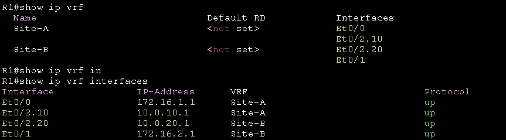

# Virtual Routing and Forwarding #

VRF允許單台路由器運行多個路由表，並且完全獨立不會互相干擾，通常會與MPLS結合使用，沒有MPLS的VRF稱為VRF Lite

## Route distinguishers 路由區分符 ##

用於在MPLS網路中區分不同客戶端的網路，假設今天有1000條10.0.0.0/24從不同vrf的客戶端發送至Route Reflector，就需要使用RD來區分每條路由是從哪個客戶	端發佈進來的例如客戶端A會稱為[Customer A RD]:10.0.0.0/24，而客戶端B則稱為[Customer B RD]:10.0.0.0/24 

## Route targets 路由目標 ##

依照RD的方式區分出路由後，RT可以用來選擇是否要接收或發出這些路由，使用import RD的exoport RD方式選擇出是否接收或發出路由


## R1 ## 

```bash
ip vrf Site-A
ip vrf Site-B
int e0/0
    ip vrf forwarding Site-A
    ip address 172.16.1.1 255.255.255.252
    no shutdown 
int e0/1
    ip vrf forwarding Site-B
    ip address 172.16.2.1 255.255.255.252
    no shutdown 
int e0/2
    no shutdown
int e0/2.10
    encapsulation dot1q 10
    ip vrf forwarding Site-A
    ip address 10.0.10.1 255.255.255.0
int e0/2.20
    encapsulation dot1q 20
    ip vrf forwarding Site-B
    ip address 10.0.20.1 255.255.255.0
router ospf 100 vrf Site-A
    router-id 1.1.1.1 
    network 172.16.1.0 0.0.0.3 area 0 
    network 10.0.10.0 0.0.0.255 area 1
router ospf 200 vrf Site-B
    router-id 2.2.2.2 
    network 172.16.2.0 0.0.0.3 area 0
    network 10.0.20.0 0.0.0.255 area 1 
```

## R2 ## 

```bash
int e0/0
    ip address 172.16.1.2 255.255.255.252
    no shutdown 
int lo0
    ip address 192.168.1.1 255.255.255.240 
int lo1
    ip address 192.168.1.17 255.255.255.240 
router ospf 100 
    network 172.16.1.0 0.0.0.3 area 0
    network 192.168.1.0 0.0.0.15 area 1
    network 192.168.1.16 0.0.0.15 area 1 
```

## R3 ## 

```bash
int e0/0
    ip address 172.16.2.2 255.255.255.252
    no shutdown 
int lo0
    ip address 192.168.2.1 255.255.255.240 
int lo1
    ip address 192.168.2.17 255.255.255.240 
router ospf 200
    network 172.16.2.0 0.0.0.3 area 0
    network 192.168.2.0 0.0.0.15 area 1
    network 192.168.2.16 0.0.0.15 area 1
```

## SW ##

```bash
vlan 10,20 
int e0/1
    switchport mode access
    switchport access vlan 10
int e0/2
    switchport mode access 
    switchport access vlan 20 
int e0/0
    switchport trunk encapsulation dot1Q 
    switchport mode trunk 
```

## 檢查vrf命令 ##

檢查是否連通

```bash
ping vrf Site-A 192.168.1.1
ping vrf Site-A 192.168.1.17
ping vrf Site-B 192.168.2.1
ping vrf Site-B 192.168.2.17
```


查看vrf關聯的介面

```bash
show ip vrf 
show ip vrf interfaces 
```



查看路由表

```bash
show ip route #查看全域的路由表
show ip route vrf Site-A connected #查看Site-A的路由表 
show ip route vrf Site-B connected #查看Site-B的路由表
```

全域路由表


Site-A 路由表


Site-B路由表


查看運行的路由協定

```bash
show ip protocol 
show ip protocol vrf Site-A #查看Site-A運行的路由協定
show ip protocol vrf Site-B #查看Site-B運行的路由協定
```


Site-A運行OSPF PID 100


Site-B運行OSPF PID 200


## OSPFv3中使用VRF ##


當要再OSPFv3中使用VRF，必須使用新版的VRF命令進行配置，配置如下

## R1 ##

```bash
vrf definition Site-A
    address-family ipv4 unicast #使用OSPFv3需在vrf definition中開啟address-family 
    address-family ipv6 unicast 
vrf definition Site-B
    address-family ipv4 unicast #使用OSPFv3需在vrf definition中需開啟address-family 
    address-family ipv6 unicast 
int e0/0
    vrf forwarding Site-A
    ip address 172.16.1.1 255.255.255.252
    no shutdown 
int e0/2.10
    vrf forwarding Site-A
    encapsulation dot1Q 10 
    ip address 10.0.10.1 255.255.255.0
int e0/2.20
    vrf forwarding Site-B
    encapsulation dot1Q 20 
    ip address 10.0.20.1 255.255.255.0
ipv6 unicast-routing #要使用OSPFv3必須開啟ipv6單波繞送
router ospfv3 100 
    address-family ipv4 unicast vrf Site-A
    address-family ipv6 unicast vrf Site-A
router ospfv3 200 
    address-family ipv4 unicast vrf Site-B
    address-family ipv6 unicast vrf Site-B
int e0/0
    ipv6 enable #使用OSPFv3需再介面開啟ipv6
    ospfv3 100 ipv4 area 0
    ospfv3 100 ipv6 area 0
int e0/2.10
    ipv6 enable #使用OSPFv3需再介面開啟ipv6
    ospfv3 100 ipv4 area 1
    ospfv3 100 ipv6 area 1
int e0/1
    ipv6 enable #使用OSPFv3需再介面開啟ipv6
    ospfv3 200 ipv4 area 0
    ospfv3 200 ipv6 area 0
int e0/2.20
    ipv6 enable #使用OSPFv3需再介面開啟ipv6
    ospfv3 200 ipv4 area 1
    ospfv3 200 ipv6 area 1
```

查看OSPF

```bash
show ospfv3 vrf Site-A
show ospfv3 vrf Site-A neighbor
show ospfv3 vrf Site-B
show ospfv3 vrf Site-B neighbor
```

## Reference ##

https://ccnp-sp.gitbook.io/studyguide/routing/l3vpn/an-in-depth-look-at-rd-and-rt-pt.-1

https://community.cisco.com/t5/ipv6/how-to-configure-ospfv3-with-vrf-in-ios-a-guide/td-p/2250812