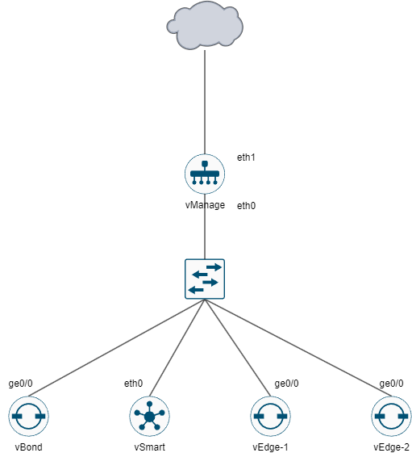

# 初始化 #

## 拓樸 ##



## vManage ##

```bash
config
system
    host-name vManage
    system-ip 1.1.1.20
    site-id 1
    organization-name cisco.com
    vbond 192.168.1.101
vpn 0
    interface eth0
    ip address 192.168.1.100/24
    no shutdown
vpn 512
    interface eth1
    ip address 192.168.10.200/24
    no shutdown
commit
```

安裝憑證

```bash
request root-cert-chain install /home/admin/ROOTCA.pem vpn 0
```

## vBond ## 

```bash
config
system
    host-name vBond
    system-ip 1.1.1.10
    site-id 1
    organization-name cisco.com
    vbond 192.168.1.101 local vbond-only
vpn 0
    interface ge0/0
    ip address 192.168.1.101/24
    no tunnel-interface
    no shutdown
commit
```

**產生憑證並傳送至vManage、vSmart、vEdge-1、vEdge-2**

```bash
vshell 
openssh genrsa -out ROOTCA.key 2048 
openssl req -x509 -new -nodes -key ROOTCA.key -sha256 -days 1024 \
        -subj "/C=AU/ST=NSW/L=NSW/O=networkacademy-io/CN=sdwan.lab" \
        -out ROOTCA.pem
scp ROOTCA.pem admin@192.168.10.100:/home/admin
scp ROOTCA.pem admin@192.168.10.102:/home/admin
scp ROOTCA.pem admin@192.168.10.103:/home/admin
scp ROOTCA.pem admin@192.168.10.104:/home/admin
```

**使用Generate CSR生成憑證後傳送至vManage、vSmart**

```bash
vshell 
scp admin@192.168.10.100:/home/admin/vManage.csr vManage.csr 
scp admin@192.168.10.101:/home/admin/vBond.csr vBond.csr
scp admin@192.168.10.102:/home/admin/vSmart.csr vSmart.csr
#簽署憑證
openssl x509 -req -in vBond.csr \
        -CA ROOTCA.pem -CAkey ROOTCA.key -CAcreateserial \
        -out vBond.crt -days 500 -sha256
openssl x509 -req -in vSmart.csr \
        -CA ROOTCA.pem -CAkey ROOTCA.key -CAcreateserial \
        -out vSmart.crt -days 500 -sha256
openssl x509 -req -in vManage.csr \
        -CA ROOTCA.pem -CAkey ROOTCA.key -CAcreateserial \
        -out vManage.crt -days 500 -sha256
```

## vSmart ##

```bash
config
system
    host-name vSmart
    system-ip 1.1.1.30
    site-id 1
    organization-name cisco.com
    vbond 192.168.10.101
vpn 0
    interface eth0
    ip address 192.168.10.102/24
    no tunnel-interface
    no shutdown
commit
```

安裝憑證

```bash
request root-cert-chain install /home/admin/ROOTCA.pem vpn 0
```

## vEdge-1 ##

```bash
config
system
    host-name vEdge-1
    system-ip 1.1.1.40
    site-id 100
    organization-name cisco.com
    vbond 192.168.10.101
vpn 0
    interface ge0/0
    ip address 192.168.10.103/24
    no tunnel-interface
    no shutdown
commit
```

安裝憑證

```bash
request root-cert-chain install /home/admin/ROOTCA.pem vpn 0
```

## vEdge-1 ##

```bash
config
system
    host-name vEdge-1
    system-ip 1.1.1.41
    site-id 100
    organization-name cisco.com
    vbond 192.168.10.101
vpn 0
    interface ge0/0
    ip address 192.168.10.104/24
    no tunnel-interface
    no shutdown
commit
```

安裝憑證

```bash
request root-cert-chain install /home/admin/ROOTCA.pem vpn 0
```