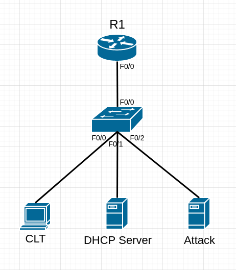

# DHCP Snooping #

## 簡介 ##

    DHCP Snooping用於封鎖接入交換機的非法DHCP Server，開啟DHCP Snooping後，所有客戶端只能從管理員指定的DHCP Server獲取IP Address，DHCP Snooping將交換機的Port分為Trust以及Untrust，交換機只會轉發Trust的DHCP封包，並丟棄Untrust的封包


## 配置方法 ##

下方只包含配置DHCP Snooping的方式，IP或網段等請自行決定



```bash

```