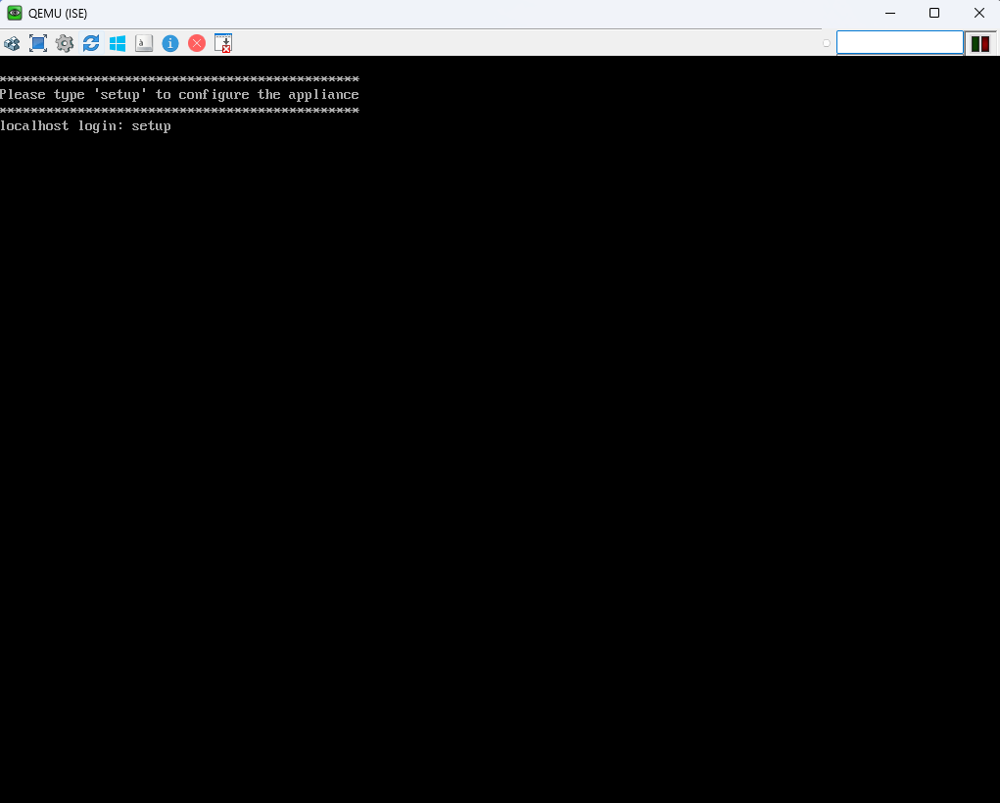
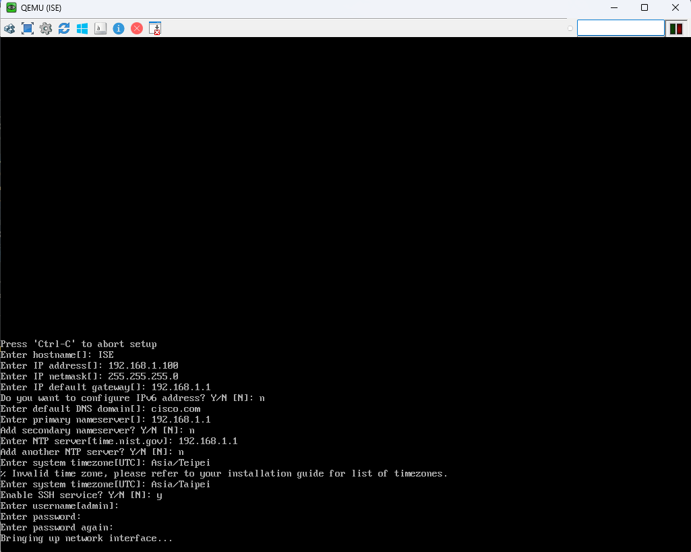

# Identify Services Engine(ISE) #

Cisco Identity Services Engine (ISE) 是一款強大的網絡安全和訪問控制解決方案，提供集中式管理功能。ISE 結合身份驗證、授權和設備配置，實現基於角色的網絡訪問控制。它支持 802.1X、MAC 認證旁路 (MAB) 等技術，能有效防止未授權設備或用戶進入網絡。同時，ISE 可整合威脅防禦工具，提供實時威脅檢測與響應能力，適用於企業網絡安全和合規需求。

## Setup ##

當開啟ISE後，會出現請你輸入setup進行初始化

接著就根據他的問題填入IP、DNS Server、NTP Server等資訊
