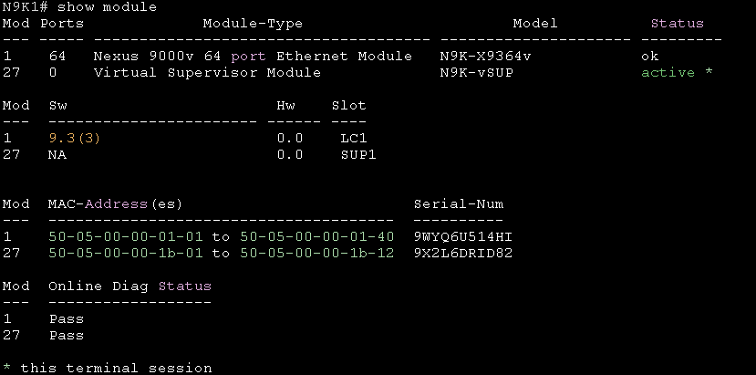

# TroubleShooting #

%STP-2-DISPUTE_DETECTED: Dispute detected on port Ethernet1/1 on VLAN0001.

%$ %L2FM-2-L2FM_MAC_FLAP_RE_ENABLE_LEARN: Re-enabling learning in vlan 1

%$ %L2FM-2-L2FM_MAC_FLAP_DISABLE_LEARN: Disabling learning in vlan 1 for 120s due to too many mac moves

## 模組問題 ##

```bash
show module #查看模組狀態
```



## Reference ##

https://www.firewall.cx/cisco/cisco-switches/cisco-nexus-7000-module-shutdown-replacement-removal.html