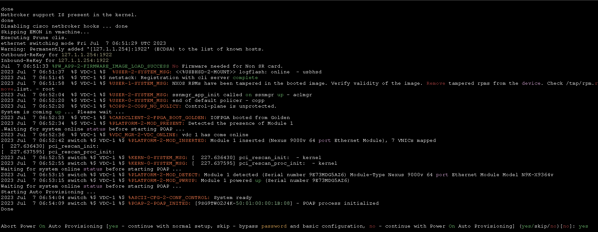
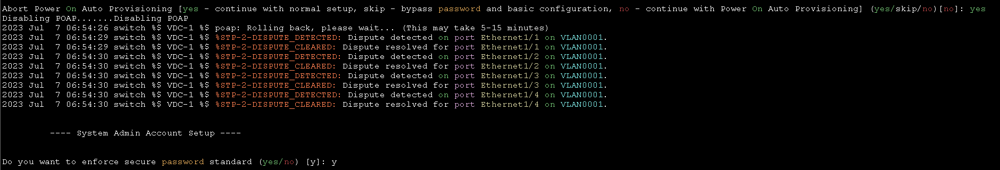
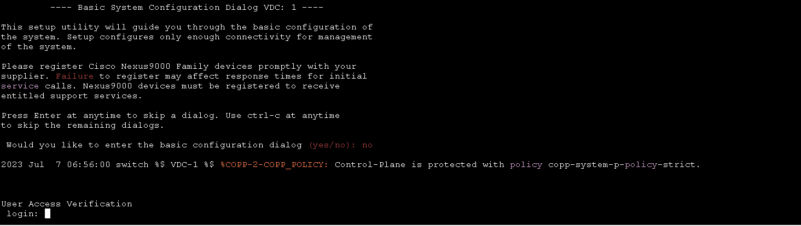

# 初始化 #

看到此畫面時，輸入yes，進行配置



使用安全密碼標準，輸入管理員密碼，長度需超過8個字元




要進行標準的配置對話嗎，輸入no



使用剛剛設定的密碼登入


## 常見命令 ##

## 更改主機名稱 ##

```bash
conf t
hostname Nexus1 
```

## 一次配置多個介面 ##

NXOS與IOS不同，不需要打range，直接選擇介面範圍即可

```bash
int e1/1-30
    no shutdown 
```

## 存檔 ##

NXOS沒有write，需使用copy running-config startup-config進行存檔

```bash
copy running-config startup-config 
```

## 查詢命令 ##

```bash
show interface brief #查看介面摘要
show interface status #查看介面狀態
```