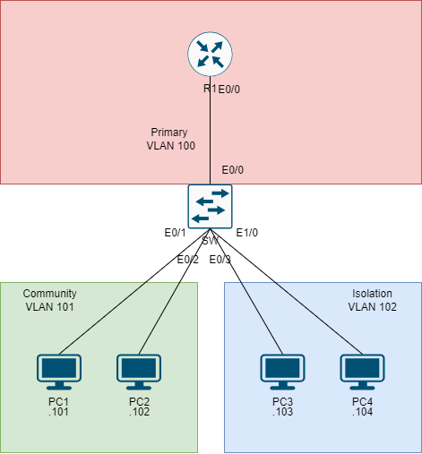

# Private VLAN #

Private VLAN（PVLAN）是一種進階的 VLAN 技術，用來在二層網路相同VLAN內部提供更細緻的隔離控制，在傳統 VLAN 中，所有設備都可以相互通訊（同 VLAN 內）。但在 Private VLAN 中，可以透過不同的 VLAN 類型來控制設備之間的流量，常用於DMZ未避免惡意軟體橫向擴散防禦使用。

## Private VLAN 的組成 ##

Private VLAN 主要由Primary VLAN和Secondary VLAN組成

- **Primary VLAN**
    - Promiscuous  
    - 能與所有Secondary VLAN內的設備通訊
    - 一般用於上行鏈路、Gateway
  
- **Secondary VLAN**
    
    Secondary VLAN 分為 **兩種模式**：

    - **Isolated VLAN（隔離 VLAN）**
        - Isolated VLAN之間的設備無法互相通訊。
        - 可以與Promiscuous Port和Community VLAN的設備通訊
    - **Community VLAN（社群 VLAN）**
        - 同一 Community VLAN 內的設備可以互相通訊
        - 但不同 Community VLAN 不能互相通訊，只能與Promiscuous Port連接

## 配置 ##

**Topology**



```bash
[R1]
int e0/0
    ip address 192.168.1.1 255.255.255.0
    no shutdown 
[SW]
#要配置private vlan需關閉VTP或者將VTP調整至transparent mode
vtp mode off 
vlan 101
    private-vlan community 
vlan 102 
    private-vlan isolation 
vlan 100
    private-vlan primary 
    private-vlan association 101,102 
int e0/0
    switchport mode private-vlan promiscuous 
    switchport private-vlan mapping 100 add 101,102 
int range e0/1-2 
    switchport mode private-vlan host 
    switchport private-vlan host-association 100 101 
int range e0/3,e1/0 
    switchport mode private-vlan host 
    switchport private-vlan host-association 100 102 
[PC1]
set pcname PC1
ip 192.168.1.101/24 192.168.1.1 
[PC2]
set pcname PC2
ip 192.168.1.102/24 192.168.1.1 
[PC3]
set pcname PC3
ip 192.168.1.103/24 192.168.1.1 
[PC4]
set pcname PC4
ip 192.168.1.104/24 192.168.1.1 
[Check]
show vlan private-vlan #檢查private-vlan 
#PC1可ping通R1、PC2、PC3、PC4
ping 192.168.1.1 
ping 192.168.1.102
ping 192.168.1.103
ping 192.168.1.104
#PC3可ping通R1、PC1、PC2，但無法ping通PC4
ping 192.168.1.1 
ping 192.168.1.101
ping 192.168.1.102
ping 192.168.1.104 
```
