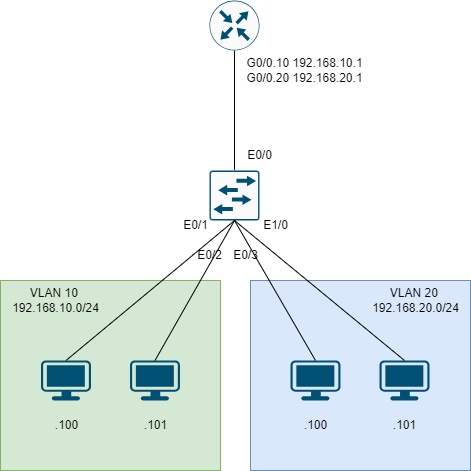

# Protected Port #

Protected Port（受保護端口）是 Cisco 交換機上的一種 端口隔離技術，主要用來限制同一台交換機上的特定端口之間的通訊。當一個端口被設定為 protected，它無法與其他 protected 端口直接通訊，但仍可與非 protected 端口（如上行鏈路） 進行通訊。

## 配置 ##

**Topology**



```bash
[R1]
int g0/0
    no shutdown
    no ip address
int g0/0.10 
    encapsulation dot1q 10 
    ip address 192.168.10.1 255.255.255.0
int g0/0.20 
    encapsulation dot1q 20 
    ip address 192.168.20.1 255.255.255.0
[SW]
vlan 10
vlan 20 
int e0/0
    switchport trunk encapsulattion dot1q
    switchport mode trunk 
int range e0/1-3,e1/0 
    switchport protected 
[PC1]
set pcname PC1
ip 192.168.10.100/24 192.168.10.1 
[PC2]
set pcname PC2
ip 192.168.10.101/24 192.168.10.1 
[PC3]
set pcname PC3
ip 192.168.20.100/24 192.168.20.1 
[PC4]
set pcname PC4
ip 192.168.20.101/24 192.168.20.1 
[Check]
#從PC1驗證
ping 192.168.10.101 #ping PC2(相同VLAN)不通
ping 192.168.10.1 #ping Gateway(未Protected Port)可連通
ping 192.168.20.100 #ping PC3(不同VLAN)可連通
ping 192.168.20.101 #ping PC4(不同VLAN)可連通
```