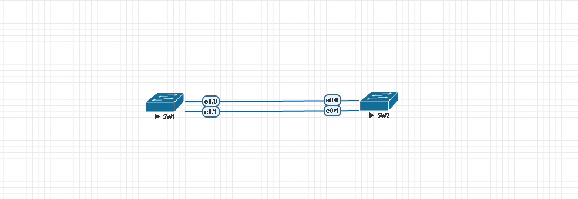

## MST ## 

Multiple Spanning-tree Protocol，由IEEE發行，允許使用者建立獨立的實例，將多個VLAN段分配到實例中，減少消耗硬體資源和方便管理



```bash
[SW1]
int range e0/0-1 #將連結Switch的Port設定為Trunk Mode，為了讓VLAN起來，因此實驗沒有於端口配置VLAN
    switchport trunk encapsulation dot1Q
    switchport mode trunk 
vlan 2-10 
spanning-tree mst configuration 
    name MST1 
    revision 1 
    instance 1 vlan 1,3,5,7,9 #將1,3,5,7,9加入到instance1中
    instance 2 vlan 2,4,6,8,10 #將2,4,6,8,10加入到instance2中
spanning-tree mst 1 priority 0 #修改instance1的priority為0，使SW1成為instnace1包含VLAN的root bridge 
spanning-tree mst 2 priority 8192 
spanning-tree mode mst #更改spanning-tree mode為mst 
[SW2]
int range e0/0-1 #將連結Switch的Port設定為Trunk Mode 
    switchport trunk encapsulation dot1Q
    switchport mode trunk 
vlan 2-10 
spanning-tree mst configuration 
    name MST1 
    revision 1 
    instance 1 vlan 1,3,5,7,9 #將1,3,5,7,9加入到instance1中
    instance 2 vlan 2,4,6,8,10 #將2,4,6,8,10加入到instance2中
spanning-tree mst 1 priority 8192 
spanning-tree mst 2 priority 0 #修改instance2的priority為0，使SW2成為instnace2包含VLAN的root bridge，達到負載平衡
spanning-tree mode mst #更改spanning-tree mode為mst 
```

查看命令 

```bash
show spanning-tree mst configuration #查看mst配置
show spanning-tree mst 1 #查看mst instance 1
```

>Hint:在做MST時，在Trunk Interface不進行Allow VLAN過濾